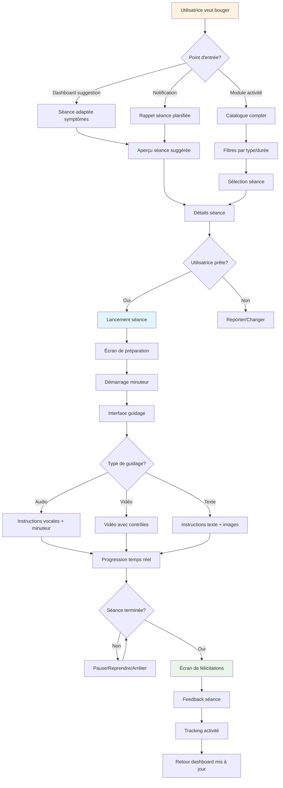
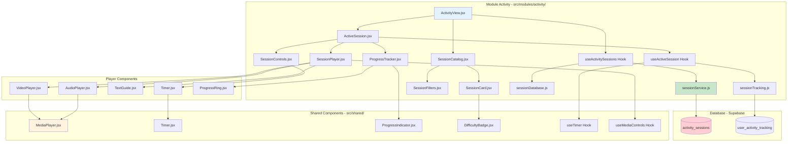
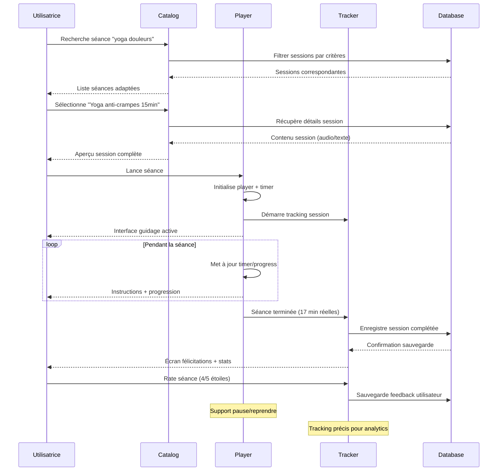

# 📝 Plan de Développement - Feature Séances Activité Courtes (MVP v1.0)

## 🎯 Vue d'ensemble

### Description de la Feature
Bibliothèque de séances d'activité physique courtes (5-20 minutes) spécialement adaptées au SOPK : yoga doux, mobilité, marche guidée, avec instructions audio/vidéo et adaptation selon les symptômes.

### Valeur Utilisateur
- **Accessibilité** : Activités douces adaptées aux jours difficiles
- **Motivation** : Séances courtes pour éviter l'abandon
- **Adaptation SOPK** : Exercices qui améliorent les symptômes sans épuiser

### Score RICE
- **Reach** : 4/5 (80% des utilisatrices SOPK veulent bouger mais ont peu d'énergie)
- **Impact** : 4/5 (activité physique = pilier du traitement SOPK)
- **Confidence** : 5/5 (format vidéo/audio éprouvé)
- **Effort** : 2/5 (contenu + interface lecture)
- **Score Final** : **40** ✅ **Priorité #5**

---

## 🔄 Diagrammes de Flux

### User Journey - Faire une Séance



### Architecture Technique



### Flux de Données



---

## 🏗️ Architecture Technique

### Structure des Données

```sql
-- Catalogue des séances d'activité
CREATE TABLE activity_sessions (
  id UUID PRIMARY KEY DEFAULT gen_random_uuid(),

  -- Informations de base
  title VARCHAR(100) NOT NULL,
  description TEXT,
  category VARCHAR(50) NOT NULL, -- 'yoga', 'mobility', 'cardio_light', 'strength_light'
  duration_minutes INTEGER NOT NULL,
  difficulty VARCHAR(20) NOT NULL, -- 'beginner', 'easy', 'medium'

  -- Contenu de la séance
  content_type VARCHAR(20) NOT NULL, -- 'audio', 'video', 'text_images'
  audio_url TEXT, -- URL fichier audio S3/CDN
  video_url TEXT, -- URL vidéo (si applicable)
  instructions_text TEXT, -- Instructions textuelles
  images_urls TEXT[], -- URLs images des positions

  -- Adaptation SOPK
  sopk_benefits TEXT[], -- ['insulin_sensitivity', 'stress_reduction', 'circulation']
  symptom_targets TEXT[], -- ['fatigue', 'period_pain', 'stress', 'mood_low']
  cycle_phase_optimal TEXT[], -- ['menstrual', 'follicular', 'ovulation', 'luteal']
  contraindications TEXT[], -- ['severe_pain', 'high_fatigue']

  -- Métadonnées
  equipment_needed TEXT[], -- ['mat', 'chair', 'none']
  space_required VARCHAR(20) DEFAULT 'small', -- 'small', 'medium', 'large'
  intensity_level INTEGER CHECK (intensity_level >= 1 AND intensity_level <= 5),
  calories_estimate INTEGER,

  -- SEO et recherche
  tags TEXT[], -- ['morning', 'evening', 'office', 'bedtime']
  keywords TEXT, -- Texte recherche

  created_at TIMESTAMP WITH TIME ZONE DEFAULT NOW(),
  is_active BOOLEAN DEFAULT true
);

-- Tracking des séances effectuées par utilisatrices
CREATE TABLE user_activity_tracking (
  id UUID PRIMARY KEY DEFAULT gen_random_uuid(),
  user_id UUID REFERENCES auth.users(id) ON DELETE CASCADE,
  session_id UUID REFERENCES activity_sessions(id),

  -- Données de session
  started_at TIMESTAMP WITH TIME ZONE DEFAULT NOW(),
  completed_at TIMESTAMP WITH TIME ZONE,
  duration_actual_minutes INTEGER, -- Durée réelle vs prévue
  completed BOOLEAN DEFAULT false,

  -- Contexte de la séance
  user_symptoms_before TEXT[], -- Symptômes avant séance
  energy_level_before INTEGER CHECK (energy_level_before >= 1 AND energy_level_before <= 5),
  energy_level_after INTEGER CHECK (energy_level_after >= 1 AND energy_level_after <= 5),

  -- Feedback utilisateur
  satisfaction_rating INTEGER CHECK (satisfaction_rating >= 1 AND satisfaction_rating <= 5),
  difficulty_felt VARCHAR(20), -- 'too_easy', 'perfect', 'too_hard'
  will_repeat BOOLEAN,
  notes TEXT,

  -- Métriques techniques
  paused_count INTEGER DEFAULT 0,
  total_pause_duration_seconds INTEGER DEFAULT 0,

  created_at TIMESTAMP WITH TIME ZONE DEFAULT NOW()
);

-- Index pour performance
CREATE INDEX idx_activity_sessions_category_duration ON activity_sessions(category, duration_minutes);
CREATE INDEX idx_activity_sessions_symptoms ON activity_sessions USING GIN(symptom_targets);
CREATE INDEX idx_user_activity_tracking_user_date ON user_activity_tracking(user_id, DATE(started_at));
```

### Structure Modulaire

#### Module Activity (`src/modules/activity/`)
```
src/modules/activity/
├── components/
│   ├── catalog/
│   │   ├── SessionCatalog.jsx         # Catalogue principal
│   │   ├── SessionCard.jsx            # Carte séance individuelle
│   │   ├── SessionFilters.jsx         # Filtres recherche
│   │   ├── CategoryTabs.jsx           # Onglets par catégorie
│   │   └── SearchBar.jsx              # Barre de recherche
│   ├── session/
│   │   ├── SessionDetails.jsx         # Détails avant séance
│   │   ├── ActiveSession.jsx          # Interface séance active
│   │   ├── SessionPlayer.jsx          # Player audio/vidéo
│   │   ├── SessionControls.jsx        # Contrôles play/pause/stop
│   │   ├── ProgressTracker.jsx        # Suivi progression
│   │   └── CompletionScreen.jsx       # Écran fin de séance
│   ├── tracking/
│   │   ├── PreSessionForm.jsx         # Form avant séance (énergie)
│   │   ├── PostSessionForm.jsx        # Form après séance (feedback)
│   │   └── SessionHistory.jsx         # Historique séances
│   └── guides/
│       ├── TextGuide.jsx              # Guide textuel + images
│       ├── AudioGuide.jsx             # Interface audio avec instructions
│       └── VideoGuide.jsx             # Player vidéo avec contrôles
├── hooks/
│   ├── useActivitySessions.js         # Hook catalogue séances
│   ├── useActiveSession.js            # Hook séance en cours
│   ├── useSessionTracking.js          # Hook tracking activité
│   └── useSessionRecommendations.js   # Hook recommandations IA
├── services/
│   ├── activityService.js             # API calls activité
│   ├── sessionService.js              # Gestion séances
│   └── trackingService.js             # Service tracking
├── types/
│   └── activity.types.js              # Types séances et tracking
├── views/
│   ├── ActivityCatalogView.jsx        # Vue catalogue
│   ├── SessionView.jsx                # Vue séance individuelle
│   └── ActivityStatsView.jsx          # Stats et historique
├── utils/
│   ├── sessionDatabase.js             # Base données séances (MVP)
│   ├── sessionFiltering.js            # Logique filtrage
│   ├── sessionScoring.js              # Scoring recommandations
│   └── sessionValidation.js           # Validation Zod
└── data/
    ├── sessions.json                  # Catalogue séances (MVP)
    └── sessionConstants.js            # Constantes activité
```

#### Extension Composants Partagés (`src/shared/`)
```
src/shared/
├── components/
│   ├── media/
│   │   ├── MediaPlayer.jsx            # Player générique audio/vidéo
│   │   ├── AudioControls.jsx          # Contrôles audio avancés
│   │   └── VolumeControl.jsx          # Contrôle volume
│   ├── ui/
│   │   ├── Timer.jsx                  # Timer visuel avec countdown
│   │   ├── ProgressRing.jsx           # Anneau progression circulaire
│   │   ├── DifficultyBadge.jsx        # Badge niveau difficulté
│   │   └── IntensityIndicator.jsx     # Indicateur intensité
│   └── activity/
│       ├── EquipmentList.jsx          # Liste équipement requis
│       ├── DurationBadge.jsx          # Badge durée formatée
│       └── CalorieEstimate.jsx        # Estimation calories brûlées
├── hooks/
│   ├── useTimer.js                    # Hook timer réutilisable
│   ├── useMediaControls.js            # Hook contrôles médias
│   ├── useFullscreen.js               # Hook mode plein écran
│   └── useWakeLock.js                 # Hook empêcher veille écran
└── utils/
    ├── mediaHelpers.js                # Utilitaires médias
    ├── timeFormatters.js              # Formatage temps
    └── activityConstants.js           # Constantes globales activité
```

### Services API

```javascript
// src/modules/activity/services/sessionService.js
export const sessionService = {
  // Récupérer toutes les séances avec filtres
  async getSessions(filters = {}) {
    const {
      category,
      maxDuration,
      difficulty,
      symptoms = [],
      equipment = 'none'
    } = filters;

    // Pour MVP: utiliser base statique, plus tard DB
    let sessions = SessionDatabase.getAll();

    // Appliquer filtres
    if (category && category !== 'all') {
      sessions = sessions.filter(s => s.category === category);
    }

    if (maxDuration) {
      sessions = sessions.filter(s => s.duration_minutes <= maxDuration);
    }

    if (difficulty && difficulty !== 'all') {
      sessions = sessions.filter(s => s.difficulty === difficulty);
    }

    if (symptoms.length > 0) {
      sessions = sessions.filter(s =>
        symptoms.some(symptom => s.symptom_targets.includes(symptom))
      );
    }

    if (equipment !== 'any') {
      sessions = sessions.filter(s =>
        s.equipment_needed.includes(equipment) ||
        s.equipment_needed.includes('none')
      );
    }

    return { data: sessions };
  },

  // Obtenir recommandations personnalisées
  async getRecommendations(userId, context = {}) {
    const {
      currentSymptoms = [],
      energyLevel = 3,
      timeAvailable = 15,
      cyclePhase = null
    } = context;

    // Algorithme de scoring basé sur contexte utilisateur
    const allSessions = SessionDatabase.getAll();
    const scoredSessions = allSessions.map(session => ({
      ...session,
      score: SessionScoring.calculateScore(session, {
        symptoms: currentSymptoms,
        energy: energyLevel,
        time: timeAvailable,
        cycle: cyclePhase
      })
    }));

    // Retourner top 3 recommandations
    const recommendations = scoredSessions
      .sort((a, b) => b.score - a.score)
      .slice(0, 3);

    return { data: recommendations };
  },

  // Détails d'une séance spécifique
  async getSessionDetails(sessionId) {
    const session = SessionDatabase.getById(sessionId);
    if (!session) {
      throw new Error('Session introuvable');
    }

    // Enrichir avec statistiques d'usage si disponibles
    const { data: stats } = await trackingService.getSessionStats(sessionId);

    return {
      data: {
        ...session,
        stats: stats || {
          completionRate: 0,
          avgRating: 0,
          totalCompletions: 0
        }
      }
    };
  }
};

// src/modules/activity/services/trackingService.js
export const trackingService = {
  // Démarrer tracking d'une séance
  async startSession(userId, sessionId, preSessionData = {}) {
    const { error, data } = await supabase
      .from('user_activity_tracking')
      .insert({
        user_id: userId,
        session_id: sessionId,
        energy_level_before: preSessionData.energyBefore,
        user_symptoms_before: preSessionData.symptomsBefore || []
      })
      .select('id')
      .single();

    return { data: data?.id, error };
  },

  // Terminer séance avec feedback
  async completeSession(trackingId, completionData) {
    const {
      actualDuration,
      energyAfter,
      satisfaction,
      difficulty,
      willRepeat,
      notes,
      pauseCount = 0,
      pauseDuration = 0
    } = completionData;

    const { error } = await supabase
      .from('user_activity_tracking')
      .update({
        completed_at: new Date().toISOString(),
        duration_actual_minutes: actualDuration,
        energy_level_after: energyAfter,
        satisfaction_rating: satisfaction,
        difficulty_felt: difficulty,
        will_repeat: willRepeat,
        notes,
        paused_count: pauseCount,
        total_pause_duration_seconds: pauseDuration,
        completed: true
      })
      .eq('id', trackingId);

    return { error };
  },

  // Historique activité utilisateur
  async getUserActivityHistory(userId, limit = 20) {
    const { data, error } = await supabase
      .from('user_activity_tracking')
      .select(`
        *,
        activity_sessions(title, category, duration_minutes)
      `)
      .eq('user_id', userId)
      .order('started_at', { ascending: false })
      .limit(limit);

    return { data, error };
  },

  // Stats séance spécifique (pour tous les utilisateurs)
  async getSessionStats(sessionId) {
    const { data, error } = await supabase
      .from('user_activity_tracking')
      .select('satisfaction_rating, completed, difficulty_felt')
      .eq('session_id', sessionId)
      .eq('completed', true);

    if (error) return { error };

    const stats = {
      totalCompletions: data.length,
      completionRate: data.length > 0 ? (data.filter(s => s.completed).length / data.length) * 100 : 0,
      avgRating: data.length > 0 ? data.reduce((sum, s) => sum + (s.satisfaction_rating || 0), 0) / data.length : 0,
      difficultyDistribution: {
        too_easy: data.filter(s => s.difficulty_felt === 'too_easy').length,
        perfect: data.filter(s => s.difficulty_felt === 'perfect').length,
        too_hard: data.filter(s => s.difficulty_felt === 'too_hard').length
      }
    };

    return { data: stats };
  }
};
```

---

## 🎨 Design UX/UI

### Interface Mobile-First

#### Catalogue de Séances
```
┌─────────────────────────┐
│   🏃 Activité physique   │
├─────────────────────────┤
│                         │
│  🔍 [Rechercher séance] │
│                         │
│  Categories:            │
│  [Yoga] [Mobilité] [+]  │
│                         │
│  Filtres: ⏱️15min 🟢Facile│
│                         │
│  💫 Recommandé pour toi: │
│  ┌─────────────────────┐ │
│  │ 🧘 Yoga anti-crampes│ │
│  │ ⏱️ 15min • 🟢 Facile │ │
│  │ 🎯 Parfait pour tes │ │
│  │    douleurs         │ │
│  │ [▶️ Commencer]      │ │
│  └─────────────────────┘ │
│                         │
│  📚 Toutes les séances: │
│  ┌─────────────────────┐ │
│  │ 🚶 Marche énergique │ │
│  │ ⏱️ 10min • 🔵 Débutant│ │
│  │ [▶️] [📖 Détails]   │ │
│  └─────────────────────┘ │
│                         │
│  ┌─────────────────────┐ │
│  │ 💪 Renfo doux      │ │
│  │ ⏱️ 20min • 🟡 Moyen │ │
│  │ [▶️] [📖 Détails]   │ │
│  └─────────────────────┘ │
└─────────────────────────┘
```

#### Détails d'une Séance
```
┌─────────────────────────┐
│  🧘 Yoga Anti-crampes    │
├─────────────────────────┤
│                         │
│  ⏱️ 15 minutes          │
│  🟢 Niveau débutant     │
│  🏠 Espace: petit       │
│  📱 Équipement: aucun   │
│                         │
│  🎯 Idéal pour:         │
│  • Douleurs menstruelles│
│  • Tension dans le dos  │
│  • Stress et anxiété    │
│                         │
│  📝 Description:        │
│  Séance de yoga doux    │
│  spécialement conçue    │
│  pour soulager les      │
│  crampes et détendre    │
│  le bassin.             │
│                         │
│  ⭐ 4.8/5 (127 avis)    │
│  ✅ 89% terminent       │
│                         │
│  Avant de commencer:    │
│  Comment te sens-tu?    │
│  Énergie: ●●●○○        │
│                         │
│  [🎧 Audio] [📱 Texte]  │
│  [▶️ Commencer séance]  │
└─────────────────────────┘
```

#### Interface Séance Active - Audio
```
┌─────────────────────────┐
│  🧘 Yoga Anti-crampes    │
│     12:34 / 15:00       │
├─────────────────────────┤
│                         │
│        ◯◯◯◯◯◯          │
│      ◯       ◯         │ ← Animation
│     ◯    ▶️    ◯        │   progression
│      ◯       ◯         │   circulaire
│        ◯◯◯◯◯◯          │
│                         │
│  🎧 "Allonge-toi        │
│      confortablement... │
│      Respire            │
│      profondément"      │
│                         │
│  Position 3/8:          │
│  🧘‍♀️ Posture de l'enfant │
│                         │
│  ⏸️  Pause   🛑  Arrêt   │
│                         │
│  Volume: ●●●●○          │
└─────────────────────────┘
```

#### Interface Séance Active - Texte + Image
```
┌─────────────────────────┐
│  🧘 Yoga Anti-crampes    │
│     08:45 / 15:00       │
├─────────────────────────┤
│                         │
│  Position 4/8:          │
│  🧘‍♀️ Chat qui s'étire    │
│                         │
│  [Image demonstration]  │
│  ┌─────────────────────┐ │
│  │     🧘‍♀️            │ │
│  │   /     \           │ │
│  │  /       \          │ │
│  │ ◯         ◯         │ │
│  └─────────────────────┘ │
│                         │
│  📝 Instructions:       │
│  1. À quatre pattes    │
│  2. Creuse le dos      │
│  3. Étire les bras     │
│  4. Maintiens 30 sec   │
│                         │
│  Prochaine: 0:25       │
│                         │
│  ⏸️  Pause   ⏭️  Suivant │
└─────────────────────────┘
```

#### Écran de Fin de Séance
```
┌─────────────────────────┐
│      🎉 Bravo !         │
├─────────────────────────┤
│                         │
│  Séance terminée !      │
│  🕐 15 minutes          │
│  🔥 ~85 calories        │
│                         │
│  Comment te sens-tu?    │
│                         │
│  Niveau d'énergie:      │
│  ●●●●○  4/5 ⬆️+1        │
│                         │
│  Note cette séance:     │
│  ⭐⭐⭐⭐⭐              │
│                         │
│  Difficulté ressentie:  │
│  [Facile] [Parfait] [Dur]│
│                         │
│  💬 Commentaire (optio.):│
│  [Zone de texte]        │
│                         │
│  ✅ Je la referai !     │
│  ◯  Pas pour moi       │
│                         │
│  [Terminer] [Nouvelle] │
└─────────────────────────┘
```

### Design System - Activité

```css
:root {
  /* Couleurs par type d'activité */
  --activity-yoga: #9C27B0;          /* Violet - yoga */
  --activity-cardio: #FF5722;        /* Rouge - cardio */
  --activity-mobility: #4CAF50;      /* Vert - mobilité */
  --activity-strength: #FF9800;      /* Orange - renforcement */

  /* Niveaux de difficulté */
  --difficulty-beginner: #4CAF50;    /* Vert - débutant */
  --difficulty-easy: #8BC34A;        /* Vert clair - facile */
  --difficulty-medium: #FF9800;      /* Orange - moyen */
  --difficulty-hard: #F44336;        /* Rouge - difficile */

  /* États de séance */
  --session-active: #2196F3;         /* Bleu - en cours */
  --session-paused: #FF9800;         /* Orange - pause */
  --session-completed: #4CAF50;      /* Vert - terminée */

  /* Timer et progression */
  --timer-background: #E8EAED;       /* Background timer */
  --timer-progress: #2196F3;         /* Progress timer */
  --timer-text: #1A202C;            /* Texte timer */
}

.session-card {
  border-radius: 16px;
  overflow: hidden;
  border: 2px solid #F5F5F5;
  transition: all 0.3s ease;
}

.session-card:hover {
  border-color: var(--activity-yoga);
  box-shadow: 0 8px 24px rgba(156, 39, 176, 0.15);
  transform: translateY(-2px);
}

.session-card.yoga {
  border-left: 4px solid var(--activity-yoga);
}

.session-card.cardio {
  border-left: 4px solid var(--activity-cardio);
}

.difficulty-badge.beginner {
  background: var(--difficulty-beginner);
  color: white;
}

.progress-ring {
  transition: stroke-dashoffset 0.5s ease;
}

.active-session {
  background: linear-gradient(135deg, #667eea 0%, #764ba2 100%);
  color: white;
  min-height: 100vh;
  display: flex;
  flex-direction: column;
  justify-content: space-between;
}

.session-timer {
  font-size: 2rem;
  font-weight: bold;
  text-align: center;
  margin: 2rem 0;
}

.audio-wave {
  display: flex;
  gap: 2px;
  align-items: center;
  justify-content: center;
}

.audio-wave-bar {
  width: 3px;
  background: currentColor;
  border-radius: 2px;
  animation: audioWave 1.5s ease-in-out infinite alternate;
}

@keyframes audioWave {
  0% { height: 8px; }
  100% { height: 24px; }
}

.completion-celebration {
  animation: celebrate 0.8s ease-out;
}

@keyframes celebrate {
  0% { transform: scale(0.8); opacity: 0; }
  50% { transform: scale(1.1); }
  100% { transform: scale(1); opacity: 1; }
}
```

---

## 📱 User Stories Détaillées

### US1: Activité Adaptée aux Symptômes
**En tant qu'** utilisatrice SOPK avec douleurs menstruelles
**Je veux** des exercices qui soulagent plutôt qu'aggravent
**Afin de** bouger même les jours difficiles

**Critères d'acceptation** :
- [ ] Recommandations adaptées selon symptômes du journal
- [ ] Séances spécifiques "anti-douleurs" et "anti-fatigue"
- [ ] Pas d'exercices intenses proposés pendant règles
- [ ] Alternative douce si l'utilisatrice signale fatigue extrême
- [ ] Possibilité de changer de séance en cours si trop difficile

### US2: Séances Courtes et Motivantes
**En tant qu'** utilisatrice débutante en sport
**Je veux** des séances courtes pour ne pas m'épuiser
**Afin de** créer une habitude sans abandon

**Critères d'acceptation** :
- [ ] Durées variées : 5, 10, 15, 20 minutes maximum
- [ ] Progression graduelle suggérée (5min → 10min → 15min)
- [ ] Celebration visible à la fin de chaque séance
- [ ] Stats de progression encourageantes
- [ ] Aucune séance obligatoire ou culpabilisante

### US3: Guidage Clair et Bienveillant
**En tant qu'** utilisatrice qui n'a jamais fait de yoga
**Je veux** des instructions simples et encourageantes
**Afin de** faire les mouvements correctement sans me blesser

**Critères d'acceptation** :
- [ ] Instructions étape par étape avec images/vidéos
- [ ] Ton bienveillant dans les consignes audio
- [ ] Alternatives proposées pour chaque mouvement
- [ ] Rappels réguliers d'écouter son corps
- [ ] Possibilité de revoir une instruction/mouvement

---

## 🛠️ Implémentation Détaillée

### Sprint 1: Catalogue et Base de Données (Semaine 1)
**Objectif** : Structure de données et première bibliothèque de séances

**Tâches** :
1. **Base de données statique MVP**
   ```javascript
   // src/modules/activity/data/sessions.json
   export const sessionsDatabase = [
     {
       id: 'yoga-anti-crampes-15min',
       title: 'Yoga Anti-crampes',
       description: 'Séance de yoga doux spécialement conçue pour soulager les crampes menstruelles et détendre le bassin.',
       category: 'yoga',
       duration_minutes: 15,
       difficulty: 'beginner',
       content_type: 'audio',
       audio_url: '/audio/yoga-anti-crampes.mp3',
       instructions_text: `1. Allonge-toi confortablement
   2. Respire profondément
   3. Position de l'enfant (2 min)
   4. Chat qui s'étire (2 min)
   5. Torsions douces (3 min)
   6. Posture jambes contre le mur (5 min)
   7. Relaxation finale (3 min)`,
       sopk_benefits: ['pain_relief', 'stress_reduction', 'circulation'],
       symptom_targets: ['period_pain', 'stress', 'mood_low'],
       cycle_phase_optimal: ['menstrual', 'luteal'],
       contraindications: [],
       equipment_needed: ['mat'],
       space_required: 'small',
       intensity_level: 2,
       calories_estimate: 45,
       tags: ['morning', 'evening', 'bedtime', 'pain_relief'],
       keywords: 'yoga douleurs règles crampes detente relaxation'
     },
     {
       id: 'marche-energique-10min',
       title: 'Marche Énergique',
       description: 'Marche guidée de 10 minutes pour booster l\'énergie et améliorer l\'humeur.',
       category: 'cardio_light',
       duration_minutes: 10,
       difficulty: 'beginner',
       content_type: 'audio',
       audio_url: '/audio/marche-energique.mp3',
       instructions_text: `1. Échauffement sur place (1 min)
   2. Marche normale (2 min)
   3. Marche rapide (3 min)
   4. Marche avec montées de genoux (2 min)
   5. Marche normale récupération (2 min)`,
       sopk_benefits: ['insulin_sensitivity', 'mood_boost', 'energy'],
       symptom_targets: ['fatigue', 'mood_low'],
       cycle_phase_optimal: ['follicular', 'ovulation'],
       contraindications: ['severe_fatigue'],
       equipment_needed: ['none'],
       space_required: 'medium',
       intensity_level: 3,
       calories_estimate: 60,
       tags: ['morning', 'outdoor', 'energy_boost'],
       keywords: 'marche cardio energie humeur exterieur'
     }
     // ... 10-15 séances pour MVP
   ];
   ```

2. **Service de catalogue**
   ```javascript
   // src/modules/activity/utils/sessionDatabase.js
   import { sessionsDatabase } from '../data/sessions.json';

   export class SessionDatabase {
     static getAll() {
       return sessionsDatabase.filter(session => session.is_active !== false);
     }

     static getById(id) {
       return sessionsDatabase.find(session => session.id === id);
     }

     static getByCategory(category) {
       return this.getAll().filter(session => session.category === category);
     }

     static search(query) {
       const lowercaseQuery = query.toLowerCase();
       return this.getAll().filter(session =>
         session.title.toLowerCase().includes(lowercaseQuery) ||
         session.keywords.toLowerCase().includes(lowercaseQuery) ||
         session.tags.some(tag => tag.includes(lowercaseQuery))
       );
     }

     static getForSymptoms(symptoms = []) {
       return this.getAll().filter(session =>
         symptoms.some(symptom => session.symptom_targets.includes(symptom))
       );
     }

     static getByDuration(maxMinutes) {
       return this.getAll().filter(session =>
         session.duration_minutes <= maxMinutes
       );
     }

     static getByDifficulty(difficulty) {
       return this.getAll().filter(session =>
         session.difficulty === difficulty
       );
     }
   }
   ```

3. **Algorithme de scoring pour recommandations**
   ```javascript
   // src/modules/activity/utils/sessionScoring.js
   export class SessionScoring {
     static calculateScore(session, userContext) {
       let score = 50; // Score de base

       // Bonus pour symptômes ciblés
       if (userContext.symptoms?.length) {
         const symptomMatches = userContext.symptoms.filter(symptom =>
           session.symptom_targets.includes(symptom)
         ).length;
         score += symptomMatches * 15;
       }

       // Adaptation au niveau d'énergie
       if (userContext.energy) {
         const energyBonus = this.getEnergyBonus(session.intensity_level, userContext.energy);
         score += energyBonus;
       }

       // Adaptation au temps disponible
       if (userContext.time) {
         if (session.duration_minutes <= userContext.time) {
           score += 10;
         } else if (session.duration_minutes > userContext.time * 1.5) {
           score -= 20; // Pénalité si trop long
         }
       }

       // Bonus pour phase du cycle
       if (userContext.cycle && session.cycle_phase_optimal.includes(userContext.cycle)) {
         score += 10;
       }

       // Vérifier contraindications
       if (this.hasContraindications(session, userContext)) {
         score = 0; // Éliminer complètement
       }

       return Math.max(0, score);
     }

     static getEnergyBonus(sessionIntensity, userEnergy) {
       // Correspondance idéale intensité/énergie
       const idealMatch = {
         1: [1, 2], // Très doux pour énergie très basse/basse
         2: [2, 3], // Doux pour énergie basse/moyenne
         3: [3, 4], // Moyen pour énergie moyenne/bonne
         4: [4, 5], // Intense pour énergie bonne/excellente
         5: [5]     // Très intense pour énergie excellente
       };

       const idealForIntensity = idealMatch[sessionIntensity] || [];
       if (idealForIntensity.includes(userEnergy)) {
         return 15; // Bonus correspondance parfaite
       }

       // Calcul distance et bonus dégressif
       const minDistance = Math.min(...idealForIntensity.map(ideal =>
         Math.abs(ideal - userEnergy)
       ));

       if (minDistance === 1) return 5;
       if (minDistance === 2) return -5;
       return -15; // Trop d'écart
     }

     static hasContraindications(session, userContext) {
       if (!session.contraindications?.length) return false;

       // Vérifier contraindications spécifiques
       if (session.contraindications.includes('severe_pain') &&
           userContext.symptoms?.includes('severe_period_pain')) {
         return true;
       }

       if (session.contraindications.includes('high_fatigue') &&
           userContext.energy <= 1) {
         return true;
       }

       return false;
     }
   }
   ```

### Sprint 2: Interface de Lecture et Player (Semaine 2)
**Objectif** : Player audio/vidéo et interface de séance active

**Tâches** :
1. **Hook de session active**
   ```javascript
   // src/modules/activity/hooks/useActiveSession.js
   import { useState, useRef, useCallback } from 'react';
   import { useTimer } from '../../../shared/hooks/useTimer';
   import { trackingService } from '../services/trackingService';

   export const useActiveSession = (session) => {
     const [sessionState, setSessionState] = useState('preparing'); // preparing, active, paused, completed
     const [trackingId, setTrackingId] = useState(null);
     const [pauseCount, setPauseCount] = useState(0);
     const [totalPauseTime, setTotalPauseTime] = useState(0);

     const pauseStartTime = useRef(null);

     const { timeLeft, isRunning, start, pause, resume, reset } = useTimer(
       session.duration_minutes * 60
     );

     const startSession = useCallback(async (preSessionData = {}) => {
       try {
         // Démarrer le tracking
         const { data: trackingIdResult } = await trackingService.startSession(
           user.id,
           session.id,
           preSessionData
         );
         setTrackingId(trackingIdResult);

         // Démarrer le timer
         start();
         setSessionState('active');

         // Analytics
         analytics.track('Activity Session Started', {
           session_id: session.id,
           category: session.category,
           duration_planned: session.duration_minutes,
           energy_before: preSessionData.energyBefore
         });

       } catch (error) {
         console.error('Erreur démarrage session:', error);
         throw error;
       }
     }, [session, user.id]);

     const pauseSession = useCallback(() => {
       pause();
       setSessionState('paused');
       setPauseCount(prev => prev + 1);
       pauseStartTime.current = Date.now();

       analytics.track('Activity Session Paused', {
         session_id: session.id,
         time_elapsed: (session.duration_minutes * 60 - timeLeft)
       });
     }, [pause, session.id, timeLeft]);

     const resumeSession = useCallback(() => {
       resume();
       setSessionState('active');

       // Calculer temps de pause
       if (pauseStartTime.current) {
         const pauseDuration = Date.now() - pauseStartTime.current;
         setTotalPauseTime(prev => prev + pauseDuration);
         pauseStartTime.current = null;
       }

       analytics.track('Activity Session Resumed', {
         session_id: session.id,
         pause_duration_ms: pauseDuration
       });
     }, [resume, session.id]);

     const stopSession = useCallback(async (reason = 'user_stopped') => {
       setSessionState('completed');
       const actualDuration = Math.round((session.duration_minutes * 60 - timeLeft) / 60);

       analytics.track('Activity Session Stopped', {
         session_id: session.id,
         reason,
         duration_actual: actualDuration,
         completion_percentage: (actualDuration / session.duration_minutes) * 100
       });

       return { actualDuration, pauseCount, totalPauseTime: Math.round(totalPauseTime / 1000) };
     }, [session, timeLeft, pauseCount, totalPauseTime]);

     const completeSession = useCallback(async (postSessionData) => {
       const sessionStats = await stopSession('completed');

       // Sauvegarder le feedback
       if (trackingId) {
         await trackingService.completeSession(trackingId, {
           actualDuration: sessionStats.actualDuration,
           pauseCount: sessionStats.pauseCount,
           pauseDuration: sessionStats.totalPauseTime,
           ...postSessionData
         });
       }

       analytics.track('Activity Session Completed', {
         session_id: session.id,
         satisfaction: postSessionData.satisfaction,
         will_repeat: postSessionData.willRepeat
       });

       return sessionStats;
     }, [trackingId, stopSession, session.id]);

     // Auto-stop when timer reaches 0
     useEffect(() => {
       if (timeLeft === 0 && sessionState === 'active') {
         setSessionState('completed');
       }
     }, [timeLeft, sessionState]);

     return {
       sessionState,
       timeLeft,
       isRunning,
       progressPercentage: ((session.duration_minutes * 60 - timeLeft) / (session.duration_minutes * 60)) * 100,
       pauseCount,
       startSession,
       pauseSession,
       resumeSession,
       stopSession,
       completeSession
     };
   };
   ```

2. **Composant Player Audio**
   ```jsx
   // src/modules/activity/components/session/SessionPlayer.jsx
   import { useState, useRef, useEffect } from 'react';
   import { useActiveSession } from '../../hooks/useActiveSession';

   export const SessionPlayer = ({ session, onComplete }) => {
     const [preSessionData, setPreSessionData] = useState(null);
     const [showPreForm, setShowPreForm] = useState(true);
     const [showPostForm, setShowPostForm] = useState(false);

     const activeSession = useActiveSession(session);
     const audioRef = useRef(null);

     const handleStartSession = async (formData) => {
       setPreSessionData(formData);
       await activeSession.startSession(formData);
       setShowPreForm(false);

       // Démarrer l'audio si disponible
       if (session.audio_url && audioRef.current) {
         audioRef.current.play().catch(console.error);
       }
     };

     const handleSessionComplete = () => {
       setShowPostForm(true);
     };

     const handleFeedbackSubmit = async (feedbackData) => {
       await activeSession.completeSession(feedbackData);
       setShowPostForm(false);
       onComplete?.();
     };

     // Synchroniser audio avec timer
     useEffect(() => {
       if (audioRef.current) {
         if (activeSession.isRunning) {
           audioRef.current.play();
         } else {
           audioRef.current.pause();
         }
       }
     }, [activeSession.isRunning]);

     // Auto-complete quand timer termine
     useEffect(() => {
       if (activeSession.sessionState === 'completed' && !showPostForm) {
         handleSessionComplete();
       }
     }, [activeSession.sessionState]);

     if (showPreForm) {
       return (
         <PreSessionForm
           session={session}
           onSubmit={handleStartSession}
         />
       );
     }

     if (showPostForm) {
       return (
         <PostSessionForm
           session={session}
           preSessionData={preSessionData}
           onSubmit={handleFeedbackSubmit}
         />
       );
     }

     return (
       <div className="active-session">
         {/* Header avec titre et timer */}
         <header className="session-header text-center py-6">
           <h1 className="text-2xl font-bold text-white mb-2">
             {session.title}
           </h1>
           <div className="session-timer">
             {Math.floor(activeSession.timeLeft / 60)}:{String(activeSession.timeLeft % 60).padStart(2, '0')}
           </div>
         </header>

         {/* Progression visuelle */}
         <div className="session-progress mx-auto mb-8">
           <ProgressRing
             progress={activeSession.progressPercentage}
             size="160px"
             strokeWidth="8px"
           />
         </div>

         {/* Instructions actuelles */}
         <div className="session-instructions text-center px-6 mb-8">
           {session.content_type === 'audio' && (
             <>
               <div className="audio-wave mb-4">
                 {[1,2,3,4,5].map(i => (
                   <div
                     key={i}
                     className="audio-wave-bar"
                     style={{ animationDelay: `${i * 0.1}s` }}
                   />
                 ))}
               </div>
               <p className="text-lg text-white/90">
                 🎧 Écoute les instructions audio
               </p>
             </>
           )}

           {session.content_type === 'text_images' && (
             <TextGuide session={session} progress={activeSession.progressPercentage} />
           )}
         </div>

         {/* Contrôles */}
         <div className="session-controls text-center px-6">
           {activeSession.sessionState === 'active' && (
             <button
               onClick={activeSession.pauseSession}
               className="bg-white/20 text-white px-8 py-3 rounded-full mr-4"
             >
               ⏸️ Pause
             </button>
           )}

           {activeSession.sessionState === 'paused' && (
             <button
               onClick={activeSession.resumeSession}
               className="bg-green-500 text-white px-8 py-3 rounded-full mr-4"
             >
               ▶️ Reprendre
             </button>
           )}

           <button
             onClick={() => activeSession.stopSession('user_stopped')}
             className="bg-red-500/80 text-white px-6 py-3 rounded-full"
           >
             🛑 Arrêter
           </button>
         </div>

         {/* Audio element (caché) */}
         {session.audio_url && (
           <audio
             ref={audioRef}
             src={session.audio_url}
             preload="auto"
             loop={false}
           />
         )}
       </div>
     );
   };
   ```

### Sprint 3: Formulaires et Tracking (Semaine 3)
**Objectif** : Formulaires avant/après et système de tracking complet

**Tâches** :
1. **Formulaire pré-séance**
   ```jsx
   // src/modules/activity/components/tracking/PreSessionForm.jsx
   export const PreSessionForm = ({ session, onSubmit }) => {
     const [energyLevel, setEnergyLevel] = useState(3);
     const [currentSymptoms, setCurrentSymptoms] = useState([]);

     const symptomOptions = [
       { id: 'fatigue', label: 'Fatigue', emoji: '😴' },
       { id: 'stress', label: 'Stress', emoji: '😰' },
       { id: 'period_pain', label: 'Douleurs', emoji: '🤕' },
       { id: 'mood_low', label: 'Moral bas', emoji: '😔' },
       { id: 'tension', label: 'Tensions', emoji: '💪' }
     ];

     const handleSubmit = () => {
       onSubmit({
         energyBefore: energyLevel,
         symptomsBefore: currentSymptoms
       });
     };

     return (
       <div className="pre-session-form max-w-md mx-auto p-6">
         <header className="text-center mb-6">
           <h2 className="text-2xl font-bold mb-2">
             Prête pour {session.title} ?
           </h2>
           <p className="text-gray-600">
             ⏱️ {session.duration_minutes} minutes • 🟢 {session.difficulty}
           </p>
         </header>

         <div className="form-section mb-6">
           <label className="block text-lg font-medium mb-3">
             Comment te sens-tu niveau énergie ?
           </label>
           <div className="energy-slider">
             <input
               type="range"
               min="1"
               max="5"
               value={energyLevel}
               onChange={(e) => setEnergyLevel(parseInt(e.target.value))}
               className="w-full mb-2"
             />
             <div className="flex justify-between text-sm text-gray-600">
               <span>😴 Épuisée</span>
               <span>⚡ En forme</span>
             </div>
             <p className="text-center mt-2 font-medium">
               {energyLevel}/5
             </p>
           </div>
         </div>

         <div className="form-section mb-6">
           <label className="block text-lg font-medium mb-3">
             As-tu des symptômes en ce moment ?
           </label>
           <div className="symptoms-grid grid grid-cols-2 gap-2">
             {symptomOptions.map(symptom => (
               <button
                 key={symptom.id}
                 type="button"
                 onClick={() => {
                   setCurrentSymptoms(prev =>
                     prev.includes(symptom.id)
                       ? prev.filter(s => s !== symptom.id)
                       : [...prev, symptom.id]
                   );
                 }}
                 className={`p-3 rounded-lg border-2 transition-all ${
                   currentSymptoms.includes(symptom.id)
                     ? 'border-blue-500 bg-blue-50'
                     : 'border-gray-200 hover:border-gray-300'
                 }`}
               >
                 <span className="text-xl mb-1 block">{symptom.emoji}</span>
                 <span className="text-sm">{symptom.label}</span>
               </button>
             ))}
           </div>
         </div>

         <div className="session-preview mb-6 p-4 bg-gray-50 rounded-lg">
           <h3 className="font-medium mb-2">Cette séance est parfaite pour :</h3>
           <div className="flex flex-wrap gap-2">
             {session.symptom_targets.map(target => (
               <span key={target} className="px-2 py-1 bg-white rounded text-sm">
                 {this.getSymptomLabel(target)}
               </span>
             ))}
           </div>
         </div>

         <button
           onClick={handleSubmit}
           className="w-full bg-blue-500 text-white py-3 px-6 rounded-lg font-medium hover:bg-blue-600 transition-colors"
         >
           ▶️ Commencer la séance
         </button>
       </div>
     );
   };
   ```

2. **Formulaire post-séance**
   ```jsx
   // src/modules/activity/components/tracking/PostSessionForm.jsx
   export const PostSessionForm = ({ session, preSessionData, onSubmit }) => {
     const [energyAfter, setEnergyAfter] = useState(preSessionData?.energyBefore || 3);
     const [satisfaction, setSatisfaction] = useState(5);
     const [difficulty, setDifficulty] = useState('perfect');
     const [willRepeat, setWillRepeat] = useState(true);
     const [notes, setNotes] = useState('');

     const difficultyOptions = [
       { value: 'too_easy', label: 'Trop facile', emoji: '😎' },
       { value: 'perfect', label: 'Parfait', emoji: '😊' },
       { value: 'too_hard', label: 'Trop dur', emoji: '😅' }
     ];

     const handleSubmit = () => {
       onSubmit({
         energyAfter,
         satisfaction,
         difficulty,
         willRepeat,
         notes: notes.trim() || null
       });
     };

     return (
       <div className="post-session-form max-w-md mx-auto p-6">
         <header className="text-center mb-6 completion-celebration">
           <div className="text-6xl mb-2">🎉</div>
           <h2 className="text-2xl font-bold mb-2">Bravo !</h2>
           <p className="text-gray-600">
             Séance terminée • 🔥 ~{session.calories_estimate} calories
           </p>
         </header>

         <div className="energy-comparison mb-6 p-4 bg-green-50 rounded-lg">
           <h3 className="font-medium mb-2">Ton niveau d'énergie :</h3>
           <div className="flex items-center justify-between">
             <div className="text-center">
               <div className="text-sm text-gray-600 mb-1">Avant</div>
               <div className="text-lg font-bold">{preSessionData?.energyBefore}/5</div>
             </div>
             <div className="flex-1 px-4">
               <div className="h-1 bg-gray-200 rounded-full overflow-hidden">
                 <div
                   className="h-full bg-green-500 transition-all duration-500"
                   style={{ width: `${(energyAfter / 5) * 100}%` }}
                 />
               </div>
             </div>
             <div className="text-center">
               <div className="text-sm text-gray-600 mb-1">Après</div>
               <div className="text-lg font-bold text-green-600">{energyAfter}/5</div>
             </div>
           </div>

           <input
             type="range"
             min="1"
             max="5"
             value={energyAfter}
             onChange={(e) => setEnergyAfter(parseInt(e.target.value))}
             className="w-full mt-3"
           />

           {energyAfter > (preSessionData?.energyBefore || 3) && (
             <p className="text-center text-green-600 text-sm mt-2">
               ⬆️ +{energyAfter - (preSessionData?.energyBefore || 3)} point(s) !
             </p>
           )}
         </div>

         <div className="form-section mb-6">
           <label className="block text-lg font-medium mb-3">
             Note cette séance :
           </label>
           <div className="stars-rating flex justify-center gap-1 mb-2">
             {[1,2,3,4,5].map(star => (
               <button
                 key={star}
                 type="button"
                 onClick={() => setSatisfaction(star)}
                 className={`text-2xl ${
                   star <= satisfaction ? 'text-yellow-400' : 'text-gray-300'
                 }`}
               >
                 ⭐
               </button>
             ))}
           </div>
           <p className="text-center text-sm text-gray-600">
             {satisfaction}/5 étoiles
           </p>
         </div>

         <div className="form-section mb-6">
           <label className="block text-lg font-medium mb-3">
             Difficulté ressentie :
           </label>
           <div className="difficulty-options flex gap-2">
             {difficultyOptions.map(option => (
               <button
                 key={option.value}
                 type="button"
                 onClick={() => setDifficulty(option.value)}
                 className={`flex-1 p-3 rounded-lg border-2 transition-all ${
                   difficulty === option.value
                     ? 'border-blue-500 bg-blue-50'
                     : 'border-gray-200 hover:border-gray-300'
                 }`}
               >
                 <div className="text-xl mb-1">{option.emoji}</div>
                 <div className="text-sm">{option.label}</div>
               </button>
             ))}
           </div>
         </div>

         <div className="form-section mb-6">
           <label className="block text-lg font-medium mb-3">
             Tu la referais ?
           </label>
           <div className="repeat-choice flex gap-2">
             <button
               type="button"
               onClick={() => setWillRepeat(true)}
               className={`flex-1 p-3 rounded-lg border-2 transition-all ${
                 willRepeat
                   ? 'border-green-500 bg-green-50 text-green-700'
                   : 'border-gray-200'
               }`}
             >
               ✅ Oui, j'ai adoré !
             </button>
             <button
               type="button"
               onClick={() => setWillRepeat(false)}
               className={`flex-1 p-3 rounded-lg border-2 transition-all ${
                 !willRepeat
                   ? 'border-red-500 bg-red-50 text-red-700'
                   : 'border-gray-200'
               }`}
             >
               ◯ Pas pour moi
             </button>
           </div>
         </div>

         <div className="form-section mb-6">
           <label className="block text-lg font-medium mb-3">
             💬 Commentaire (optionnel) :
           </label>
           <textarea
             value={notes}
             onChange={(e) => setNotes(e.target.value)}
             placeholder="Comment s'est passée la séance ?"
             className="w-full p-3 border rounded-lg resize-none"
             rows={3}
             maxLength={200}
           />
         </div>

         <div className="actions flex gap-3">
           <button
             onClick={handleSubmit}
             className="flex-1 bg-green-500 text-white py-3 px-6 rounded-lg font-medium hover:bg-green-600"
           >
             Terminer
           </button>
           <button
             onClick={() => {/* Navigate to new session */}}
             className="bg-blue-500 text-white px-4 py-3 rounded-lg font-medium hover:bg-blue-600"
           >
             Nouvelle séance
           </button>
         </div>
       </div>
     );
   };
   ```

---

## 🧪 Tests & Validation

### Tests Unitaires (Vitest)
```javascript
describe('useActiveSession Hook', () => {
  test('démarre une session et initialise le tracking', async () => {
    const mockSession = {
      id: 'yoga-test',
      duration_minutes: 15
    };

    const { result } = renderHook(() => useActiveSession(mockSession));

    await act(async () => {
      await result.current.startSession({ energyBefore: 3 });
    });

    expect(result.current.sessionState).toBe('active');
    expect(result.current.timeLeft).toBe(900); // 15 minutes
    expect(mockTrackingService.startSession).toHaveBeenCalledWith(
      expect.any(String),
      'yoga-test',
      { energyBefore: 3 }
    );
  });

  test('gère correctement pause et reprise', async () => {
    const { result } = renderHook(() => useActiveSession(mockSession));

    await act(async () => {
      await result.current.startSession();
    });

    act(() => {
      result.current.pauseSession();
    });

    expect(result.current.sessionState).toBe('paused');
    expect(result.current.pauseCount).toBe(1);

    act(() => {
      result.current.resumeSession();
    });

    expect(result.current.sessionState).toBe('active');
  });
});

describe('SessionScoring Algorithm', () => {
  test('score plus élevé pour symptômes ciblés', () => {
    const yogaSession = {
      symptom_targets: ['stress', 'period_pain'],
      intensity_level: 2
    };

    const userWithStress = { symptoms: ['stress'], energy: 3 };
    const userWithoutStress = { symptoms: ['fatigue'], energy: 3 };

    const scoreWithStress = SessionScoring.calculateScore(yogaSession, userWithStress);
    const scoreWithoutStress = SessionScoring.calculateScore(yogaSession, userWithoutStress);

    expect(scoreWithStress).toBeGreaterThan(scoreWithoutStress);
  });

  test('élimine séances avec contraindications', () => {
    const intenseSession = {
      contraindications: ['high_fatigue'],
      intensity_level: 4
    };

    const exhaustedUser = { energy: 1, symptoms: [] };

    const score = SessionScoring.calculateScore(intenseSession, exhaustedUser);
    expect(score).toBe(0);
  });
});
```

### Tests d'Intégration
```javascript
describe('Complete Activity Session E2E', () => {
  test('flow complet depuis sélection jusqu\'à feedback', async () => {
    render(<ActivityCatalogView />);

    // Rechercher et sélectionner séance
    const searchInput = screen.getByPlaceholderText(/rechercher/i);
    fireEvent.change(searchInput, { target: { value: 'yoga' } });

    await waitFor(() => {
      expect(screen.getByText(/yoga anti-crampes/i)).toBeInTheDocument();
    });

    fireEvent.click(screen.getByText(/commencer/i));

    // Formulaire pré-séance
    const energySlider = screen.getByRole('slider');
    fireEvent.change(energySlider, { target: { value: '4' } });

    fireEvent.click(screen.getByText(/stress/i)); // Sélectionner symptôme
    fireEvent.click(screen.getByText(/commencer la séance/i));

    // Vérifier session active
    await waitFor(() => {
      expect(screen.getByText(/15:00/)).toBeInTheDocument(); // Timer
    });

    // Simuler fin de séance
    act(() => {
      jest.advanceTimersByTime(15 * 60 * 1000); // 15 minutes
    });

    // Formulaire post-séance
    await waitFor(() => {
      expect(screen.getByText(/bravo/i)).toBeInTheDocument();
    });

    // Donner feedback
    fireEvent.click(screen.getAllByText(/⭐/)[4]); // 5 étoiles
    fireEvent.click(screen.getByText(/parfait/i));
    fireEvent.click(screen.getByText(/oui, j'ai adoré/i));
    fireEvent.click(screen.getByText(/terminer/i));

    // Vérifier sauvegarde
    await waitFor(() => {
      expect(mockTrackingService.completeSession).toHaveBeenCalledWith(
        expect.any(String),
        expect.objectContaining({
          satisfaction: 5,
          difficulty: 'perfect',
          willRepeat: true
        })
      );
    });
  });
});
```

### Critères de Validation MVP
- [ ] **Contenu** : 15+ séances de qualité avec audio/instructions claires
- [ ] **Performance** : Lecture audio fluide sans latence
- [ ] **UX** : 90% utilisatrices complètent séance démarrée
- [ ] **Adaptation** : 85% trouvent recommandations pertinentes
- [ ] **Engagement** : 60% utilisatrices font ≥2 séances/semaine

---

## 🚀 Déploiement & Monitoring

### Variables d'Environnement
```env
# Configuration contenu
VITE_AUDIO_CDN_URL=https://cdn.sopk-app.com/audio
VITE_ENABLE_VIDEO_SESSIONS=false  # Phase 2
VITE_ENABLE_OFFLINE_AUDIO=false   # Phase 2

# Feature flags
VITE_ENABLE_SESSION_SHARING=false
VITE_ENABLE_CUSTOM_PLAYLISTS=false
VITE_ENABLE_SESSION_BOOKING=false
```

### Métriques Clés
```javascript
// Analytics events activité
const trackActivityEvents = {
  session_browsed: (category, filters) => analytics.track('Activity Sessions Browsed', {
    category,
    filters_applied: filters
  }),
  session_started: (session_id, pre_session_data) => analytics.track('Activity Session Started', {
    session_id,
    duration_planned: session.duration_minutes,
    energy_before: pre_session_data.energyBefore,
    symptoms_before: pre_session_data.symptomsBefore
  }),
  session_completed: (session_id, completion_data) => analytics.track('Activity Session Completed', {
    session_id,
    completion_rate: 100,
    satisfaction: completion_data.satisfaction,
    energy_improvement: completion_data.energyAfter - completion_data.energyBefore,
    will_repeat: completion_data.willRepeat
  }),
  session_abandoned: (session_id, time_elapsed, reason) => analytics.track('Activity Session Abandoned', {
    session_id,
    time_elapsed_minutes: time_elapsed,
    abandonment_reason: reason,
    completion_percentage: (time_elapsed / session.duration_minutes) * 100
  }),
  recommendation_accepted: (session_id, context) => analytics.track('Activity Recommendation Accepted', {
    session_id,
    recommendation_context: context,
    user_symptoms: context.symptoms
  })
};
```

### Dashboard Monitoring
- **Engagement** : Sessions démarrées vs complétées par utilisatrice
- **Contenu** : Séances les plus populaires et mieux notées
- **Adaptation** : Efficacité recommandations (taux d'acceptation)
- **Bien-être** : Amélioration énergie avant/après par catégorie

---

## 🔄 Évolutions Post-MVP

### Version 1.1
- **Séances vidéo** : Démonstrations visuelles pour mouvements complexes
- **Programmes personnalisés** : Progression sur 4-6 semaines
- **Mode offline** : Téléchargement audio pour usage sans connexion

### Version 1.2
- **Séances live** : Sessions collectives en direct avec coach
- **Suivi biométrique** : Intégration Apple Watch/Fitbit pendant séance
- **Contenu premium** : Séances exclusives et programmes avancés

---

## ✅ Definition of Done

### Critères Techniques
- [ ] 15+ séances audio de qualité professionnelle intégrées
- [ ] Player audio robuste avec contrôles complets
- [ ] Système de tracking précis sans perte de données
- [ ] Performance optimisée pour lecture audio continue
- [ ] Tests E2E couvrant tous les flows utilisateur

### Critères Utilisateur
- [ ] Instructions audio enregistrées par coach certifiée SOPK
- [ ] Tests utilisateur > 4.4/5 clarté des instructions
- [ ] Validation médicale des séances par gynécologue
- [ ] 0 feedback sur exercices dangereux ou inappropriés
- [ ] Interface accessible aux malentendants (transcriptions)

### Critères Business
- [ ] Analytics complets pour optimiser contenu populaire
- [ ] Système de rating intégré pour amélioration continue
- [ ] Infrastructure prête pour expansion contenu (vidéos)
- [ ] Partenariats coaches validés pour contenu futur
- [ ] Métriques impact bien-être configurées

---

*📋 Cette feature transforme l'app en coach personnel d'activité physique, adaptée spécifiquement aux besoins et contraintes du SOPK.*