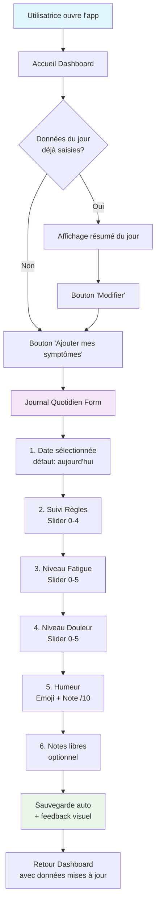
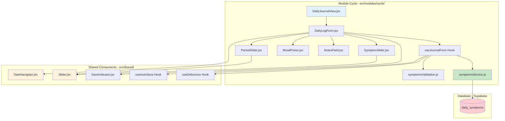
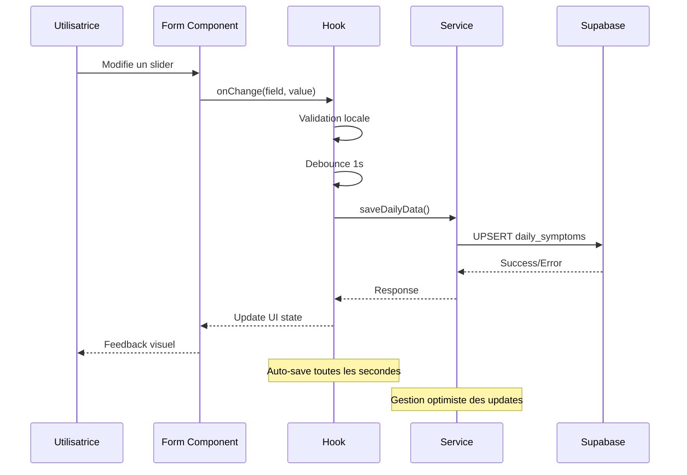
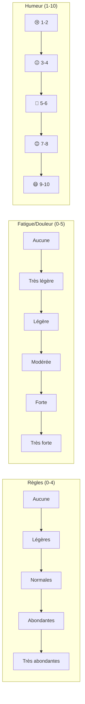

# 📝 Plan de Développement - Feature Journal Quotidien (MVP v1.0)

## 🎯 Vue d'ensemble

### Description de la Feature
Interface simple permettant à l'utilisatrice de noter quotidiennement ses symptômes SOPK : règles, fatigue, douleurs et humeur en moins de 2 minutes.

### Valeur Utilisateur
- **Compréhension** : Traquer ses patterns personnels sans complexité
- **Routine** : Créer l'habitude du suivi sans culpabilité
- **Données** : Alimenter les autres features avec des données de qualité

### Score RICE
- **Reach** : 5/5 (100% des utilisatrices)
- **Impact** : 5/5 (besoin fondamental)
- **Confidence** : 5/5 (feature éprouvée)
- **Effort** : 2/5 (implémentation simple)
- **Score Final** : **62.5** ✅ **Priorité #1**

---

## 🔄 Diagrammes de Flux

### User Journey - Saisie Quotidienne



### Architecture Technique



### Flux de Données



---

## 🏗️ Architecture Technique

### Structure des Données

```sql
-- Table principale pour cette feature
CREATE TABLE daily_symptoms (
  id UUID PRIMARY KEY DEFAULT gen_random_uuid(),
  user_id UUID REFERENCES auth.users(id) ON DELETE CASCADE,
  date DATE NOT NULL,

  -- Données spécifiques au journal quotidien
  period_flow INTEGER CHECK (period_flow >= 0 AND period_flow <= 4),
  fatigue_level INTEGER CHECK (fatigue_level >= 0 AND fatigue_level <= 5),
  pain_level INTEGER CHECK (pain_level >= 0 AND pain_level <= 5),
  mood_score INTEGER CHECK (mood_score >= 1 AND mood_score <= 10),
  mood_emoji VARCHAR(10),
  notes TEXT,

  created_at TIMESTAMP WITH TIME ZONE DEFAULT NOW(),
  updated_at TIMESTAMP WITH TIME ZONE DEFAULT NOW(),
  UNIQUE(user_id, date)
);
```

### Structure Modulaire

#### Module Cycle (`src/modules/cycle/`)
```
src/modules/cycle/
├── components/
│   ├── DailyLogForm.jsx           # Formulaire principal
│   ├── PeriodSlider.jsx          # Slider règles (0-4)
│   ├── SymptomSlider.jsx         # Slider fatigue/douleur (0-5)
│   ├── MoodPicker.jsx            # Emoji + note sur 10
│   └── NotesField.jsx            # Zone texte libre
├── hooks/
│   ├── useJournalForm.js         # Hook de gestion du form
│   └── useDailySymptoms.js       # Hook données quotidiennes
├── services/
│   └── symptomsService.js        # API calls pour symptoms
├── types/
│   └── symptoms.types.js         # Types pour les symptômes
├── views/
│   └── DailyJournalView.jsx      # Point d'entrée principal
└── utils/
    ├── symptomsValidation.js     # Validation Zod
    └── symptomsHelpers.js        # Helpers calculs
```

#### Composants Partagés (`src/shared/`)
```
src/shared/
├── components/
│   ├── selectors/
│   │   └── DateNavigator.jsx     # Navigation dates réutilisable
│   └── ui/
│       ├── Slider.jsx           # Slider générique
│       ├── SaveIndicator.jsx    # Indicateur sauvegarde
│       └── EmojiPicker.jsx      # Picker emoji réutilisable
├── hooks/
│   ├── useAutoSave.js           # Hook auto-save générique
│   └── useDebounce.js           # Hook debounce utilitaire
└── utils/
    ├── dateHelpers.js           # Utilitaires dates
    └── validationSchemas.js     # Schémas Zod communs
```

### Services API

```javascript
// src/modules/cycle/services/symptomsService.js
export const symptomsService = {
  // Sauvegarder/mettre à jour les données du jour
  async saveDailyEntry(userId, date, data) {
    const { error } = await supabase
      .from('daily_symptoms')
      .upsert({
        user_id: userId,
        date,
        ...data,
        updated_at: new Date().toISOString()
      });
    return { error };
  },

  // Récupérer les données d'une date
  async getDailyEntry(userId, date) {
    const { data, error } = await supabase
      .from('daily_symptoms')
      .select('*')
      .eq('user_id', userId)
      .eq('date', date)
      .single();
    return { data, error };
  }
};
```

---

## 🎨 Design UX/UI

### Interface Mobile-First

#### Layout Principal
```
┌─────────────────────────┐
│    📅 Journal du jour    │
├─────────────────────────┤
│  Mer. 13 Sept. 2024    │
│  < Hier    Demain >     │
├─────────────────────────┤
│                         │
│  🩸 Mes règles          │
│  ●○○○○  Aucune         │
│                         │
│  😴 Ma fatigue          │
│  ●●●○○  Modérée        │
│                         │
│  🤕 Mes douleurs        │
│  ●●○○○  Légères        │
│                         │
│  😊 Mon humeur          │
│  [😊] Note: 7/10       │
│                         │
│  📝 Notes (optionnel)   │
│  [Zone de texte]        │
│                         │
│  ✅ Sauvegardé !        │
└─────────────────────────┘
```

#### États des Sliders



### Design System - Couleurs

```css
:root {
  /* Couleurs par symptôme */
  --period-color: #F8BBD9;      /* Rose doux */
  --fatigue-color: #B8E6B8;     /* Vert apaisant */
  --pain-color: #FFD1A9;        /* Orange doux */
  --mood-happy: #A8DADC;        /* Bleu calme */

  /* États des sliders */
  --slider-track: #F1F3F4;      /* Fond inactif */
  --slider-active: var(--period-color); /* Dynamique selon le symptôme */

  /* Feedback */
  --success-green: #4CAF50;     /* Sauvegardé */
  --warning-orange: #FF9800;    /* Attention */
}
```

---

## 📱 User Stories Détaillées

### US1: Saisie Rapide
**En tant qu'** utilisatrice SOPK
**Je veux** noter mes symptômes en moins de 2 minutes
**Afin de** maintenir une routine sans contrainte

**Critères d'acceptation** :
- [ ] Le formulaire s'ouvre directement sur la date du jour
- [ ] Tous les champs sont visibles sans scroll sur mobile
- [ ] La sauvegarde est automatique (pas de bouton "Enregistrer")
- [ ] Un feedback visuel confirme la sauvegarde
- [ ] Je peux modifier les données des 7 derniers jours

### US2: Navigation Temporelle
**En tant qu'** utilisatrice
**Je veux** pouvoir saisir des données pour d'autres jours
**Afin de** rattraper les jours oubliés

**Critères d'acceptation** :
- [ ] Je peux naviguer avec des boutons < Hier / Demain >
- [ ] La date actuelle est claire et bien visible
- [ ] Les jours avec données existantes sont indiqués visuellement
- [ ] Je ne peux pas saisir de données futures (> aujourd'hui)

### US3: Expérience Intuitive
**En tant qu'** utilisatrice non-technique
**Je veux** une interface évidente sans apprentissage
**Afin de** me concentrer sur mon bien-être

**Critères d'acceptation** :
- [ ] Chaque slider a des labels explicites ("Aucune", "Légère", etc.)
- [ ] Les émojis humeur sont compréhensibles universellement
- [ ] Les couleurs suivent les conventions (rouge = douleur, vert = énergie)
- [ ] Pas de jargon médical, langage bienveillant
- [ ] Le champ notes est clairement optionnel

---

## 🛠️ Implémentation Détaillée

### Sprint 1: Fondations (Semaine 1)
**Objectif** : Structure modulaire de base fonctionnelle

**Tâches** :
1. **Setup base de données**
   ```sql
   -- Création table + RLS policies
   ALTER TABLE daily_symptoms ENABLE ROW LEVEL SECURITY;
   CREATE POLICY "Users see own symptoms" ON daily_symptoms
     FOR ALL USING (auth.uid() = user_id);
   ```

2. **Structure modulaire cycle**
   ```
   src/modules/cycle/
   ├── views/DailyJournalView.jsx    # Point d'entrée
   ├── services/symptomsService.js   # API layer
   ├── types/symptoms.types.js       # Types/schemas
   └── utils/symptomsValidation.js   # Validation Zod
   ```

3. **Composants partagés de base**
   ```
   src/shared/
   ├── components/ui/Slider.jsx      # Slider générique
   ├── hooks/useAutoSave.js          # Hook auto-save
   └── utils/dateHelpers.js          # Utilitaires dates
   ```

4. **Service API minimal**
   ```javascript
   // src/modules/cycle/services/symptomsService.js
   const mockData = {
     date: '2024-09-13',
     period_flow: 2,
     fatigue_level: 3,
     pain_level: 1,
     mood_score: 7,
     mood_emoji: '😊'
   };
   ```

### Sprint 2: Interface (Semaine 2)
**Objectif** : UX/UI finalisée avec composants modulaires

**Tâches** :
1. **Composants spécifiques au module cycle**
   ```jsx
   // src/modules/cycle/components/SymptomSlider.jsx
   import { Slider } from '../../../shared/components/ui/Slider';

   const SymptomSlider = ({ label, value, onChange, max = 5 }) => {
     const labels = ['Aucune', 'Très légère', 'Légère', 'Modérée', 'Forte', 'Très forte'];

     return (
       <Slider
         label={label}
         value={value}
         onChange={onChange}
         max={max}
         labels={labels}
         variant="symptom"
       />
     );
   };
   ```

2. **Navigation dates partagée**
   ```jsx
   // src/shared/components/selectors/DateNavigator.jsx
   import { isToday, subDays, addDays, format } from 'date-fns';
   import { fr } from 'date-fns/locale';

   export const DateNavigator = ({ currentDate, onDateChange }) => {
     const canGoNext = !isToday(currentDate);

     return (
       <div className="flex justify-between items-center mb-4">
         <button onClick={() => onDateChange(subDays(currentDate, 1))}>
           ← Hier
         </button>
         <h2 className="text-lg font-medium">
           {format(currentDate, 'EEEE d MMMM', { locale: fr })}
         </h2>
         <button
           onClick={() => onDateChange(addDays(currentDate, 1))}
           disabled={!canGoNext}
           className={!canGoNext ? 'opacity-50' : ''}
         >
           Demain →
         </button>
       </div>
     );
   };
   ```

3. **Hook de formulaire spécifique**
   ```jsx
   // src/modules/cycle/hooks/useJournalForm.js
   import { useAutoSave } from '../../../shared/hooks/useAutoSave';
   import { symptomsService } from '../services/symptomsService';
   ```

### Sprint 3: Logique Métier (Semaine 3)
**Objectif** : Intégration hooks partagés et logique métier

**Tâches** :
1. **Hook de gestion formulaire avec architecture modulaire**
   ```javascript
   // src/modules/cycle/hooks/useJournalForm.js
   import { useState } from 'react';
   import { useAutoSave } from '../../../shared/hooks/useAutoSave';
   import { symptomsService } from '../services/symptomsService';
   import { validateDailySymptoms } from '../utils/symptomsValidation';

   export const useJournalForm = (initialDate = new Date()) => {
     const [formData, setFormData] = useState({});
     const [currentDate, setCurrentDate] = useState(initialDate);

     // Utilisation du hook auto-save partagé
     const { saveStatus, triggerSave } = useAutoSave({
       saveFunction: async (data) => {
         const validatedData = validateDailySymptoms(data);
         return symptomsService.saveDailyEntry(user.id, currentDate, validatedData);
       },
       debounceMs: 1000
     });

     const updateField = (field, value) => {
       const newData = { ...formData, [field]: value };
       setFormData(newData);
       triggerSave(newData);
     };

     return { formData, currentDate, saveStatus, updateField, setCurrentDate };
   };
   ```

2. **Composant d'indicateur partagé**
   ```jsx
   // src/shared/components/ui/SaveIndicator.jsx
   export const SaveIndicator = ({ status }) => {
     const statusConfig = {
       idle: { icon: '', text: '', color: '' },
       saving: { icon: '⏳', text: 'Sauvegarde...', color: 'text-yellow-600' },
       saved: { icon: '✅', text: 'Sauvegardé !', color: 'text-green-600' },
       error: { icon: '⚠️', text: 'Erreur réseau', color: 'text-red-600' }
     };

     const config = statusConfig[status];
     return config.text ? (
       <div className={`text-sm ${config.color} flex items-center gap-1`}>
         <span>{config.icon}</span>
         <span>{config.text}</span>
       </div>
     ) : null;
   };
   ```

3. **Point d'entrée principal du module**
   ```jsx
   // src/modules/cycle/views/DailyJournalView.jsx
   import { DailyLogForm } from '../components/DailyLogForm';
   import { DateNavigator } from '../../../shared/components/selectors/DateNavigator';
   import { SaveIndicator } from '../../../shared/components/ui/SaveIndicator';
   import { useJournalForm } from '../hooks/useJournalForm';

   export const DailyJournalView = () => {
     const { formData, currentDate, saveStatus, updateField, setCurrentDate } = useJournalForm();

     return (
       <div className="max-w-md mx-auto p-4">
         <DateNavigator currentDate={currentDate} onDateChange={setCurrentDate} />
         <DailyLogForm data={formData} onFieldChange={updateField} />
         <SaveIndicator status={saveStatus} />
       </div>
     );
   };
   ```

---

## 🧪 Tests & Validation

### Tests Unitaires (Vitest)
```javascript
describe('useJournalForm Hook', () => {
  test('met à jour un champ et déclenche la sauvegarde', async () => {
    const { result } = renderHook(() => useJournalForm());

    act(() => {
      result.current.updateField('fatigue_level', 3);
    });

    expect(result.current.formData.fatigue_level).toBe(3);
    expect(result.current.saveStatus).toBe('saving');

    // Attendre le debounce + API call
    await waitFor(() => {
      expect(result.current.saveStatus).toBe('saved');
    });
  });

  test('valide les données avant sauvegarde', () => {
    const invalidData = { mood_score: 11 }; // > 10
    expect(() => validateDailySymptoms(invalidData)).toThrow();
  });
});
```

### Tests d'Intégration
```javascript
describe('Journal Feature E2E', () => {
  test('flow complet de saisie', async () => {
    render(<DailyJournalPage />);

    // Saisir les données
    const fatigueSlider = screen.getByLabelText(/fatigue/i);
    fireEvent.change(fatigueSlider, { target: { value: '3' } });

    const moodButton = screen.getByText('😊');
    fireEvent.click(moodButton);

    // Vérifier sauvegarde
    await waitFor(() => {
      expect(screen.getByText('Sauvegardé !')).toBeInTheDocument();
    });

    // Vérifier données en base
    const savedData = await journalService.getDailyEntry(testUser.id, today());
    expect(savedData.data.fatigue_level).toBe(3);
  });
});
```

### Critères de Validation MVP
- [ ] **Performance** : Sauvegarde < 500ms sur 3G
- [ ] **UX** : 90% des utilisatrices complètent la saisie en < 2min
- [ ] **Fiabilité** : 0% de perte de données lors de la saisie
- [ ] **Accessibilité** : Compatible lecteurs d'écran
- [ ] **Mobile** : Responsive parfait sur iOS/Android

---

## 🚀 Déploiement & Monitoring

### Variables d'Environnement
```env
# Auto-save configuration
VITE_DEBOUNCE_DELAY=1000
VITE_RETRY_ATTEMPTS=3

# Feature flags
VITE_ENABLE_OFFLINE_MODE=false
VITE_ENABLE_ADVANCED_MOOD=false
```

### Métriques Clés
```javascript
// Analytics events
const trackJournalEvents = {
  journal_opened: (date) => analytics.track('Journal Opened', { date }),
  field_updated: (field, value) => analytics.track('Field Updated', { field, value }),
  auto_save_success: (duration) => analytics.track('Auto Save Success', { duration }),
  auto_save_failed: (error) => analytics.track('Auto Save Failed', { error }),
  navigation_used: (direction) => analytics.track('Date Navigation', { direction })
};
```

### Dashboard Monitoring
- **Engagement** : % utilisatrices saisissant > 4 jours/semaine
- **Performance** : Temps moyen de saisie
- **Erreurs** : Taux d'échec de sauvegarde
- **UX** : Heatmap des interactions (quels champs le plus utilisés)

---

## 🔄 Évolutions Post-MVP

### Version 1.1
- **Saisie vocale** pour les notes libres
- **Rappels intelligents** basés sur l'historique
- **Mode hors-ligne** avec synchronisation

### Version 1.2
- **Templates de notes** ("Crampes fortes", "Envie de sucre")
- **Export CSV** des données saisies
- **Synchronisation wearables** (Apple Health, Fitbit)

---

## ✅ Definition of Done

### Critères Techniques
- [ ] Code reviewé et couvert à 85%+ par les tests
- [ ] Performance validée sur mobile (Core Web Vitals)
- [ ] Accessible WCAG 2.1 AA
- [ ] Documentation complète (README + Storybook)
- [ ] Déployé avec feature flag activé

### Critères Utilisateur
- [ ] Onboarding intégré et testé
- [ ] Messages d'erreur en français, bienveillants
- [ ] Tests utilisateur > 4.2/5 satisfaction
- [ ] Support offline basique fonctionnel
- [ ] Guideline design system respecté

### Critères Business
- [ ] Métriques tracking configurées
- [ ] A/B test infrastructure prête
- [ ] Plan de rollback validé
- [ ] Formation support client effectuée

---

*📋 Ce plan se concentre uniquement sur la feature "Journal Quotidien" et sera complété par les autres features du module dans des plans séparés.*