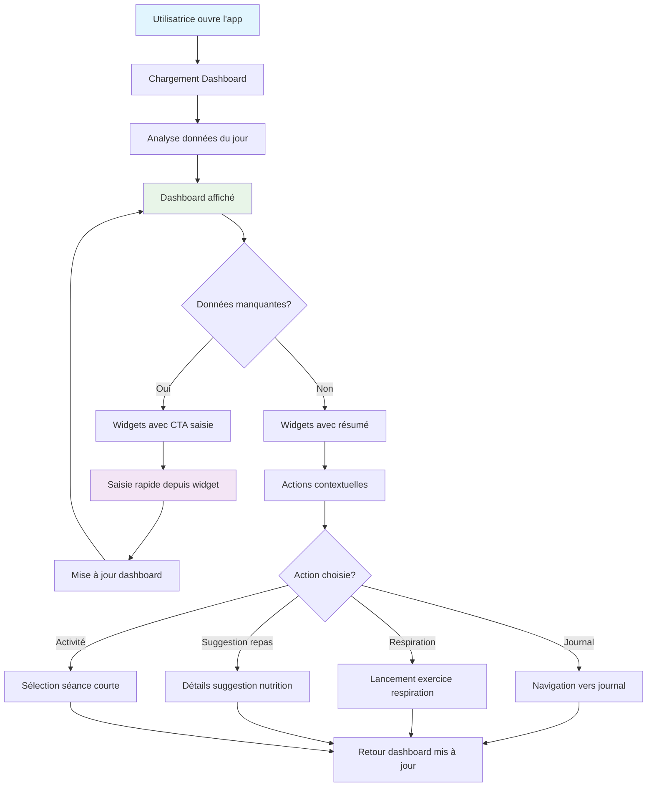
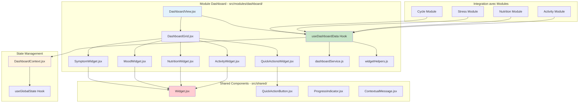
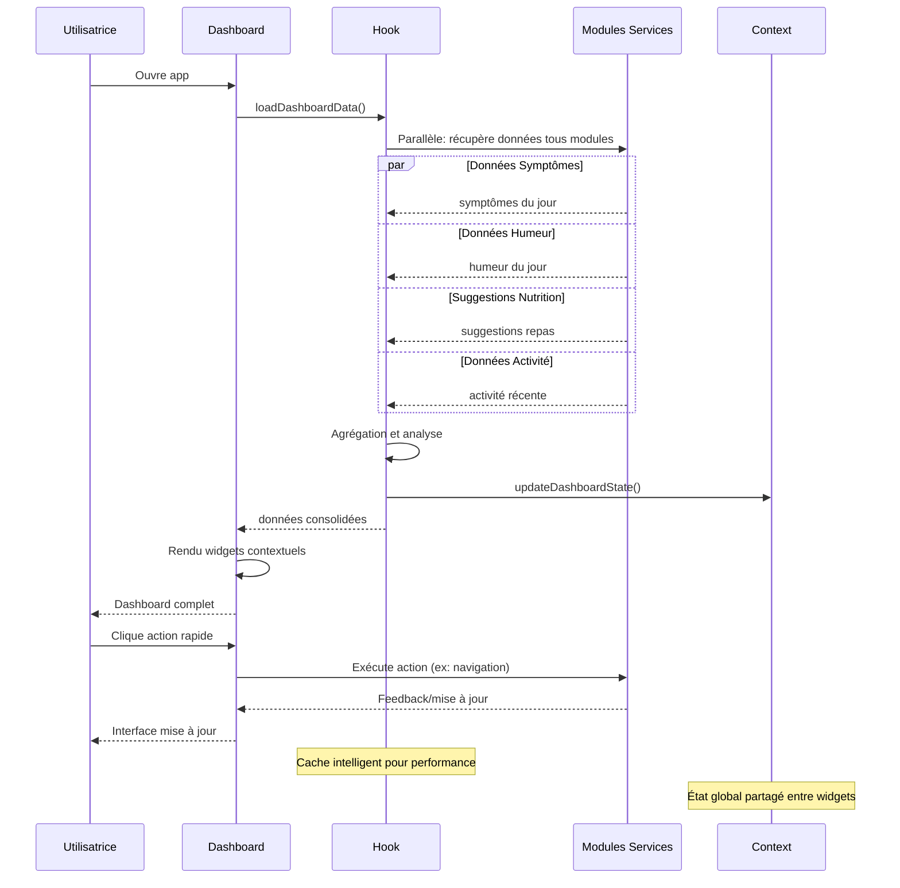

# 📝 Plan de Développement - Feature Dashboard Vue Quotidienne (MVP v1.0)

## 🎯 Vue d'ensemble

### Description de la Feature
Interface centrale qui agrège et affiche en un coup d'œil tous les modules du jour : symptômes, humeur, suggestions repas, exercices, avec un design épuré et actions rapides.

### Valeur Utilisateur
- **Vision globale** : Comprendre son état du jour en 30 secondes
- **Actions rapides** : Accéder aux outils utiles sans navigation complexe
- **Motivation** : Voir ses progrès et garder l'engagement quotidien

### Score RICE
- **Reach** : 5/5 (100% des utilisatrices voient le dashboard)
- **Impact** : 4/5 (hub central, détermine l'engagement)
- **Confidence** : 4/5 (pattern dashboard connu)
- **Effort** : 2/5 (agrégation de composants existants)
- **Score Final** : **40** ✅ **Priorité #4**

---

## 🔄 Diagrammes de Flux

### User Journey - Consultation Dashboard



### Architecture Technique



### Flux de Données



---

## 🏗️ Architecture Technique

### Structure des Données

```sql
-- Vue matérialisée pour performance dashboard (optionnel pour MVP)
CREATE MATERIALIZED VIEW user_dashboard_summary AS
SELECT
    u.id as user_id,
    CURRENT_DATE as date,

    -- Symptômes du jour
    ds.period_flow,
    ds.fatigue_level,
    ds.pain_level,
    ds.mood_score,
    ds.mood_emoji,

    -- Stats récentes (7 derniers jours)
    COUNT(DISTINCT ds_week.date) as journal_consistency,
    COUNT(DISTINCT bs.id) as breathing_sessions_week,
    COUNT(DISTINCT mt.id) as meals_tracked_week,

    -- Moyennes
    AVG(ds_week.mood_score) as avg_mood_week,
    AVG(ds_week.fatigue_level) as avg_fatigue_week

FROM auth.users u
LEFT JOIN daily_symptoms ds ON ds.user_id = u.id AND ds.date = CURRENT_DATE
LEFT JOIN daily_symptoms ds_week ON ds_week.user_id = u.id
    AND ds_week.date >= CURRENT_DATE - INTERVAL '7 days'
LEFT JOIN breathing_sessions bs ON bs.user_id = u.id
    AND DATE(bs.created_at) >= CURRENT_DATE - INTERVAL '7 days'
LEFT JOIN user_meal_tracking mt ON mt.user_id = u.id
    AND mt.date >= CURRENT_DATE - INTERVAL '7 days'
GROUP BY u.id, ds.period_flow, ds.fatigue_level, ds.pain_level, ds.mood_score, ds.mood_emoji;

-- Index pour performance
CREATE INDEX idx_dashboard_summary_user_date ON user_dashboard_summary(user_id, date);
```

### Structure Modulaire

#### Module Dashboard (`src/modules/dashboard/`)
```
src/modules/dashboard/
├── components/
│   ├── widgets/
│   │   ├── SymptomWidget.jsx          # Widget journal quotidien
│   │   ├── MoodWidget.jsx             # Widget humeur + suggestions
│   │   ├── NutritionWidget.jsx        # Widget suggestions repas
│   │   ├── ActivityWidget.jsx         # Widget activité physique
│   │   ├── QuickActionsWidget.jsx     # Actions rapides
│   │   └── WelcomeWidget.jsx          # Message d'accueil contextuel
│   ├── grid/
│   │   ├── DashboardGrid.jsx          # Layout responsive widgets
│   │   ├── WidgetContainer.jsx        # Container générique widget
│   │   └── EmptyState.jsx             # État vide première utilisation
│   └── insights/
│       ├── WeeklyInsights.jsx         # Insights hebdomadaires
│       └── ProgressIndicators.jsx     # Indicateurs de progression
├── hooks/
│   ├── useDashboardData.js            # Hook principal données
│   ├── useWidgetData.js               # Hook données spécifiques widgets
│   ├── useDashboardActions.js         # Hook actions rapides
│   └── useDashboardInsights.js        # Hook calculs insights
├── services/
│   ├── dashboardService.js            # Agrégation données modules
│   └── insightsService.js             # Calculs métriques et insights
├── context/
│   └── DashboardContext.jsx           # Context global dashboard
├── types/
│   └── dashboard.types.js             # Types dashboard et widgets
├── views/
│   └── DashboardView.jsx              # Point d'entrée principal
└── utils/
    ├── widgetHelpers.js               # Helpers logique widgets
    ├── dashboardLayout.js             # Logique layout responsive
    └── contextualMessages.js          # Messages contextuels
```

#### Extension Composants Partagés (`src/shared/`)
```
src/shared/
├── components/
│   ├── widgets/
│   │   ├── Widget.jsx                 # Container widget générique
│   │   ├── WidgetHeader.jsx           # Header avec titre + actions
│   │   ├── WidgetContent.jsx          # Zone contenu widget
│   │   └── WidgetFooter.jsx           # Footer avec CTA
│   ├── ui/
│   │   ├── QuickActionButton.jsx      # Boutons actions rapides
│   │   ├── ProgressRing.jsx           # Anneaux de progression
│   │   ├── TrendIndicator.jsx         # Flèches tendances ↗️↘️
│   │   └── ContextualMessage.jsx      # Messages adaptatifs
│   └── layout/
│       ├── ResponsiveGrid.jsx         # Grid responsive générique
│       └── CardContainer.jsx          # Container cartes génériques
├── hooks/
│   ├── useGlobalState.js              # Hook état global app
│   ├── useDailyData.js                # Hook données agrégées jour
│   └── useContextualActions.js        # Hook actions contextuelles
└── utils/
    ├── dateHelpers.js                 # Extensions utilitaires dates
    ├── statsHelpers.js                # Calculs statistiques
    └── layoutHelpers.js               # Helpers responsive layout
```

### Services API

```javascript
// src/modules/dashboard/services/dashboardService.js
export const dashboardService = {
  // Récupérer toutes les données dashboard en une requête
  async getDashboardData(userId, date = new Date()) {
    const dateStr = date.toISOString().split('T')[0];

    // Requête parallèle de toutes les données nécessaires
    const [
      dailySymptoms,
      moodData,
      nutritionSuggestions,
      recentActivity,
      weeklyStats
    ] = await Promise.all([
      // Symptômes du jour
      supabase
        .from('daily_symptoms')
        .select('*')
        .eq('user_id', userId)
        .eq('date', dateStr)
        .single(),

      // Données humeur + récentes pour contexte
      supabase
        .from('mood_entries')
        .select('*')
        .eq('user_id', userId)
        .eq('date', dateStr)
        .single(),

      // Suggestions nutrition contextuelles
      suggestionService.getPersonalizedSuggestions(userId, {
        mealType: 'auto',
        maxCount: 2
      }),

      // Activité récente
      supabase
        .from('breathing_sessions')
        .select('*')
        .eq('user_id', userId)
        .gte('created_at', `${dateStr}T00:00:00`)
        .order('created_at', { ascending: false })
        .limit(3),

      // Stats hebdomadaires pour insights
      this.getWeeklyStats(userId, date)
    ]);

    return {
      date: dateStr,
      symptoms: dailySymptoms.data,
      mood: moodData.data,
      nutritionSuggestions: nutritionSuggestions.data || [],
      todayActivity: recentActivity.data || [],
      weeklyStats: weeklyStats.data || {}
    };
  },

  // Calculer stats hebdomadaires pour insights
  async getWeeklyStats(userId, endDate = new Date()) {
    const weekStart = new Date(endDate);
    weekStart.setDate(weekStart.getDate() - 6);

    const weekStartStr = weekStart.toISOString().split('T')[0];
    const endDateStr = endDate.toISOString().split('T')[0];

    const [symptomsWeek, breathingWeek, mealsWeek] = await Promise.all([
      supabase
        .from('daily_symptoms')
        .select('date, mood_score, fatigue_level, pain_level')
        .eq('user_id', userId)
        .gte('date', weekStartStr)
        .lte('date', endDateStr),

      supabase
        .from('breathing_sessions')
        .select('created_at, technique, completed')
        .eq('user_id', userId)
        .eq('completed', true)
        .gte('created_at', `${weekStartStr}T00:00:00`),

      supabase
        .from('user_meal_tracking')
        .select('date, satisfaction_rating')
        .eq('user_id', userId)
        .gte('date', weekStartStr)
        .lte('date', endDateStr)
    ]);

    // Calculs statistiques
    const symptoms = symptomsWeek.data || [];
    const breathing = breathingWeek.data || [];
    const meals = mealsWeek.data || [];

    return {
      journalConsistency: symptoms.length, // jours remplis sur 7
      avgMood: symptoms.reduce((acc, s) => acc + (s.mood_score || 0), 0) / Math.max(symptoms.length, 1),
      avgFatigue: symptoms.reduce((acc, s) => acc + (s.fatigue_level || 0), 0) / Math.max(symptoms.length, 1),
      breathingSessions: breathing.length,
      mealsTracked: meals.length,
      mealsSatisfaction: meals.reduce((acc, m) => acc + (m.satisfaction_rating || 0), 0) / Math.max(meals.length, 1),

      // Tendances (comparaison 7 jours précédents)
      trends: await this.calculateTrends(userId, weekStart)
    };
  },

  // Calculer tendances pour indicateurs visuels
  async calculateTrends(userId, currentWeekStart) {
    const prevWeekStart = new Date(currentWeekStart);
    prevWeekStart.setDate(prevWeekStart.getDate() - 7);

    const prevWeekEnd = new Date(currentWeekStart);
    prevWeekEnd.setDate(prevWeekEnd.getDate() - 1);

    const prevWeekStats = await this.getWeeklyStats(userId, prevWeekEnd);

    // Comparaison et calcul direction tendances
    return {
      mood: this.getTrendDirection(prevWeekStats.avgMood, currentWeekStats.avgMood),
      fatigue: this.getTrendDirection(prevWeekStats.avgFatigue, currentWeekStats.avgFatigue, true), // inverse pour fatigue
      consistency: this.getTrendDirection(prevWeekStats.journalConsistency, currentWeekStats.journalConsistency)
    };
  },

  getTrendDirection(oldValue, newValue, inverse = false) {
    if (!oldValue || !newValue) return 'stable';

    const diff = newValue - oldValue;
    const threshold = 0.1; // 10% de changement minimum

    if (Math.abs(diff) < threshold) return 'stable';

    if (inverse) {
      return diff > 0 ? 'down' : 'up'; // Pour fatigue: moins = mieux
    } else {
      return diff > 0 ? 'up' : 'down';
    }
  }
};
```

---

## 🎨 Design UX/UI

### Interface Mobile-First

#### Dashboard Principal
```
┌─────────────────────────┐
│   👋 Bonjour Sarah !     │
├─────────────────────────┤
│                         │
│ 📊 Aujourd'hui          │
│ ┌─────────────────────┐ │
│ │ 😊 Humeur: 7/10     │ │
│ │ 😴 Fatigue: 3/5     │ │
│ │ 🔴 Règles: Jour 2   │ │
│ └─────────────────────┘ │
│                         │
│ 🍽️ Idée repas          │
│ ┌─────────────────────┐ │
│ │ Bowl quinoa-avocat  │ │
│ │ ⏱️ 10min • 🟢 IG bas│ │
│ │ [Voir] [✅ Mangé]   │ │
│ └─────────────────────┘ │
│                         │
│ 🧘 Pause bien-être ?    │
│ ┌─────────────────────┐ │
│ │ 🌟 3 sessions       │ │
│ │    cette semaine    │ │
│ │ [🧘 Respiration 5min]│ │
│ └─────────────────────┘ │
│                         │
│ ⚡ Actions rapides       │
│ [📝] [🧘] [🍽️] [🏃] [📊] │
└─────────────────────────┘
```

#### Widgets Adaptatifs selon État

##### Widget Symptômes - Données Manquantes
```
┌─────────────────────────┐
│ 📝 Comment ça va ?      │
├─────────────────────────┤
│                         │
│  Prends 2 minutes pour  │
│  noter ton état du jour │
│                         │
│  ⭐ Aide à mieux te     │
│     comprendre         │
│  ⭐ Améliore suggestions │
│                         │
│  [📝 Compléter journal] │
└─────────────────────────┘
```

##### Widget Symptômes - Données Présentes
```
┌─────────────────────────┐
│ 📊 Ton état du jour     │
├─────────────────────────┤
│                         │
│ 😊 Humeur    7/10 ↗️    │
│ 😴 Fatigue   3/5  ↘️    │
│ 🤕 Douleur   1/5  ↘️    │
│                         │
│ 💚 Belle amélioration   │
│    depuis hier !        │
│                         │
│ [Modifier] [Voir détails]│
└─────────────────────────┘
```

##### Widget Nutrition - Contextuel
```
┌─────────────────────────┐
│ 🍽️ Idée pour ton énergie│
├─────────────────────────┤
│                         │
│ Tu sembles fatiguée...  │
│                         │
│ 🥗 Salade protéinée     │
│ ⏱️ 15 min • 💪 Énergie   │
│                         │
│ [Voir recette]          │
│ [Autres suggestions]    │
│                         │
│ Déjà mangé ? [✅ Oui]   │
└─────────────────────────┘
```

### Design System - Dashboard

```css
:root {
  /* Palette dashboard */
  --dashboard-bg: #FAFBFC;           /* Background principal */
  --widget-bg: #FFFFFF;              /* Background widgets */
  --widget-border: #E8EAED;          /* Bordures widgets */
  --widget-shadow: rgba(0,0,0,0.08); /* Ombre widgets */

  /* Couleurs fonctionnelles */
  --trend-up: #4CAF50;               /* Tendance positive */
  --trend-down: #FF5722;             /* Tendance négative */
  --trend-stable: #9E9E9E;           /* Tendance stable */

  /* Actions rapides */
  --action-journal: #9C27B0;         /* Violet - journal */
  --action-breathing: #2196F3;       /* Bleu - respiration */
  --action-nutrition: #4CAF50;       /* Vert - nutrition */
  --action-activity: #FF9800;        /* Orange - activité */
  --action-stats: #607D8B;           /* Gris - stats */
}

.dashboard-grid {
  display: grid;
  gap: 1rem;
  padding: 1rem;
  grid-template-columns: 1fr;
}

@media (min-width: 768px) {
  .dashboard-grid {
    grid-template-columns: 1fr 1fr;
  }
}

@media (min-width: 1024px) {
  .dashboard-grid {
    grid-template-columns: 2fr 1fr;
  }
}

.widget {
  background: var(--widget-bg);
  border: 1px solid var(--widget-border);
  border-radius: 16px;
  padding: 1.5rem;
  box-shadow: 0 2px 8px var(--widget-shadow);
  transition: all 0.3s ease;
}

.widget:hover {
  box-shadow: 0 4px 16px var(--widget-shadow);
  transform: translateY(-2px);
}

.quick-actions {
  display: flex;
  gap: 0.5rem;
  justify-content: space-around;
  padding: 1rem;
  background: var(--widget-bg);
  border-radius: 16px;
  margin-top: 1rem;
}

.quick-action-btn {
  width: 3rem;
  height: 3rem;
  border-radius: 50%;
  border: none;
  display: flex;
  align-items: center;
  justify-content: center;
  font-size: 1.2rem;
  transition: all 0.2s ease;
}

.quick-action-btn:hover {
  transform: scale(1.1);
}

.trend-indicator.up::before {
  content: "↗️";
  color: var(--trend-up);
}

.trend-indicator.down::before {
  content: "↘️";
  color: var(--trend-down);
}

.trend-indicator.stable::before {
  content: "➡️";
  color: var(--trend-stable);
}
```

---

## 📱 User Stories Détaillées

### US1: Vue d'Ensemble Rapide
**En tant qu'** utilisatrice occupée
**Je veux** comprendre mon état du jour en 30 secondes
**Afin de** savoir quoi prioriser pour mon bien-être

**Critères d'acceptation** :
- [ ] Dashboard charge en < 2 secondes sur 3G
- [ ] Toutes les infos importantes visibles sans scroll
- [ ] Hiérarchie visuelle claire (le plus important en premier)
- [ ] Messages contextuels bienveillants et utiles
- [ ] Actions possibles évidentes à première vue

### US2: Actions Rapides Sans Friction
**En tant qu'** utilisatrice motivée
**Je veux** accéder aux outils en 1-2 clics maximum
**Afin de** maintenir ma routine sans me décourager

**Critères d'acceptation** :
- [ ] Boutons d'actions rapides toujours visibles
- [ ] Navigation directe vers fonctionnalités principales
- [ ] Pas de pop-ups ou d'interruptions intempestives
- [ ] Retour au dashboard préservé après actions
- [ ] États de chargement courts et feedback immédiat

### US3: Encouragement et Progression
**En tant qu'** utilisatrice SOPK en parcours de soins
**Je veux** voir mes progrès et être encouragée
**Afin de** rester motivée sur le long terme

**Critères d'acceptation** :
- [ ] Indicateurs de progression visibles (jours de suivi, etc.)
- [ ] Messages positifs qui célèbrent les petits wins
- [ ] Comparaisons avec données précédentes (tendances)
- [ ] Jamais de culpabilisation ou jugement négatif
- [ ] Suggestions d'amélioration bienveillantes

---

## 🛠️ Implémentation Détaillée

### Sprint 1: Fondation et Layout (Semaine 1)
**Objectif** : Structure de base et grid responsive

**Tâches** :
1. **Architecture modulaire dashboard**
   ```jsx
   // src/modules/dashboard/views/DashboardView.jsx
   import { DashboardGrid } from '../components/grid/DashboardGrid';
   import { useDashboardData } from '../hooks/useDashboardData';
   import { DashboardContext } from '../context/DashboardContext';

   export const DashboardView = () => {
     const dashboardData = useDashboardData();

     return (
       <DashboardContext.Provider value={dashboardData}>
         <div className="dashboard-container">
           <header className="dashboard-header">
             <WelcomeMessage />
           </header>

           <main className="dashboard-main">
             <DashboardGrid />
           </main>

           <footer className="dashboard-footer">
             <QuickActionsWidget />
           </footer>
         </div>
       </DashboardContext.Provider>
     );
   };
   ```

2. **Hook principal de données**
   ```javascript
   // src/modules/dashboard/hooks/useDashboardData.js
   import { useState, useEffect } from 'react';
   import { dashboardService } from '../services/dashboardService';
   import { useAuth } from '../../../shared/hooks/useAuth';

   export const useDashboardData = () => {
     const [data, setData] = useState(null);
     const [loading, setLoading] = useState(true);
     const [error, setError] = useState(null);
     const [lastRefresh, setLastRefresh] = useState(new Date());

     const { user } = useAuth();

     const loadDashboardData = async (force = false) => {
       if (!user?.id) return;

       // Cache simple basé sur timestamp (éviter requêtes multiples)
       const now = new Date();
       const cacheValid = (now - lastRefresh) < 300000; // 5 minutes

       if (!force && cacheValid && data) return;

       setLoading(true);
       setError(null);

       try {
         const dashboardData = await dashboardService.getDashboardData(user.id);
         setData(dashboardData);
         setLastRefresh(now);
       } catch (err) {
         setError(err);
         console.error('Erreur chargement dashboard:', err);
       } finally {
         setLoading(false);
       }
     };

     const refreshDashboard = () => loadDashboardData(true);

     useEffect(() => {
       loadDashboardData();
     }, [user?.id]);

     // Auto-refresh données si l'app revient au premier plan
     useEffect(() => {
       const handleFocus = () => {
         const timeSinceLastRefresh = new Date() - lastRefresh;
         if (timeSinceLastRefresh > 600000) { // 10 minutes
           loadDashboardData(true);
         }
       };

       window.addEventListener('focus', handleFocus);
       return () => window.removeEventListener('focus', handleFocus);
     }, [lastRefresh]);

     return {
       data,
       loading,
       error,
       refreshDashboard,
       lastRefresh
     };
   };
   ```

3. **Grid responsive générique**
   ```jsx
   // src/modules/dashboard/components/grid/DashboardGrid.jsx
   import { SymptomWidget } from '../widgets/SymptomWidget';
   import { MoodWidget } from '../widgets/MoodWidget';
   import { NutritionWidget } from '../widgets/NutritionWidget';
   import { ActivityWidget } from '../widgets/ActivityWidget';

   export const DashboardGrid = () => {
     return (
       <div className="dashboard-grid">
         {/* Widget principal - Symptômes/État du jour */}
         <div className="widget-area-primary">
           <SymptomWidget />
         </div>

         {/* Widget secondaires */}
         <div className="widget-area-secondary">
           <NutritionWidget />
           <ActivityWidget />
         </div>

         {/* Widgets tertaires (insights, stats) */}
         <div className="widget-area-tertiary">
           <WeeklyInsights />
         </div>
       </div>
     );
   };
   ```

### Sprint 2: Widgets Fonctionnels (Semaine 2)
**Objectif** : Implémentation de tous les widgets avec données réelles

**Tâches** :
1. **Widget Symptômes avec états adaptatifs**
   ```jsx
   // src/modules/dashboard/components/widgets/SymptomWidget.jsx
   import { Widget } from '../../../../shared/components/widgets/Widget';
   import { TrendIndicator } from '../../../../shared/components/ui/TrendIndicator';
   import { useDashboardContext } from '../../context/DashboardContext';

   export const SymptomWidget = () => {
     const { data, loading } = useDashboardContext();
     const { symptoms, weeklyStats } = data || {};

     // État vide - Incitation à compléter
     if (!symptoms) {
       return (
         <Widget
           title="📝 Comment ça va ?"
           className="symptom-widget-empty"
         >
           <div className="text-center py-4">
             <p className="text-gray-600 mb-4">
               Prends 2 minutes pour noter ton état du jour
             </p>
             <div className="space-y-2 mb-4">
               <div className="flex items-center justify-center gap-2 text-sm text-gray-500">
                 <span>⭐</span>
                 <span>Aide à mieux te comprendre</span>
               </div>
               <div className="flex items-center justify-center gap-2 text-sm text-gray-500">
                 <span>⭐</span>
                 <span>Améliore tes suggestions</span>
               </div>
             </div>
             <button
               onClick={() => navigate('/journal')}
               className="bg-purple-500 text-white px-6 py-3 rounded-lg font-medium hover:bg-purple-600"
             >
               📝 Compléter journal
             </button>
           </div>
         </Widget>
       );
     }

     // État avec données
     return (
       <Widget
         title="📊 Ton état du jour"
         className="symptom-widget-filled"
         actions={[
           { label: 'Modifier', onClick: () => navigate('/journal') }
         ]}
       >
         <div className="space-y-3">
           <div className="flex justify-between items-center">
             <span className="flex items-center gap-2">
               <span>😊</span>
               <span>Humeur</span>
             </span>
             <span className="flex items-center gap-2 font-medium">
               <span>{symptoms.mood_score}/10</span>
               <TrendIndicator direction={weeklyStats?.trends?.mood} />
             </span>
           </div>

           <div className="flex justify-between items-center">
             <span className="flex items-center gap-2">
               <span>😴</span>
               <span>Fatigue</span>
             </span>
             <span className="flex items-center gap-2 font-medium">
               <span>{symptoms.fatigue_level}/5</span>
               <TrendIndicator direction={weeklyStats?.trends?.fatigue} />
             </span>
           </div>

           {symptoms.pain_level > 0 && (
             <div className="flex justify-between items-center">
               <span className="flex items-center gap-2">
                 <span>🤕</span>
                 <span>Douleur</span>
               </span>
               <span className="font-medium">
                 {symptoms.pain_level}/5
               </span>
             </div>
           )}

           {this.getContextualMessage(symptoms, weeklyStats) && (
             <div className="mt-4 p-3 bg-green-50 rounded-lg">
               <p className="text-sm text-green-700">
                 💚 {this.getContextualMessage(symptoms, weeklyStats)}
               </p>
             </div>
           )}
         </div>
       </Widget>
     );
   };
   ```

2. **Widget Nutrition avec suggestions contextuelles**
   ```jsx
   // src/modules/dashboard/components/widgets/NutritionWidget.jsx
   import { useMealSuggestions } from '../../../nutrition/hooks/useMealSuggestions';

   export const NutritionWidget = () => {
     const { data } = useDashboardContext();
     const { symptoms } = data || {};

     const { suggestions, trackMealChosen } = useMealSuggestions({
       symptoms: symptoms ? this.extractSymptomsList(symptoms) : [],
       mealType: 'auto',
       maxCount: 1
     });

     const primarySuggestion = suggestions[0];

     if (!primarySuggestion) {
       return (
         <Widget title="🍽️ Nutrition" className="nutrition-widget-empty">
           <div className="text-center py-4">
             <p className="text-gray-600 mb-3">Aucune suggestion pour le moment</p>
             <button
               onClick={() => navigate('/nutrition/suggestions')}
               className="text-blue-600 text-sm hover:underline"
             >
               Voir toutes les suggestions →
             </button>
           </div>
         </Widget>
       );
     }

     return (
       <Widget
         title={this.getNutritionTitle(symptoms)}
         className="nutrition-widget"
       >
         <div className="space-y-3">
           {symptoms && (
             <p className="text-sm text-gray-600">
               {this.getContextMessage(symptoms)}
             </p>
           )}

           <div className="bg-gray-50 rounded-lg p-3">
             <h4 className="font-medium mb-2">🥗 {primarySuggestion.name}</h4>

             <div className="flex gap-2 mb-3 text-sm">
               <span className="bg-white px-2 py-1 rounded">
                 ⏱️ {primarySuggestion.prepTimeMinutes} min
               </span>
               {primarySuggestion.glycemicIndex === 'low' && (
                 <span className="bg-green-100 text-green-700 px-2 py-1 rounded">
                   🟢 IG bas
                 </span>
               )}
             </div>

             <div className="flex gap-2">
               <button
                 onClick={() => navigate(`/nutrition/meals/${primarySuggestion.id}`)}
                 className="flex-1 bg-blue-50 text-blue-600 py-2 px-3 rounded text-sm font-medium"
               >
                 Voir recette
               </button>
               <button
                 onClick={() => trackMealChosen(primarySuggestion.id, primarySuggestion.category)}
                 className="bg-green-500 text-white px-3 py-2 rounded text-sm font-medium"
               >
                 ✅ Mangé
               </button>
             </div>
           </div>

           <button
             onClick={() => navigate('/nutrition/suggestions')}
             className="w-full text-center text-blue-600 text-sm hover:underline"
           >
             Autres suggestions
           </button>
         </div>
       </Widget>
     );
   };
   ```

### Sprint 3: Actions Rapides et Polish (Semaine 3)
**Objectif** : Navigation fluide et expérience utilisateur finalisée

**Tâches** :
1. **Widget Actions Rapides**
   ```jsx
   // src/modules/dashboard/components/widgets/QuickActionsWidget.jsx
   export const QuickActionsWidget = () => {
     const actions = [
       {
         icon: '📝',
         label: 'Journal',
         color: 'var(--action-journal)',
         path: '/journal',
         shortcut: 'j'
       },
       {
         icon: '🧘',
         label: 'Respiration',
         color: 'var(--action-breathing)',
         action: () => navigate('/stress/breathing/coherence'), // Direct vers technique populaire
         shortcut: 'r'
       },
       {
         icon: '🍽️',
         label: 'Nutrition',
         color: 'var(--action-nutrition)',
         path: '/nutrition/suggestions',
         shortcut: 'n'
       },
       {
         icon: '🏃',
         label: 'Activité',
         color: 'var(--action-activity)',
         path: '/activity',
         shortcut: 'a'
       },
       {
         icon: '📊',
         label: 'Insights',
         color: 'var(--action-stats)',
         path: '/insights',
         shortcut: 's'
       }
     ];

     return (
       <div className="quick-actions">
         {actions.map(action => (
           <QuickActionButton
             key={action.label}
             {...action}
             onClick={action.action || (() => navigate(action.path))}
           />
         ))}
       </div>
     );
   };
   ```

2. **Insights hebdomadaires**
   ```jsx
   // src/modules/dashboard/components/insights/WeeklyInsights.jsx
   export const WeeklyInsights = () => {
     const { data } = useDashboardContext();
     const { weeklyStats } = data || {};

     if (!weeklyStats) return null;

     const insights = [
       {
         metric: 'Régularité journal',
         value: `${weeklyStats.journalConsistency}/7 jours`,
         trend: weeklyStats.trends?.consistency,
         good: weeklyStats.journalConsistency >= 5
       },
       {
         metric: 'Humeur moyenne',
         value: `${weeklyStats.avgMood?.toFixed(1)}/10`,
         trend: weeklyStats.trends?.mood,
         good: weeklyStats.avgMood >= 6
       },
       {
         metric: 'Sessions respiration',
         value: `${weeklyStats.breathingSessions}`,
         trend: 'stable',
         good: weeklyStats.breathingSessions >= 3
       }
     ];

     return (
       <Widget title="📈 Cette semaine" className="insights-widget">
         <div className="space-y-3">
           {insights.map(insight => (
             <div key={insight.metric} className="flex justify-between items-center">
               <span className="text-sm text-gray-600">{insight.metric}</span>
               <div className="flex items-center gap-2">
                 <span className={`font-medium ${insight.good ? 'text-green-600' : 'text-gray-800'}`}>
                   {insight.value}
                 </span>
                 <TrendIndicator direction={insight.trend} />
               </div>
             </div>
           ))}

           {weeklyStats.journalConsistency >= 5 && (
             <div className="mt-4 p-3 bg-blue-50 rounded-lg">
               <p className="text-sm text-blue-700">
                 🌟 Excellent suivi cette semaine ! Continue comme ça.
               </p>
             </div>
           )}
         </div>
       </Widget>
     );
   };
   ```

---

## 🧪 Tests & Validation

### Tests Unitaires (Vitest)
```javascript
describe('useDashboardData Hook', () => {
  test('charge les données dashboard au montage', async () => {
    const mockUser = { id: 'user-123' };
    mockAuthHook.mockReturnValue({ user: mockUser });

    const { result } = renderHook(() => useDashboardData());

    expect(result.current.loading).toBe(true);

    await waitFor(() => {
      expect(result.current.loading).toBe(false);
      expect(result.current.data).toBeDefined();
    });

    expect(mockDashboardService.getDashboardData).toHaveBeenCalledWith(mockUser.id);
  });

  test('met en cache les données pour éviter requêtes multiples', async () => {
    const { result } = renderHook(() => useDashboardData());

    await waitFor(() => {
      expect(result.current.loading).toBe(false);
    });

    // Simuler un re-render rapide
    result.rerender();

    // Pas de nouvelle requête si cache valide (< 5 min)
    expect(mockDashboardService.getDashboardData).toHaveBeenCalledTimes(1);
  });
});

describe('SymptomWidget', () => {
  test('affiche CTA si pas de données symptômes', () => {
    const mockContext = { data: { symptoms: null } };

    render(<SymptomWidget />, {
      wrapper: ({ children }) => (
        <DashboardContext.Provider value={mockContext}>
          {children}
        </DashboardContext.Provider>
      )
    });

    expect(screen.getByText(/comment ça va/i)).toBeInTheDocument();
    expect(screen.getByText(/compléter journal/i)).toBeInTheDocument();
  });

  test('affiche données et tendances si présentes', () => {
    const mockContext = {
      data: {
        symptoms: { mood_score: 7, fatigue_level: 3 },
        weeklyStats: { trends: { mood: 'up', fatigue: 'down' } }
      }
    };

    render(<SymptomWidget />, {
      wrapper: ({ children }) => (
        <DashboardContext.Provider value={mockContext}>
          {children}
        </DashboardContext.Provider>
      )
    });

    expect(screen.getByText('7/10')).toBeInTheDocument();
    expect(screen.getByText('3/5')).toBeInTheDocument();
    expect(screen.getByText('↗️')).toBeInTheDocument(); // trend up
    expect(screen.getByText('↘️')).toBeInTheDocument(); // trend down
  });
});
```

### Tests d'Intégration
```javascript
describe('Dashboard Complete E2E', () => {
  test('flow complet dashboard vers action', async () => {
    // Setup utilisateur avec données complètes
    const user = await createTestUser({
      symptoms: { mood_score: 4, fatigue_level: 4 },
      weeklyStats: { journalConsistency: 6 }
    });

    render(<DashboardView />, { user });

    // Attendre chargement
    await waitFor(() => {
      expect(screen.getByText(/bonjour/i)).toBeInTheDocument();
    });

    // Vérifier widgets affichés
    expect(screen.getByText(/ton état du jour/i)).toBeInTheDocument();
    expect(screen.getByText(/idée repas/i)).toBeInTheDocument();

    // Cliquer action rapide respiration
    const respirationBtn = screen.getByLabelText(/respiration/i);
    fireEvent.click(respirationBtn);

    // Vérifier navigation
    expect(mockNavigate).toHaveBeenCalledWith('/stress/breathing/coherence');
  });

  test('adaptabilité selon contexte utilisateur', async () => {
    const userFatiguée = await createTestUser({
      symptoms: { fatigue_level: 5, mood_score: 3 }
    });

    render(<DashboardView />, { user: userFatiguée });

    await waitFor(() => {
      // Vérifier suggestions adaptées à la fatigue
      expect(screen.getByText(/tu sembles fatiguée/i)).toBeInTheDocument();
      expect(screen.getByText(/énergie/i)).toBeInTheDocument();
    });
  });
});
```

### Critères de Validation MVP
- [ ] **Performance** : Chargement dashboard < 2 secondes sur 3G
- [ ] **UX** : 90% utilisatrices trouvent info recherchée en < 30 secondes
- [ ] **Engagement** : Dashboard consulté par 95% utilisatrices quotidiennes
- [ ] **Actions** : 70% utilisatrices utilisent ≥1 action rapide/jour
- [ ] **Satisfaction** : 85%+ jugent dashboard "très utile"

---

## 🚀 Déploiement & Monitoring

### Variables d'Environnement
```env
# Configuration cache dashboard
VITE_DASHBOARD_CACHE_TTL=300000  # 5 minutes
VITE_DASHBOARD_REFRESH_INTERVAL=600000  # 10 minutes

# Widgets affichés
VITE_ENABLE_INSIGHTS_WIDGET=true
VITE_ENABLE_ACTIVITY_WIDGET=false  # MVP Phase 2

# Feature flags
VITE_ENABLE_DASHBOARD_CUSTOMIZATION=false
VITE_ENABLE_DASHBOARD_SHARING=false
```

### Métriques Clés
```javascript
// Analytics events dashboard
const trackDashboardEvents = {
  dashboard_viewed: (load_time, widgets_count) => analytics.track('Dashboard Viewed', {
    load_time_ms: load_time,
    widgets_displayed: widgets_count,
    time_of_day: new Date().getHours()
  }),
  widget_interacted: (widget_type, action) => analytics.track('Widget Interaction', {
    widget_type,
    action,
    position: widget_position
  }),
  quick_action_used: (action_type) => analytics.track('Quick Action Used', {
    action_type,
    from_dashboard: true
  }),
  dashboard_refreshed: (method) => analytics.track('Dashboard Refreshed', {
    refresh_method: method, // 'manual', 'auto', 'focus'
  }),
  data_completion: (modules_completed) => analytics.track('Data Completion Rate', {
    modules_with_data: modules_completed,
    completion_percentage: (modules_completed / total_modules) * 100
  })
};
```

### Dashboard Monitoring
- **Performance** : Temps de chargement moyen et percentiles
- **Engagement** : Taux consultation dashboard vs autres pages
- **Widgets** : Interactions par widget (clics, conversions)
- **Parcours** : Actions les plus utilisées depuis dashboard

---

## 🔄 Évolutions Post-MVP

### Version 1.1
- **Personnalisation layout** : Réorganiser l'ordre des widgets
- **Widgets avancés** : Météo, phases de lune, cycle prediction
- **Mode sombre** : Thème adapté aux yeux sensibles

### Version 1.2
- **Dashboard partagé** : Partage anonymisé avec médecin/proche
- **Notifications intelligentes** : Rappels basés sur patterns dashboard
- **Widgets tiers** : Intégration apps santé (Sleep Cycle, MyFitnessPal)

---

## ✅ Definition of Done

### Critères Techniques
- [ ] Performance optimisée avec cache intelligent
- [ ] Responsive design testé sur 10+ devices
- [ ] Code coverage > 85% avec tests d'intégration
- [ ] Accessibilité WCAG 2.1 AA complète
- [ ] État offline graceful avec données mises en cache

### Critères Utilisateur
- [ ] Tests utilisateur > 4.5/5 facilité d'utilisation
- [ ] Onboarding dashboard intégré et testé
- [ ] Messages contextuels validés par UX designer
- [ ] Temps moyen première action < 45 secondes
- [ ] 0 feedback sur surcharge cognitive ou visuelle

### Critères Business
- [ ] Analytics configurés pour toutes les métriques clés
- [ ] Monitoring performance temps réel
- [ ] Documentation complète pour équipe support
- [ ] Plan d'évolution dashboard validé avec Product
- [ ] Intégration prête pour futures fonctionnalités

---

*📋 Le dashboard devient le cœur de l'expérience utilisateur, transformant une collection d'outils en un compagnon personnel intelligent et bienveillant.*