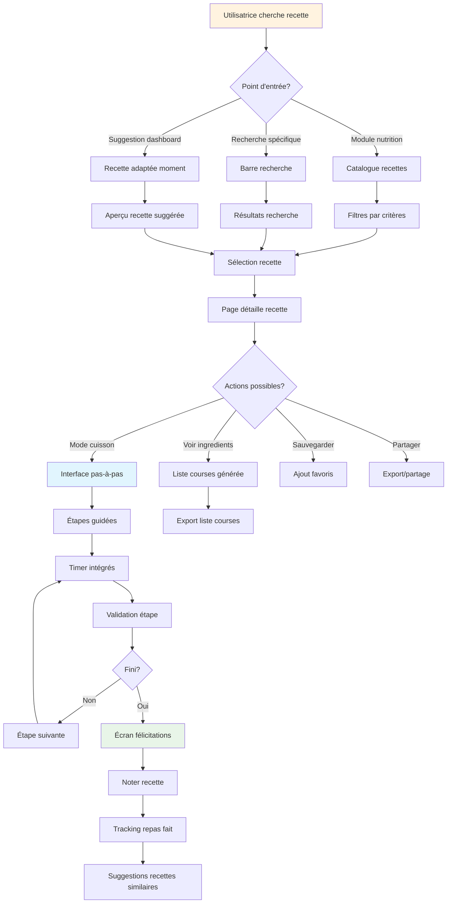
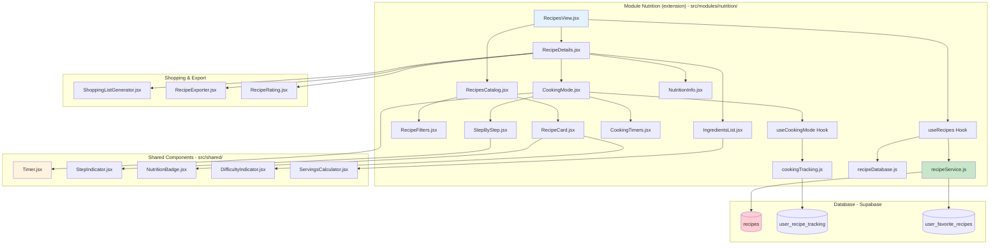
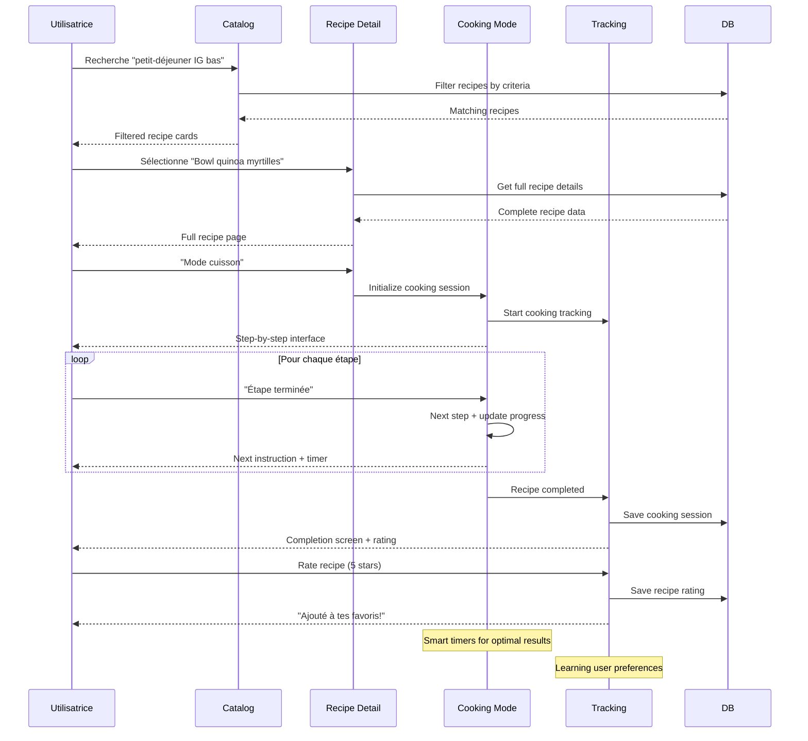

# 📝 Plan de Développement - Feature Recettes Index Glycémique Bas (MVP v1.0)

## 🎯 Vue d'ensemble

### Description de la Feature
Bibliothèque de recettes détaillées spécialement sélectionnées pour leur index glycémique bas, avec instructions étape par étape, temps de préparation réalistes et adaptation aux symptômes SOPK.

### Valeur Utilisateur
- **Éducation nutritionnelle** : Apprendre à cuisiner sainement sans restriction
- **Variété alimentaire** : Éviter la lassitude avec des recettes savoureuses
- **Confiance culinaire** : Instructions claires pour tous niveaux

### Score RICE
- **Reach** : 4/5 (75% des utilisatrices veulent cuisiner mais manquent d'idées)
- **Impact** : 4/5 (alimentation = fondement du traitement SOPK)
- **Confidence** : 5/5 (format recette éprouvé)
- **Effort** : 2/5 (contenu + interface de lecture)
- **Score Final** : **40** ✅ **Priorité #6**

---

## 🔄 Diagrammes de Flux

### User Journey - Découvrir et Cuisiner une Recette



### Architecture Technique



### Flux de Données



---

## 🏗️ Architecture Technique

### Structure des Données

```sql
-- Catalogue des recettes
CREATE TABLE recipes (
  id UUID PRIMARY KEY DEFAULT gen_random_uuid(),

  -- Informations de base
  title VARCHAR(150) NOT NULL,
  description TEXT,
  category VARCHAR(50) NOT NULL, -- 'breakfast', 'lunch', 'dinner', 'snack', 'dessert'
  cuisine_type VARCHAR(50), -- 'mediterranean', 'asian', 'french', 'vegetarian'

  -- Temps et difficulté
  prep_time_minutes INTEGER NOT NULL,
  cook_time_minutes INTEGER NOT NULL,
  total_time_minutes GENERATED ALWAYS AS (prep_time_minutes + cook_time_minutes) STORED,
  difficulty VARCHAR(20) NOT NULL, -- 'very_easy', 'easy', 'medium', 'advanced'
  servings INTEGER DEFAULT 4,

  -- Nutrition SOPK-friendly
  glycemic_index_category VARCHAR(20) NOT NULL, -- 'low', 'medium' (pas de 'high' pour SOPK)
  estimated_calories_per_serving INTEGER,
  main_macros JSONB, -- {"protein": 25, "carbs": 30, "fat": 15, "fiber": 8}

  -- Contenu détaillé
  ingredients JSONB NOT NULL, -- [{"name": "quinoa", "quantity": "150g", "notes": "bien rincer"}]
  instructions JSONB NOT NULL, -- [{"step": 1, "instruction": "...", "duration_minutes": 5, "tips": "..."}]
  images_urls TEXT[], -- URLs images étapes importantes

  -- Spécialisation SOPK
  sopk_benefits TEXT[], -- ['insulin_regulation', 'anti_inflammatory']
  symptom_targets TEXT[], -- ['fatigue', 'cravings', 'pms']
  cycle_phase_optimal TEXT[], -- ['any', 'menstrual', 'follicular']

  -- Métadonnées
  dietary_restrictions TEXT[], -- ['vegetarian', 'vegan', 'gluten_free', 'dairy_free']
  allergens TEXT[], -- ['nuts', 'shellfish', 'eggs']
  seasonal_ingredients TEXT[], -- ['spring', 'summer', 'autumn', 'winter']
  equipment_needed TEXT[], -- ['blender', 'oven', 'steamer']

  -- SEO et recherche
  keywords TEXT,
  tags TEXT[], -- ['quick', 'make_ahead', 'freezer_friendly', 'one_pot']

  -- Contenu éditorial
  chef_notes TEXT, -- Conseils du chef
  nutritionist_notes TEXT, -- Notes de la nutritionniste SOPK
  storage_tips TEXT, -- Conservation

  created_at TIMESTAMP WITH TIME ZONE DEFAULT NOW(),
  updated_at TIMESTAMP WITH TIME ZONE DEFAULT NOW(),
  is_active BOOLEAN DEFAULT true,
  featured BOOLEAN DEFAULT false
);

-- Tracking des recettes cuisinées
CREATE TABLE user_recipe_tracking (
  id UUID PRIMARY KEY DEFAULT gen_random_uuid(),
  user_id UUID REFERENCES auth.users(id) ON DELETE CASCADE,
  recipe_id UUID REFERENCES recipes(id),

  -- Session de cuisine
  started_cooking_at TIMESTAMP WITH TIME ZONE DEFAULT NOW(),
  completed_cooking_at TIMESTAMP WITH TIME ZONE,
  completed BOOLEAN DEFAULT false,

  -- Adaptations utilisateur
  servings_made INTEGER,
  ingredient_substitutions JSONB, -- Substitutions faites
  cooking_notes TEXT, -- Notes personnelles

  -- Feedback
  difficulty_felt VARCHAR(20), -- vs difficulté annoncée
  taste_rating INTEGER CHECK (taste_rating >= 1 AND taste_rating <= 5),
  ease_rating INTEGER CHECK (ease_rating >= 1 AND ease_rating <= 5),
  will_make_again BOOLEAN,

  -- Temps réels
  actual_prep_time_minutes INTEGER,
  actual_cook_time_minutes INTEGER,

  created_at TIMESTAMP WITH TIME ZONE DEFAULT NOW()
);

-- Favoris utilisateur
CREATE TABLE user_favorite_recipes (
  id UUID PRIMARY KEY DEFAULT gen_random_uuid(),
  user_id UUID REFERENCES auth.users(id) ON DELETE CASCADE,
  recipe_id UUID REFERENCES recipes(id) ON DELETE CASCADE,
  added_at TIMESTAMP WITH TIME ZONE DEFAULT NOW(),
  notes TEXT, -- Notes personnelles sur pourquoi c'est favori

  UNIQUE(user_id, recipe_id)
);

-- Listes de courses générées
CREATE TABLE user_shopping_lists (
  id UUID PRIMARY KEY DEFAULT gen_random_uuid(),
  user_id UUID REFERENCES auth.users(id) ON DELETE CASCADE,

  name VARCHAR(100) DEFAULT 'Liste de courses',
  recipes_included UUID[], -- IDs des recettes
  additional_items JSONB, -- Items ajoutés manuellement

  created_at TIMESTAMP WITH TIME ZONE DEFAULT NOW(),
  completed BOOLEAN DEFAULT false
);

-- Index pour performance
CREATE INDEX idx_recipes_category_gi ON recipes(category, glycemic_index_category);
CREATE INDEX idx_recipes_difficulty_time ON recipes(difficulty, total_time_minutes);
CREATE INDEX idx_recipes_symptoms ON recipes USING GIN(symptom_targets);
CREATE INDEX idx_recipes_dietary ON recipes USING GIN(dietary_restrictions);
CREATE INDEX idx_recipes_search ON recipes USING GIN(to_tsvector('french', title || ' ' || keywords));
```

### Structure Modulaire

#### Extension Module Nutrition (`src/modules/nutrition/`)
```
src/modules/nutrition/
├── components/
│   ├── recipes/
│   │   ├── RecipesCatalog.jsx          # Catalogue principal
│   │   ├── RecipeCard.jsx              # Carte recette
│   │   ├── RecipeFilters.jsx           # Filtres recherche
│   │   ├── RecipeSearch.jsx            # Barre recherche avancée
│   │   ├── RecipeDetails.jsx           # Page détails recette
│   │   ├── IngredientsList.jsx         # Liste ingrédients formatée
│   │   ├── InstructionsSteps.jsx       # Étapes de préparation
│   │   └── NutritionInfo.jsx           # Infos nutritionnelles
│   ├── cooking/
│   │   ├── CookingMode.jsx             # Mode cuisine guidé
│   │   ├── StepByStep.jsx              # Interface pas-à-pas
│   │   ├── CookingTimers.jsx           # Timers multiples
│   │   ├── ServingsAdjuster.jsx        # Ajustement portions
│   │   └── CookingNotes.jsx            # Prise de notes en cuisinant
│   ├── shopping/
│   │   ├── ShoppingListGenerator.jsx   # Générateur liste courses
│   │   ├── ShoppingList.jsx            # Interface liste courses
│   │   └── IngredientCalculator.jsx    # Calculateur quantités
│   ├── favorites/
│   │   ├── FavoriteRecipes.jsx         # Interface favoris
│   │   ├── RecipeCollections.jsx       # Collections personnelles
│   │   └── RecipeRating.jsx            # Système notation
│   └── export/
│       ├── RecipeExporter.jsx          # Export PDF/image
│       └── RecipeSharing.jsx           # Partage social
├── hooks/
│   ├── useRecipes.js                   # Hook catalogue recettes
│   ├── useRecipeDetails.js             # Hook détails recette
│   ├── useCookingMode.js               # Hook mode cuisine
│   ├── useFavoriteRecipes.js           # Hook gestion favoris
│   ├── useShoppingList.js              # Hook liste courses
│   └── useRecipeTracking.js            # Hook tracking cuisine
├── services/
│   ├── recipeService.js                # API calls recettes
│   ├── cookingService.js               # Service mode cuisine
│   ├── favoritesService.js             # Service favoris
│   └── shoppingService.js              # Service listes courses
├── views/
│   ├── RecipesCatalogView.jsx          # Vue catalogue
│   ├── RecipeDetailsView.jsx           # Vue détails
│   ├── CookingModeView.jsx             # Vue mode cuisine
│   ├── FavoriteRecipesView.jsx         # Vue favoris
│   └── ShoppingListView.jsx            # Vue liste courses
├── utils/
│   ├── recipeDatabase.js               # Base recettes (MVP)
│   ├── recipeFiltering.js              # Logique filtrage
│   ├── nutritionCalculator.js          # Calculs nutrition
│   ├── servingsCalculator.js           # Calculs portions
│   └── ingredientParser.js             # Parsing ingrédients
└── data/
    ├── recipes.json                    # Catalogue recettes (MVP)
    ├── ingredients.json                # Base ingrédients
    └── nutritionData.json              # Données nutritionnelles
```

#### Extension Composants Partagés (`src/shared/`)
```
src/shared/
├── components/
│   ├── cooking/
│   │   ├── Timer.jsx                   # Timer cuisine avec son
│   │   ├── StepIndicator.jsx           # Indicateur progression étapes
│   │   ├── ServingsCalculator.jsx      # Calculateur portions universel
│   │   └── IngredientQuantity.jsx      # Affichage quantités formatées
│   ├── nutrition/
│   │   ├── NutritionBadge.jsx          # Badges nutrition étendus
│   │   ├── CalorieIndicator.jsx        # Indicateur calories
│   │   ├── MacroBreakdown.jsx          # Répartition macronutriments
│   │   └── GlycemicIndex.jsx           # Indicateur IG
│   └── ui/
│       ├── RatingStars.jsx             # Système étoiles étendu
│       ├── DifficultyIndicator.jsx     # Niveau difficulté cuisine
│       ├── TimeIndicator.jsx           # Temps prépa + cuisson
│       └── TagCloud.jsx                # Nuage de tags
├── hooks/
│   ├── useMultipleTimers.js            # Hook timers multiples
│   ├── useServingsCalculation.js       # Hook calculs portions
│   ├── useIngredientParsing.js         # Hook parsing ingrédients
│   └── useNutritionCalculation.js      # Hook calculs nutrition
└── utils/
    ├── cookingHelpers.js               # Utilitaires cuisine
    ├── nutritionHelpers.js             # Calculs nutrition avancés
    ├── unitConversions.js              # Conversions unités
    └── ingredientUtils.js              # Utilitaires ingrédients
```

### Services API

```javascript
// src/modules/nutrition/services/recipeService.js
export const recipeService = {
  // Récupérer toutes les recettes avec filtres
  async getRecipes(filters = {}) {
    const {
      category,
      maxTime,
      difficulty,
      dietary = [],
      symptoms = [],
      search = ''
    } = filters;

    // Pour MVP: base statique, puis DB Supabase
    let recipes = RecipeDatabase.getAll();

    // Appliquer filtres
    if (category && category !== 'all') {
      recipes = recipes.filter(r => r.category === category);
    }

    if (maxTime) {
      recipes = recipes.filter(r => r.total_time_minutes <= maxTime);
    }

    if (difficulty && difficulty !== 'all') {
      recipes = recipes.filter(r => r.difficulty === difficulty);
    }

    if (dietary.length > 0) {
      recipes = recipes.filter(r =>
        dietary.every(restriction =>
          r.dietary_restrictions?.includes(restriction)
        )
      );
    }

    if (symptoms.length > 0) {
      recipes = recipes.filter(r =>
        symptoms.some(symptom => r.symptom_targets?.includes(symptom))
      );
    }

    if (search.trim()) {
      const searchLower = search.toLowerCase();
      recipes = recipes.filter(r =>
        r.title.toLowerCase().includes(searchLower) ||
        r.keywords?.toLowerCase().includes(searchLower)
      );
    }

    // Trier par pertinence ou popularité
    recipes = this.sortRecipes(recipes, filters);

    return { data: recipes };
  },

  // Obtenir détails complets d'une recette
  async getRecipeDetails(recipeId) {
    const recipe = RecipeDatabase.getById(recipeId);
    if (!recipe) {
      throw new Error('Recette introuvable');
    }

    // Enrichir avec stats utilisateur si connecté
    let userStats = null;
    if (user?.id) {
      const { data: stats } = await this.getRecipeUserStats(user.id, recipeId);
      userStats = stats;
    }

    // Enrichir avec stats communauté
    const { data: communityStats } = await this.getRecipeCommunityStats(recipeId);

    return {
      data: {
        ...recipe,
        userStats: userStats || {
          isFavorite: false,
          hasCooked: false,
          personalRating: null
        },
        communityStats: communityStats || {
          avgRating: 0,
          totalRatings: 0,
          cookCount: 0,
          successRate: 0
        }
      }
    };
  },

  // Stats utilisateur pour une recette
  async getRecipeUserStats(userId, recipeId) {
    const [favoriteCheck, cookingHistory, userRating] = await Promise.all([
      supabase
        .from('user_favorite_recipes')
        .select('id')
        .eq('user_id', userId)
        .eq('recipe_id', recipeId)
        .single(),

      supabase
        .from('user_recipe_tracking')
        .select('completed, taste_rating, will_make_again')
        .eq('user_id', userId)
        .eq('recipe_id', recipeId)
        .order('created_at', { ascending: false })
        .limit(1),

      supabase
        .from('user_recipe_tracking')
        .select('taste_rating')
        .eq('user_id', userId)
        .eq('recipe_id', recipeId)
        .not('taste_rating', 'is', null)
        .order('created_at', { ascending: false })
        .limit(1)
    ]);

    return {
      data: {
        isFavorite: !favoriteCheck.error,
        hasCooked: cookingHistory.data?.length > 0,
        lastCookingSuccess: cookingHistory.data?.[0]?.completed || false,
        personalRating: userRating.data?.[0]?.taste_rating || null,
        wouldMakeAgain: cookingHistory.data?.[0]?.will_make_again || null
      }
    };
  },

  // Statistiques communauté pour une recette
  async getRecipeCommunityStats(recipeId) {
    // Pour MVP, retourner des stats simulées
    // Plus tard: vraies requêtes Supabase
    const mockStats = {
      avgRating: 4.2 + Math.random() * 0.6, // 4.2-4.8
      totalRatings: Math.floor(Math.random() * 200) + 50,
      cookCount: Math.floor(Math.random() * 500) + 100,
      successRate: 85 + Math.random() * 10 // 85-95%
    };

    return { data: mockStats };
  },

  // Trier recettes par pertinence
  sortRecipes(recipes, context = {}) {
    return recipes.sort((a, b) => {
      let scoreA = 50, scoreB = 50;

      // Boost recettes featured
      if (a.featured) scoreA += 10;
      if (b.featured) scoreB += 10;

      // Boost si symptômes ciblés
      if (context.symptoms?.length) {
        const matchA = context.symptoms.filter(s => a.symptom_targets?.includes(s)).length;
        const matchB = context.symptoms.filter(s => b.symptom_targets?.includes(s)).length;
        scoreA += matchA * 5;
        scoreB += matchB * 5;
      }

      // Boost recettes plus rapides (si pas de filtre temps spécifique)
      if (!context.maxTime) {
        if (a.total_time_minutes <= 30) scoreA += 5;
        if (b.total_time_minutes <= 30) scoreB += 5;
        if (a.total_time_minutes <= 15) scoreA += 5;
        if (b.total_time_minutes <= 15) scoreB += 5;
      }

      return scoreB - scoreA;
    });
  }
};

// src/modules/nutrition/services/cookingService.js
export const cookingService = {
  // Démarrer session de cuisine
  async startCooking(userId, recipeId, adjustments = {}) {
    const { servings, substitutions = [] } = adjustments;

    const { error, data } = await supabase
      .from('user_recipe_tracking')
      .insert({
        user_id: userId,
        recipe_id: recipeId,
        servings_made: servings,
        ingredient_substitutions: substitutions
      })
      .select('id')
      .single();

    return { data: data?.id, error };
  },

  // Terminer session avec feedback
  async completeCooking(trackingId, completionData) {
    const {
      actualPrepTime,
      actualCookTime,
      difficultyFelt,
      tasteRating,
      easeRating,
      willMakeAgain,
      cookingNotes
    } = completionData;

    const { error } = await supabase
      .from('user_recipe_tracking')
      .update({
        completed_cooking_at: new Date().toISOString(),
        completed: true,
        actual_prep_time_minutes: actualPrepTime,
        actual_cook_time_minutes: actualCookTime,
        difficulty_felt: difficultyFelt,
        taste_rating: tasteRating,
        ease_rating: easeRating,
        will_make_again: willMakeAgain,
        cooking_notes: cookingNotes
      })
      .eq('id', trackingId);

    return { error };
  },

  // Ajuster quantités selon nombre de portions
  calculateAdjustedIngredients(recipe, targetServings) {
    const ratio = targetServings / recipe.servings;

    return recipe.ingredients.map(ingredient => {
      const adjustedQuantity = this.adjustQuantity(ingredient.quantity, ratio);
      return {
        ...ingredient,
        quantity: adjustedQuantity,
        originalQuantity: ingredient.quantity
      };
    });
  },

  // Ajuster une quantité (gère les unités)
  adjustQuantity(originalQuantity, ratio) {
    // Parser la quantité (ex: "150g", "2 cuillères", "1/2 tasse")
    const parsed = this.parseQuantity(originalQuantity);
    if (!parsed) return originalQuantity;

    const adjustedAmount = parsed.amount * ratio;
    const roundedAmount = this.roundQuantity(adjustedAmount, parsed.unit);

    return `${roundedAmount}${parsed.unit}`;
  },

  // Parser une quantité textuelle
  parseQuantity(quantity) {
    // Expressions régulières pour différents formats
    const patterns = [
      /^(\d+(?:[.,]\d+)?)\s*(g|kg|ml|l|cuillères?|c\.)$/i,
      /^(\d+(?:\/\d+)?)\s*(tasse|cup)s?$/i,
      /^(\d+)\s*$/  // Juste un nombre
    ];

    for (const pattern of patterns) {
      const match = quantity.match(pattern);
      if (match) {
        const amount = this.parseAmount(match[1]);
        const unit = match[2] || '';
        return { amount, unit };
      }
    }

    return null;
  },

  // Convertir quantité textuelle en nombre
  parseAmount(amountStr) {
    if (amountStr.includes('/')) {
      const [num, denom] = amountStr.split('/').map(Number);
      return num / denom;
    }
    return parseFloat(amountStr.replace(',', '.'));
  },

  // Arrondir quantité de manière sensée
  roundQuantity(amount, unit) {
    if (unit.match(/g|ml/i)) {
      if (amount < 10) return Math.round(amount * 10) / 10;
      return Math.round(amount);
    }

    if (unit.match(/kg|l/i)) {
      return Math.round(amount * 100) / 100;
    }

    if (unit.match(/cuill|c\./i)) {
      return Math.round(amount * 4) / 4; // Quarts de cuillères
    }

    return Math.round(amount * 10) / 10;
  }
};
```

---

## 🎨 Design UX/UI

### Interface Mobile-First

#### Catalogue de Recettes
```
┌─────────────────────────┐
│   🍽️ Recettes IG Bas    │
├─────────────────────────┤
│                         │
│  🔍 [Rechercher...]     │
│                         │
│  Catégories:            │
│  [P.déj] [Repas] [Snack]│
│                         │
│  Filtres: ⏱️30min 🟢Facile│
│  🌿 Végé ✨ Favoris     │
│                         │
│  💫 Recommandées:       │
│  ┌─────────────────────┐ │
│  │ 🥗 Bowl quinoa-avocat│ │
│  │ ⭐ 4.8 • ⏱️ 15min    │ │
│  │ 🟢 IG très bas      │ │
│  │ 💚 Parfait fatigue  │ │
│  │ [Voir] [❤️ Fav]     │ │
│  └─────────────────────┘ │
│                         │
│  📚 Toutes les recettes:│
│  ┌─────────────────────┐ │
│  │ 🍳 Omelette épinards │ │
│  │ ⭐ 4.5 • ⏱️ 10min    │ │
│  │ 🥚 Protéines        │ │
│  │ [❤️] [👁️] [🛒]      │ │
│  └─────────────────────┘ │
│                         │
│  ┌─────────────────────┐ │
│  │ 🥙 Wrap légumes     │ │
│  │ ⭐ 4.3 • ⏱️ 20min    │ │
│  │ 🌿 Végétarien       │ │
│  │ [❤️] [👁️] [🛒]      │ │
│  └─────────────────────┘ │
└─────────────────────────┘
```

#### Page Détails Recette
```
┌─────────────────────────┐
│ 🥗 Bowl Quinoa-Avocat    │
├─────────────────────────┤
│                         │
│ [Image appétissante]    │
│ ┌─────────────────────┐ │
│ │     🥗              │ │
│ │   Beautiful         │ │
│ │   Food Photo        │ │
│ │                     │ │
│ │  ❤️ 342   👁️ 1.2k   │ │
│ └─────────────────────┘ │
│                         │
│ ⭐⭐⭐⭐⭐ 4.8 (127 avis) │
│                         │
│ ⏱️ Préparation: 10min   │
│ ⏱️ Cuisson: 5min        │
│ 🍽️ 2 portions          │
│ 🟢 IG très bas         │
│                         │
│ 💚 Idéal pour:         │
│ • Fatigue              │
│ • Fringales            │
│ • Énergie stable       │
│                         │
│ 📝 "Un plat complet    │
│     qui rassasie sans  │
│     pic glycémique"    │
│                         │
│ [🍳 Cuisiner] [🛒 Courses]│
│ [❤️ Favoris] [📤 Partager]│
│                         │
│ 📋 Ingrédients:        │
│ • Quinoa cuit: 150g    │
│ • Avocat: 1/2          │
│ • Œuf dur: 1           │
│ • Épinards: 50g        │
│ • Graines: 2 c.à.s     │
│                         │
│ 👩‍🍳 Instructions:       │
│ 1. Rincer le quinoa... │
│ 2. Faire durcir l'œuf..│
│ 3. Mélanger tous...    │
│                         │
│ 💡 Conseils chef:      │
│ • Rincer quinoa à fond │
│ • Avocat bien mûr      │
│                         │
│ 🔬 Nutrition (portion): │
│ 📊 345 kcal • P:18g     │
│     G:25g • L:22g       │
└─────────────────────────┘
```

#### Mode Cuisine Guidé
```
┌─────────────────────────┐
│ 🍳 Mode Cuisine         │
│    Bowl Quinoa-Avocat   │
├─────────────────────────┤
│                         │
│    Étape 2/5 ●●○○○      │
│                         │
│  🥄 Préparer l'œuf dur  │
│                         │
│  Porter une casserole   │
│  d'eau à ébullition.    │
│  Ajouter l'œuf et       │
│  laisser cuire.         │
│                         │
│  Timer: ⏰ 08:42        │
│                         │
│  💡 Tip: Commencer par  │
│     l'eau froide pour   │
│     éviter les fissures │
│                         │
│  📝 Notes cuisine:      │
│  [Écrivez vos notes...] │
│                         │
│  ⏸️ Pause  🔔 +2min     │
│                         │
│  [⬅️ Précédent] [➡️ Suivant]│
│                         │
│  Portions: 🍽️ 2 [+] [-] │
│  Ajustement automatique │
│  des quantités          │
└─────────────────────────┘
```

#### Écran Fin de Cuisine
```
┌─────────────────────────┐
│      🎉 Bravo !         │
├─────────────────────────┤
│                         │
│  Recette terminée !     │
│  🕐 Temps total: 18min  │
│  🍽️ 2 délicieuses       │
│      portions prêtes    │
│                         │
│  Comment c'était ?      │
│                         │
│  Goût: ⭐⭐⭐⭐⭐       │
│  Facilité: ⭐⭐⭐⭐⭐   │
│                         │
│  Difficulté ressentie:  │
│  [Plus facile] [Comme   │
│   annoncé] [Plus dur]   │
│                         │
│  ✅ Je la referai !     │
│  ◯  Pas convaincue      │
│                         │
│  💬 Notes personnelles: │
│  [J'ai ajouté des       │
│   tomates cerises...]   │
│                         │
│  [❤️ Ajouter favoris]   │
│  [📤 Partager résultat] │
│  [🍽️ Nouvelle recette]  │
└─────────────────────────┘
```

#### Générateur Liste de Courses
```
┌─────────────────────────┐
│ 🛒 Liste de Courses     │
├─────────────────────────┤
│                         │
│ Recettes sélectionnées: │
│ • Bowl quinoa-avocat    │
│ • Omelette épinards     │
│ • Wrap légumes          │
│                         │
│ Portions totales: 6     │
│ Budget estimé: 18€      │
│                         │
│ 📋 Votre liste:        │
│                         │
│ 🥬 Légumes frais:       │
│ □ Avocat: 2            │
│ □ Épinards: 200g       │
│ □ Tomates: 3           │
│ □ Courgettes: 2        │
│                         │
│ 🥚 Protéines:          │
│ □ Œufs: 6              │
│ □ Feta: 150g           │
│                         │
│ 🌾 Céréales:           │
│ □ Quinoa: 300g         │
│ □ Pain complet: 1      │
│                         │
│ 🥜 Divers:             │
│ □ Graines tournesol    │
│ □ Huile olive          │
│                         │
│ [📱 Exporter] [✉️ Email]│
│ [🛒 App courses]        │
└─────────────────────────┘
```

### Design System - Recettes

```css
:root {
  /* Couleurs par catégorie alimentaire */
  --recipe-breakfast: #FF9800;       /* Orange - petit-déjeuner */
  --recipe-lunch: #4CAF50;           /* Vert - déjeuner */
  --recipe-dinner: #9C27B0;          /* Violet - dîner */
  --recipe-snack: #2196F3;           /* Bleu - snack */
  --recipe-dessert: #E91E63;         /* Rose - dessert */

  /* Niveaux IG */
  --gi-very-low: #2E7D32;            /* Vert foncé - IG très bas */
  --gi-low: #4CAF50;                 /* Vert - IG bas */
  --gi-medium: #FF9800;              /* Orange - IG moyen */

  /* Temps de préparation */
  --time-quick: #4CAF50;             /* < 20 min */
  --time-medium: #FF9800;            /* 20-45 min */
  --time-long: #F44336;              /* > 45 min */

  /* Difficulté */
  --difficulty-very-easy: #4CAF50;   /* Très facile */
  --difficulty-easy: #8BC34A;        /* Facile */
  --difficulty-medium: #FF9800;      /* Moyen */
  --difficulty-advanced: #F44336;    /* Avancé */
}

.recipe-card {
  border-radius: 16px;
  overflow: hidden;
  box-shadow: 0 2px 8px rgba(0,0,0,0.1);
  transition: all 0.3s ease;
  border-left: 4px solid transparent;
}

.recipe-card:hover {
  transform: translateY(-4px);
  box-shadow: 0 8px 24px rgba(0,0,0,0.15);
}

.recipe-card.breakfast {
  border-left-color: var(--recipe-breakfast);
}

.recipe-card.lunch {
  border-left-color: var(--recipe-lunch);
}

.gi-badge.very-low {
  background: var(--gi-very-low);
  color: white;
}

.gi-badge.low {
  background: var(--gi-low);
  color: white;
}

.cooking-mode {
  background: linear-gradient(135deg, #667eea 0%, #764ba2 100%);
  min-height: 100vh;
  color: white;
}

.step-indicator {
  display: flex;
  gap: 0.5rem;
  justify-content: center;
  margin: 2rem 0;
}

.step-indicator .step {
  width: 12px;
  height: 12px;
  border-radius: 50%;
  background: rgba(255,255,255,0.3);
  transition: all 0.3s ease;
}

.step-indicator .step.active {
  background: white;
  transform: scale(1.3);
}

.step-indicator .step.completed {
  background: #4CAF50;
}

.cooking-timer {
  font-size: 3rem;
  font-weight: bold;
  text-align: center;
  margin: 2rem 0;
  font-variant-numeric: tabular-nums;
}

.timer-alert {
  animation: pulse 1s infinite;
}

@keyframes pulse {
  0%, 100% { opacity: 1; }
  50% { opacity: 0.7; }
}

.recipe-rating {
  display: flex;
  gap: 0.25rem;
}

.recipe-rating .star {
  color: #FFD700;
  font-size: 1.2rem;
  cursor: pointer;
  transition: transform 0.2s ease;
}

.recipe-rating .star:hover {
  transform: scale(1.2);
}

.recipe-rating .star.inactive {
  color: #E0E0E0;
}

.nutrition-breakdown {
  display: grid;
  grid-template-columns: 1fr 1fr;
  gap: 1rem;
}

.macro-indicator {
  background: #F5F5F5;
  padding: 1rem;
  border-radius: 8px;
  text-align: center;
}

.macro-indicator.protein {
  border-left: 4px solid #FF5722;
}

.macro-indicator.carbs {
  border-left: 4px solid #4CAF50;
}

.macro-indicator.fat {
  border-left: 4px solid #FF9800;
}

.shopping-list-item {
  padding: 0.75rem;
  border-bottom: 1px solid #E0E0E0;
  display: flex;
  align-items: center;
  gap: 0.75rem;
}

.shopping-list-item.checked {
  opacity: 0.6;
  text-decoration: line-through;
}

.ingredient-quantity {
  font-weight: 600;
  color: #1976D2;
}
```

---

## 📱 User Stories Détaillées

### US1: Découvrir Recettes Adaptées
**En tant qu'** utilisatrice SOPK cherchant à mieux manger
**Je veux** trouver facilement des recettes savoureuses à IG bas
**Afin de** varier mes repas sans nuire à ma santé

**Critères d'acceptation** :
- [ ] Catalogue organisé par catégories (petit-déj, repas, snacks)
- [ ] Filtrage par temps de préparation, difficulté, régime alimentaire
- [ ] Badge IG clairement visible sur chaque recette
- [ ] Indication des bénéfices SOPK (anti-inflammatoire, régulation insuline)
- [ ] Recherche textuelle efficace par ingrédients ou nom

### US2: Cuisiner avec Guidance
**En tant qu'** utilisatrice débutante en cuisine
**Je veux** être guidée étape par étape pendant la préparation
**Afin de** réussir mes plats sans stress

**Critères d'acceptation** :
- [ ] Mode cuisine avec instructions détaillées pour chaque étape
- [ ] Timers intégrés qui alertent aux moments clés
- [ ] Possibilité d'ajuster les portions automatiquement
- [ ] Conseils et astuces du chef à chaque étape critique
- [ ] Mode pause/reprendre pour gérer les interruptions

### US3: Organiser mes Courses
**En tant qu'** utilisatrice qui planifie ses repas
**Je veux** générer automatiquement ma liste de courses
**Afin de** ne rien oublier et optimiser mes achats

**Critères d'acceptation** :
- [ ] Sélection multiple de recettes pour génération liste
- [ ] Regroupement intelligent par rayons de magasin
- [ ] Calcul automatique des quantités totales nécessaires
- [ ] Export vers apps de courses ou email
- [ ] Possibilité d'ajouter items supplémentaires à la liste

---

## 🛠️ Implémentation Détaillée

### Sprint 1: Base de Données Recettes (Semaine 1)
**Objectif** : Catalogue de recettes structuré et système de filtrage

**Tâches** :
1. **Base de données recettes MVP**
   ```javascript
   // src/modules/nutrition/data/recipes.json
   export const recipesDatabase = [
     {
       id: 'bowl-quinoa-avocat-proteine',
       title: 'Bowl Quinoa-Avocat Protéiné',
       description: 'Un plat complet et équilibré, parfait pour maintenir une glycémie stable tout en apportant tous les nutriments essentiels.',
       category: 'lunch',
       cuisine_type: 'mediterranean',
       prep_time_minutes: 15,
       cook_time_minutes: 10,
       difficulty: 'easy',
       servings: 2,
       glycemic_index_category: 'low',
       estimated_calories_per_serving: 380,
       main_macros: {
         protein: 18,
         carbs: 32,
         fat: 22,
         fiber: 8
       },
       ingredients: [
         {
           name: 'Quinoa',
           quantity: '150g',
           notes: 'Bien rincer avant cuisson',
           category: 'grains'
         },
         {
           name: 'Avocat',
           quantity: '1',
           notes: 'Bien mûr',
           category: 'vegetables'
         },
         {
           name: 'Œufs',
           quantity: '2',
           notes: 'De préférence bio',
           category: 'proteins'
         },
         {
           name: 'Épinards frais',
           quantity: '100g',
           notes: '',
           category: 'vegetables'
         },
         {
           name: 'Graines de tournesol',
           quantity: '2 c.à.s',
           notes: '',
           category: 'seeds'
         },
         {
           name: 'Huile d\'olive',
           quantity: '1 c.à.s',
           notes: 'Première pression à froid',
           category: 'fats'
         },
         {
           name: 'Citron',
           quantity: '1/2',
           notes: 'Pour la vinaigrette',
           category: 'condiments'
         }
       ],
       instructions: [
         {
           step: 1,
           instruction: 'Rincer le quinoa à l\'eau froide jusqu\'à ce que l\'eau soit claire. Le faire cuire dans 300ml d\'eau bouillante salée pendant 15 minutes.',
           duration_minutes: 15,
           tips: 'Le rinçage élimine la saponine qui donne un goût amer',
           equipment: ['casserole']
         },
         {
           step: 2,
           instruction: 'Pendant la cuisson du quinoa, faire cuire les œufs durs dans de l\'eau bouillante pendant 8 minutes. Les refroidir dans l\'eau glacée.',
           duration_minutes: 8,
           tips: 'Commencer par l\'eau froide évite que les œufs se fissurent',
           equipment: ['casserole']
         },
         {
           step: 3,
           instruction: 'Laver les épinards et les essorer. Couper l\'avocat en lamelles et l\'arroser de jus de citron.',
           duration_minutes: 3,
           tips: 'Le citron évite l\'oxydation de l\'avocat',
           equipment: ['planche', 'couteau']
         },
         {
           step: 4,
           instruction: 'Préparer la vinaigrette en mélangeant l\'huile d\'olive, le reste du jus de citron, sel et poivre.',
           duration_minutes: 2,
           tips: 'Émulsionner en fouettant énergiquement',
           equipment: ['fouet', 'bol']
         },
         {
           step: 5,
           instruction: 'Disposer dans deux bols le quinoa tiède, les épinards, l\'avocat et les œufs coupés en deux. Parsemer de graines de tournesol et arroser de vinaigrette.',
           duration_minutes: 5,
           tips: 'Servir tiède pour plus de saveur',
           equipment: ['bols']
         }
       ],
       sopk_benefits: ['insulin_regulation', 'anti_inflammatory', 'hormone_balance'],
       symptom_targets: ['fatigue', 'cravings', 'mood_swings'],
       cycle_phase_optimal: ['any'],
       dietary_restrictions: ['vegetarian'],
       allergens: ['eggs'],
       seasonal_ingredients: ['spring', 'summer'],
       equipment_needed: ['casserole', 'fouet', 'planche'],
       keywords: 'quinoa avocat proteines oeuf equilibre glycemie stable energie',
       tags: ['complete_meal', 'high_protein', 'anti_inflammatory', 'easy'],
       chef_notes: 'Cette recette peut se préparer à l\'avance, sans l\'avocat qui doit être ajouté au dernier moment.',
       nutritionist_notes: 'Excellent équilibre des macronutriments pour réguler la glycémie. Les graines ajoutent des minéraux essentiels.',
       storage_tips: 'Se conserve 2 jours au réfrigérateur dans un contenant hermétique.',
       featured: true
     },
     {
       id: 'omelette-epinards-fromage',
       title: 'Omelette aux Épinards et Feta',
       description: 'Omelette moelleuse et riche en protéines, parfaite pour un petit-déjeuner nourrissant qui maintient la satiété.',
       category: 'breakfast',
       cuisine_type: 'french',
       prep_time_minutes: 5,
       cook_time_minutes: 8,
       difficulty: 'very_easy',
       servings: 1,
       glycemic_index_category: 'low',
       estimated_calories_per_serving: 290,
       main_macros: {
         protein: 22,
         carbs: 4,
         fat: 20,
         fiber: 2
       },
       // ... suite de la structure similaire
     }
     // ... 20-25 recettes pour MVP couvrant toutes catégories
   ];
   ```

2. **Service de recherche et filtrage**
   ```javascript
   // src/modules/nutrition/utils/recipeDatabase.js
   import { recipesDatabase } from '../data/recipes.json';

   export class RecipeDatabase {
     static getAll() {
       return recipesDatabase.filter(recipe => recipe.is_active !== false);
     }

     static getById(id) {
       return recipesDatabase.find(recipe => recipe.id === id);
     }

     static getByCategory(category) {
       return this.getAll().filter(recipe => recipe.category === category);
     }

     static search(query) {
       const searchTerms = query.toLowerCase().split(' ');
       return this.getAll().filter(recipe =>
         searchTerms.every(term =>
           recipe.title.toLowerCase().includes(term) ||
           recipe.keywords.toLowerCase().includes(term) ||
           recipe.ingredients.some(ing =>
             ing.name.toLowerCase().includes(term)
           )
         )
       );
     }

     static filter(criteria = {}) {
       let recipes = this.getAll();

       // Filtre par temps total
       if (criteria.maxTime) {
         recipes = recipes.filter(r =>
           r.prep_time_minutes + r.cook_time_minutes <= criteria.maxTime
         );
       }

       // Filtre par difficulté
       if (criteria.difficulty) {
         recipes = recipes.filter(r => r.difficulty === criteria.difficulty);
       }

       // Filtre par régime alimentaire
       if (criteria.dietary?.length) {
         recipes = recipes.filter(r =>
           criteria.dietary.every(diet =>
             r.dietary_restrictions?.includes(diet)
           )
         );
       }

       // Filtre par symptômes SOPK
       if (criteria.symptoms?.length) {
         recipes = recipes.filter(r =>
           criteria.symptoms.some(symptom =>
             r.symptom_targets?.includes(symptom)
           )
         );
       }

       // Filtre par allergènes (exclusion)
       if (criteria.excludeAllergens?.length) {
         recipes = recipes.filter(r =>
           !criteria.excludeAllergens.some(allergen =>
             r.allergens?.includes(allergen)
           )
         );
       }

       return recipes;
     }

     static getFeatured() {
       return this.getAll().filter(recipe => recipe.featured);
     }

     static getForSymptoms(symptoms = []) {
       return this.getAll().filter(recipe =>
         symptoms.some(symptom => recipe.symptom_targets?.includes(symptom))
       );
     }

     static getQuick(maxMinutes = 20) {
       return this.getAll().filter(recipe =>
         recipe.prep_time_minutes + recipe.cook_time_minutes <= maxMinutes
       );
     }
   }
   ```

3. **Hook de gestion recettes**
   ```javascript
   // src/modules/nutrition/hooks/useRecipes.js
   import { useState, useEffect, useMemo } from 'react';
   import { RecipeDatabase } from '../utils/recipeDatabase';
   import { recipeService } from '../services/recipeService';

   export const useRecipes = (initialFilters = {}) => {
     const [recipes, setRecipes] = useState([]);
     const [loading, setLoading] = useState(true);
     const [error, setError] = useState(null);
     const [filters, setFilters] = useState(initialFilters);

     // Charger recettes avec filtres
     const loadRecipes = async () => {
       setLoading(true);
       setError(null);

       try {
         const { data } = await recipeService.getRecipes(filters);
         setRecipes(data);
       } catch (err) {
         setError(err);
         console.error('Erreur chargement recettes:', err);
       } finally {
         setLoading(false);
       }
     };

     // Recharger si filtres changent
     useEffect(() => {
       loadRecipes();
     }, [filters]);

     // Statistiques des recettes
     const stats = useMemo(() => {
       if (!recipes.length) return null;

       return {
         total: recipes.length,
         byCategory: recipes.reduce((acc, recipe) => {
           acc[recipe.category] = (acc[recipe.category] || 0) + 1;
           return acc;
         }, {}),
         avgPrepTime: recipes.reduce((sum, r) => sum + r.prep_time_minutes, 0) / recipes.length,
         quickRecipes: recipes.filter(r => r.prep_time_minutes + r.cook_time_minutes <= 20).length
       };
     }, [recipes]);

     // Actions
     const updateFilters = (newFilters) => {
       setFilters(prev => ({ ...prev, ...newFilters }));
     };

     const resetFilters = () => {
       setFilters({});
     };

     const searchRecipes = (query) => {
       setFilters(prev => ({ ...prev, search: query }));
     };

     return {
       recipes,
       loading,
       error,
       filters,
       stats,
       updateFilters,
       resetFilters,
       searchRecipes,
       refresh: loadRecipes
     };
   };
   ```

### Sprint 2: Interface Catalogue et Détails (Semaine 2)
**Objectif** : Interface de découverte et pages détails

**Tâches** :
1. **Composant catalogue avec filtres**
   ```jsx
   // src/modules/nutrition/components/recipes/RecipesCatalog.jsx
   import { useState } from 'react';
   import { RecipeCard } from './RecipeCard';
   import { RecipeFilters } from './RecipeFilters';
   import { RecipeSearch } from './RecipeSearch';
   import { useRecipes } from '../../hooks/useRecipes';

   export const RecipesCatalog = () => {
     const [activeCategory, setActiveCategory] = useState('all');
     const { recipes, loading, filters, updateFilters, stats } = useRecipes();

     const categories = [
       { id: 'all', label: 'Toutes', emoji: '🍽️' },
       { id: 'breakfast', label: 'P.déj', emoji: '🌅' },
       { id: 'lunch', label: 'Repas', emoji: '🍽️' },
       { id: 'dinner', label: 'Dîner', emoji: '🌙' },
       { id: 'snack', label: 'Snack', emoji: '🥨' }
     ];

     const handleCategoryChange = (categoryId) => {
       setActiveCategory(categoryId);
       updateFilters({
         category: categoryId === 'all' ? undefined : categoryId
       });
     };

     const featuredRecipes = recipes.filter(r => r.featured);
     const regularRecipes = recipes.filter(r => !r.featured);

     if (loading) {
       return <RecipesCatalogSkeleton />;
     }

     return (
       <div className="recipes-catalog">
         <header className="catalog-header mb-6">
           <h1 className="text-2xl font-bold mb-4">🍽️ Recettes IG Bas</h1>

           <RecipeSearch
             onSearch={(query) => updateFilters({ search: query })}
             placeholder="Rechercher une recette..."
           />
         </header>

         {/* Onglets catégories */}
         <div className="category-tabs mb-6">
           <div className="flex gap-2 overflow-x-auto pb-2">
             {categories.map(category => (
               <button
                 key={category.id}
                 onClick={() => handleCategoryChange(category.id)}
                 className={`whitespace-nowrap px-4 py-2 rounded-full border-2 transition-all ${
                   activeCategory === category.id
                     ? 'border-blue-500 bg-blue-50 text-blue-700'
                     : 'border-gray-200 hover:border-gray-300'
                 }`}
               >
                 <span className="mr-1">{category.emoji}</span>
                 {category.label}
                 {stats?.byCategory[category.id] && (
                   <span className="ml-1 text-xs bg-gray-200 px-1.5 py-0.5 rounded-full">
                     {stats.byCategory[category.id]}
                   </span>
                 )}
               </button>
             ))}
           </div>
         </div>

         {/* Filtres avancés */}
         <RecipeFilters
           currentFilters={filters}
           onFiltersChange={updateFilters}
           className="mb-6"
         />

         {/* Section recommandées */}
         {featuredRecipes.length > 0 && (
           <section className="featured-section mb-8">
             <h2 className="text-xl font-semibold mb-4 flex items-center gap-2">
               💫 Recommandées
             </h2>
             <div className="grid gap-4 md:grid-cols-2">
               {featuredRecipes.slice(0, 4).map(recipe => (
                 <RecipeCard
                   key={recipe.id}
                   recipe={recipe}
                   variant="featured"
                   onView={(recipe) => navigate(`/nutrition/recipes/${recipe.id}`)}
                   onFavorite={(recipe) => toggleFavorite(recipe.id)}
                   onShoppingList={(recipe) => addToShoppingList(recipe)}
                 />
               ))}
             </div>
           </section>
         )}

         {/* Toutes les recettes */}
         <section className="all-recipes-section">
           <div className="flex justify-between items-center mb-4">
             <h2 className="text-xl font-semibold">
               📚 {activeCategory === 'all' ? 'Toutes les recettes' : 'Recettes sélectionnées'}
             </h2>
             <span className="text-sm text-gray-600">
               {regularRecipes.length} recettes
             </span>
           </div>

           {regularRecipes.length === 0 ? (
             <div className="text-center py-12 text-gray-600">
               <div className="text-6xl mb-4">🔍</div>
               <h3 className="text-lg font-medium mb-2">Aucune recette trouvée</h3>
               <p className="mb-4">Essayez d'ajuster vos filtres de recherche</p>
               <button
                 onClick={() => updateFilters({})}
                 className="bg-blue-500 text-white px-4 py-2 rounded-lg hover:bg-blue-600"
               >
                 Réinitialiser filtres
               </button>
             </div>
           ) : (
             <div className="grid gap-4 md:grid-cols-2 lg:grid-cols-3">
               {regularRecipes.map(recipe => (
                 <RecipeCard
                   key={recipe.id}
                   recipe={recipe}
                   onView={(recipe) => navigate(`/nutrition/recipes/${recipe.id}`)}
                   onFavorite={(recipe) => toggleFavorite(recipe.id)}
                   onShoppingList={(recipe) => addToShoppingList(recipe)}
                 />
               ))}
             </div>
           )}
         </section>
       </div>
     );
   };
   ```

2. **Composant carte recette**
   ```jsx
   // src/modules/nutrition/components/recipes/RecipeCard.jsx
   import { NutritionBadge } from '../../../../shared/components/nutrition/NutritionBadge';
   import { DifficultyIndicator } from '../../../../shared/components/ui/DifficultyIndicator';
   import { TimeIndicator } from '../../../../shared/components/ui/TimeIndicator';

   export const RecipeCard = ({ recipe, variant = 'default', onView, onFavorite, onShoppingList }) => {
     const totalTime = recipe.prep_time_minutes + recipe.cook_time_minutes;
     const isFeatured = variant === 'featured';

     return (
       <div className={`recipe-card ${recipe.category} ${isFeatured ? 'featured' : ''}`}>
         {/* Image placeholder */}
         <div className="recipe-image">
           <div className="w-full h-48 bg-gradient-to-br from-orange-100 to-green-100 flex items-center justify-center text-6xl">
             {this.getCategoryEmoji(recipe.category)}
           </div>

           {isFeatured && (
             <div className="absolute top-3 left-3 bg-yellow-400 text-yellow-900 px-2 py-1 rounded-full text-xs font-bold">
               ⭐ Recommandée
             </div>
           )}

           <div className="absolute top-3 right-3 flex gap-2">
             <button
               onClick={(e) => {
                 e.stopPropagation();
                 onFavorite?.(recipe);
               }}
               className="bg-white/90 backdrop-blur-sm p-2 rounded-full hover:bg-white transition-colors"
               aria-label="Ajouter aux favoris"
             >
               ❤️
             </button>
             <button
               onClick={(e) => {
                 e.stopPropagation();
                 onShoppingList?.(recipe);
               }}
               className="bg-white/90 backdrop-blur-sm p-2 rounded-full hover:bg-white transition-colors"
               aria-label="Ajouter à la liste de courses"
             >
               🛒
             </button>
           </div>
         </div>

         <div className="recipe-content p-4">
           {/* Header */}
           <div className="mb-3">
             <h3 className="font-semibold text-lg mb-1 line-clamp-2">
               {recipe.title}
             </h3>

             <div className="flex items-center gap-2 text-sm text-gray-600">
               <span className="flex items-center gap-1">
                 ⭐ {(4.2 + Math.random() * 0.6).toFixed(1)}
               </span>
               <span>•</span>
               <TimeIndicator totalMinutes={totalTime} />
             </div>
           </div>

           {/* Tags nutrition */}
           <div className="flex gap-1 mb-3 flex-wrap">
             <NutritionBadge
               type="glycemic-index"
               value={recipe.glycemic_index_category}
             />
             {recipe.main_macros.protein > 15 && (
               <NutritionBadge type="protein">Protéines</NutritionBadge>
             )}
             {recipe.dietary_restrictions?.includes('vegetarian') && (
               <NutritionBadge type="vegetarian">🌿 Végé</NutritionBadge>
             )}
           </div>

           {/* Bénéfices SOPK */}
           {recipe.sopk_benefits?.length > 0 && (
             <div className="mb-3">
               <p className="text-sm text-green-700 font-medium">
                 💚 {this.formatSopkBenefit(recipe.sopk_benefits[0])}
               </p>
             </div>
           )}

           {/* Description courte */}
           {!isFeatured && (
             <p className="text-sm text-gray-600 mb-3 line-clamp-2">
               {recipe.description}
             </p>
           )}

           {/* Actions */}
           <div className="flex gap-2">
             <button
               onClick={() => onView?.(recipe)}
               className="flex-1 bg-blue-50 text-blue-600 py-2 px-3 rounded-lg text-sm font-medium hover:bg-blue-100 transition-colors"
             >
               👁️ Voir
             </button>
             <button
               onClick={() => navigate(`/nutrition/recipes/${recipe.id}/cook`)}
               className="bg-green-500 text-white px-3 py-2 rounded-lg text-sm font-medium hover:bg-green-600 transition-colors"
             >
               🍳 Cuisiner
             </button>
           </div>
         </div>
       </div>
     );
   };
   ```

### Sprint 3: Mode Cuisine et Tracking (Semaine 3)
**Objectif** : Interface de cuisine guidée et système de suivi

**Tâches** :
1. **Hook mode cuisine**
   ```javascript
   // src/modules/nutrition/hooks/useCookingMode.js
   import { useState, useRef, useCallback } from 'react';
   import { useMultipleTimers } from '../../../shared/hooks/useMultipleTimers';
   import { cookingService } from '../services/cookingService';

   export const useCookingMode = (recipe) => {
     const [currentStep, setCurrentStep] = useState(0);
     const [cookingState, setCookingState] = useState('preparing'); // preparing, cooking, paused, completed
     const [servingsAdjustment, setServingsAdjustment] = useState(recipe.servings);
     const [personalNotes, setPersonalNotes] = useState('');
     const [trackingId, setTrackingId] = useState(null);

     const startTime = useRef(null);
     const stepStartTime = useRef(null);

     const { timers, startTimer, stopTimer, pauseTimer, resumeTimer } = useMultipleTimers();

     // Ajuster ingrédients selon portions
     const adjustedIngredients = cookingService.calculateAdjustedIngredients(
       recipe,
       servingsAdjustment
     );

     const totalSteps = recipe.instructions.length;
     const currentInstruction = recipe.instructions[currentStep];

     const startCooking = useCallback(async () => {
       try {
         const { data: trackingIdResult } = await cookingService.startCooking(
           user.id,
           recipe.id,
           { servings: servingsAdjustment }
         );

         setTrackingId(trackingIdResult);
         setCookingState('cooking');
         startTime.current = Date.now();
         stepStartTime.current = Date.now();

         // Démarrer timer si l'étape en a un
         if (currentInstruction?.duration_minutes) {
           startTimer(`step_${currentStep}`, currentInstruction.duration_minutes * 60);
         }

         analytics.track('Recipe Cooking Started', {
           recipe_id: recipe.id,
           servings_planned: servingsAdjustment,
           total_steps: totalSteps
         });

       } catch (error) {
         console.error('Erreur démarrage cuisine:', error);
         throw error;
       }
     }, [recipe.id, servingsAdjustment, currentInstruction]);

     const nextStep = useCallback(() => {
       if (currentStep < totalSteps - 1) {
         // Arrêter timer actuel
         if (currentInstruction?.duration_minutes) {
           stopTimer(`step_${currentStep}`);
         }

         // Avancer à l'étape suivante
         const nextStepIndex = currentStep + 1;
         setCurrentStep(nextStepIndex);
         stepStartTime.current = Date.now();

         const nextInstruction = recipe.instructions[nextStepIndex];

         // Démarrer nouveau timer si nécessaire
         if (nextInstruction?.duration_minutes) {
           startTimer(`step_${nextStepIndex}`, nextInstruction.duration_minutes * 60);
         }

         analytics.track('Recipe Step Completed', {
           recipe_id: recipe.id,
           step_number: currentStep + 1,
           step_duration_actual: Date.now() - stepStartTime.current
         });
       }
     }, [currentStep, totalSteps, currentInstruction, recipe.id]);

     const previousStep = useCallback(() => {
       if (currentStep > 0) {
         // Arrêter timer actuel
         if (currentInstruction?.duration_minutes) {
           stopTimer(`step_${currentStep}`);
         }

         setCurrentStep(currentStep - 1);
         stepStartTime.current = Date.now();
       }
     }, [currentStep, currentInstruction]);

     const pauseCooking = useCallback(() => {
       setCookingState('paused');

       // Pause tous les timers actifs
       Object.keys(timers).forEach(timerId => {
         if (timers[timerId].isRunning) {
           pauseTimer(timerId);
         }
       });

       analytics.track('Recipe Cooking Paused', {
         recipe_id: recipe.id,
         step_number: currentStep + 1
       });
     }, [timers, recipe.id, currentStep]);

     const resumeCooking = useCallback(() => {
       setCookingState('cooking');

       // Reprendre les timers
       Object.keys(timers).forEach(timerId => {
         if (timers[timerId].isPaused) {
           resumeTimer(timerId);
         }
       });

       analytics.track('Recipe Cooking Resumed', {
         recipe_id: recipe.id,
         step_number: currentStep + 1
       });
     }, [timers, recipe.id, currentStep]);

     const completeCooking = useCallback(async (feedbackData) => {
       setCookingState('completed');

       // Arrêter tous les timers
       Object.keys(timers).forEach(timerId => {
         stopTimer(timerId);
       });

       const totalCookingTime = startTime.current ?
         Math.round((Date.now() - startTime.current) / 1000 / 60) : null;

       if (trackingId) {
         await cookingService.completeCooking(trackingId, {
           actualPrepTime: Math.round(totalCookingTime * 0.6), // Estimation
           actualCookTime: Math.round(totalCookingTime * 0.4),
           ...feedbackData,
           cookingNotes: personalNotes
         });
       }

       analytics.track('Recipe Cooking Completed', {
         recipe_id: recipe.id,
         total_time_actual: totalCookingTime,
         servings_made: servingsAdjustment,
         satisfaction: feedbackData.tasteRating
       });

       return { totalCookingTime };
     }, [timers, trackingId, personalNotes, recipe.id, servingsAdjustment]);

     const adjustServings = (newServings) => {
       if (newServings > 0 && newServings <= 10) { // Limite raisonnable
         setServingsAdjustment(newServings);
       }
     };

     return {
       // État
       cookingState,
       currentStep,
       currentInstruction,
       totalSteps,

       // Données ajustées
       adjustedIngredients,
       servingsAdjustment,

       // Timers
       activeTimers: timers,

       // Notes
       personalNotes,
       setPersonalNotes,

       // Actions
       startCooking,
       nextStep,
       previousStep,
       pauseCooking,
       resumeCooking,
       completeCooking,
       adjustServings,

       // Computed
       progress: totalSteps > 0 ? (currentStep / totalSteps) * 100 : 0,
       isFirstStep: currentStep === 0,
       isLastStep: currentStep === totalSteps - 1
     };
   };
   ```

2. **Interface mode cuisine**
   ```jsx
   // src/modules/nutrition/components/cooking/CookingMode.jsx
   export const CookingMode = ({ recipe, onComplete }) => {
     const cooking = useCookingMode(recipe);
     const [showPreparation, setShowPreparation] = useState(true);
     const [showFeedback, setShowFeedback] = useState(false);

     const handleStart = async () => {
       await cooking.startCooking();
       setShowPreparation(false);
     };

     const handleComplete = () => {
       setShowFeedback(true);
     };

     const handleFeedbackSubmit = async (feedbackData) => {
       await cooking.completeCooking(feedbackData);
       setShowFeedback(false);
       onComplete?.();
     };

     if (showPreparation) {
       return (
         <CookingPreparation
           recipe={recipe}
           adjustedIngredients={cooking.adjustedIngredients}
           servings={cooking.servingsAdjustment}
           onServingsChange={cooking.adjustServings}
           onStart={handleStart}
         />
       );
     }

     if (showFeedback) {
       return (
         <CookingFeedback
           recipe={recipe}
           servingsMade={cooking.servingsAdjustment}
           onSubmit={handleFeedbackSubmit}
         />
       );
     }

     return (
       <div className="cooking-mode">
         {/* Header avec progression */}
         <header className="cooking-header p-4 text-white text-center">
           <h1 className="text-xl font-bold mb-2">🍳 Mode Cuisine</h1>
           <h2 className="text-lg mb-4">{recipe.title}</h2>

           <div className="step-progress mb-4">
             <div className="text-sm mb-2">
               Étape {cooking.currentStep + 1}/{cooking.totalSteps}
             </div>

             <div className="step-indicators flex justify-center gap-2">
               {recipe.instructions.map((_, index) => (
                 <div
                   key={index}
                   className={`step w-3 h-3 rounded-full ${
                     index < cooking.currentStep
                       ? 'bg-green-400 completed'
                       : index === cooking.currentStep
                       ? 'bg-white active'
                       : 'bg-white/30'
                   }`}
                 />
               ))}
             </div>
           </div>
         </header>

         {/* Instruction actuelle */}
         <main className="cooking-content flex-1 p-6">
           <div className="instruction-card bg-white rounded-2xl p-6 shadow-lg">
             <div className="instruction-header mb-4">
               <h3 className="text-xl font-semibold mb-2">
                 {cooking.currentInstruction.title ||
                  `Étape ${cooking.currentStep + 1}`}
               </h3>

               {cooking.currentInstruction.duration_minutes && (
                 <div className="timer-display">
                   <CookingTimer
                     timerId={`step_${cooking.currentStep}`}
                     timers={cooking.activeTimers}
                     onComplete={() => {
                       // Timer terminé, peut passer à l'étape suivante
                       if (!cooking.isLastStep) {
                         // Notification sonore/vibration
                         this.notifyStepComplete();
                       }
                     }}
                   />
                 </div>
               )}
             </div>

             <div className="instruction-body">
               <p className="text-lg leading-relaxed mb-4">
                 {cooking.currentInstruction.instruction}
               </p>

               {cooking.currentInstruction.tips && (
                 <div className="instruction-tip bg-blue-50 border-l-4 border-blue-400 p-4 mb-4">
                   <p className="text-sm text-blue-800">
                     💡 <strong>Conseil :</strong> {cooking.currentInstruction.tips}
                   </p>
                 </div>
               )}

               {cooking.currentInstruction.equipment?.length > 0 && (
                 <div className="equipment-needed mb-4">
                   <p className="text-sm text-gray-600 mb-2">
                     🔧 <strong>Équipement :</strong>
                   </p>
                   <div className="flex flex-wrap gap-2">
                     {cooking.currentInstruction.equipment.map(item => (
                       <span key={item} className="bg-gray-100 px-2 py-1 rounded text-sm">
                         {item}
                       </span>
                     ))}
                   </div>
                 </div>
               )}
             </div>
           </div>

           {/* Notes personnelles */}
           <div className="personal-notes mt-6 bg-white rounded-2xl p-4 shadow">
             <label className="block text-sm font-medium mb-2">
               📝 Tes notes de cuisine :
             </label>
             <textarea
               value={cooking.personalNotes}
               onChange={(e) => cooking.setPersonalNotes(e.target.value)}
               placeholder="Notes, modifications, observations..."
               className="w-full p-3 border rounded-lg resize-none text-sm"
               rows={3}
             />
           </div>
         </main>

         {/* Contrôles */}
         <footer className="cooking-controls p-4 bg-white border-t">
           <div className="flex justify-between items-center">
             {/* Contrôles de session */}
             <div className="session-controls flex gap-2">
               {cooking.cookingState === 'cooking' && (
                 <button
                   onClick={cooking.pauseCooking}
                   className="bg-yellow-500 text-white px-4 py-2 rounded-lg flex items-center gap-2"
                 >
                   ⏸️ Pause
                 </button>
               )}

               {cooking.cookingState === 'paused' && (
                 <button
                   onClick={cooking.resumeCooking}
                   className="bg-green-500 text-white px-4 py-2 rounded-lg flex items-center gap-2"
                 >
                   ▶️ Reprendre
                 </button>
               )}
             </div>

             {/* Navigation étapes */}
             <div className="step-navigation flex gap-2">
               <button
                 onClick={cooking.previousStep}
                 disabled={cooking.isFirstStep}
                 className="bg-gray-500 text-white px-4 py-2 rounded-lg disabled:opacity-50 disabled:cursor-not-allowed"
               >
                 ⬅️ Précédent
               </button>

               {!cooking.isLastStep ? (
                 <button
                   onClick={cooking.nextStep}
                   className="bg-blue-500 text-white px-4 py-2 rounded-lg"
                 >
                   Suivant ➡️
                 </button>
               ) : (
                 <button
                   onClick={handleComplete}
                   className="bg-green-600 text-white px-6 py-2 rounded-lg font-semibold"
                 >
                   🎉 Terminé !
                 </button>
               )}
             </div>
           </div>

           {/* Ajustement portions */}
           <div className="servings-adjustment mt-4 flex items-center justify-center gap-4">
             <span className="text-sm text-gray-600">Portions :</span>
             <div className="flex items-center gap-2">
               <button
                 onClick={() => cooking.adjustServings(cooking.servingsAdjustment - 1)}
                 disabled={cooking.servingsAdjustment <= 1}
                 className="w-8 h-8 rounded-full bg-gray-200 flex items-center justify-center disabled:opacity-50"
               >
                 −
               </button>
               <span className="text-lg font-semibold min-w-[2rem] text-center">
                 {cooking.servingsAdjustment}
               </span>
               <button
                 onClick={() => cooking.adjustServings(cooking.servingsAdjustment + 1)}
                 disabled={cooking.servingsAdjustment >= 10}
                 className="w-8 h-8 rounded-full bg-gray-200 flex items-center justify-center disabled:opacity-50"
               >
                 +
               </button>
             </div>
             <span className="text-sm text-gray-600">
               (ajustement automatique des quantités)
             </span>
           </div>
         </footer>
       </div>
     );
   };
   ```

---

## 🧪 Tests & Validation

### Tests Unitaires (Vitest)
```javascript
describe('useCookingMode Hook', () => {
  test('ajuste correctement les quantités d\'ingrédients', () => {
    const mockRecipe = {
      servings: 2,
      ingredients: [
        { name: 'Quinoa', quantity: '150g' },
        { name: 'Œufs', quantity: '2' }
      ]
    };

    const { result } = renderHook(() => useCookingMode(mockRecipe));

    act(() => {
      result.current.adjustServings(4); // Double les portions
    });

    const adjustedIngredients = result.current.adjustedIngredients;
    expect(adjustedIngredients[0].quantity).toBe('300g');
    expect(adjustedIngredients[1].quantity).toBe('4');
  });

  test('gère la progression des étapes correctement', () => {
    const mockRecipe = {
      instructions: [
        { instruction: 'Étape 1' },
        { instruction: 'Étape 2' },
        { instruction: 'Étape 3' }
      ]
    };

    const { result } = renderHook(() => useCookingMode(mockRecipe));

    expect(result.current.currentStep).toBe(0);
    expect(result.current.isFirstStep).toBe(true);

    act(() => {
      result.current.nextStep();
    });

    expect(result.current.currentStep).toBe(1);
    expect(result.current.isFirstStep).toBe(false);
    expect(result.current.isLastStep).toBe(false);

    act(() => {
      result.current.nextStep();
    });

    expect(result.current.currentStep).toBe(2);
    expect(result.current.isLastStep).toBe(true);
  });
});

describe('RecipeDatabase', () => {
  test('filtre recettes par critères multiples', () => {
    const results = RecipeDatabase.filter({
      maxTime: 30,
      dietary: ['vegetarian'],
      symptoms: ['fatigue']
    });

    results.forEach(recipe => {
      expect(recipe.prep_time_minutes + recipe.cook_time_minutes).toBeLessThanOrEqual(30);
      expect(recipe.dietary_restrictions).toContain('vegetarian');
      expect(recipe.symptom_targets).toContain('fatigue');
    });
  });

  test('recherche par mots-clés fonctionne', () => {
    const results = RecipeDatabase.search('quinoa avocat');

    expect(results.length).toBeGreaterThan(0);
    results.forEach(recipe => {
      const searchable = `${recipe.title} ${recipe.keywords}`.toLowerCase();
      expect(searchable).toMatch(/quinoa|avocat/);
    });
  });
});
```

### Tests d'Intégration
```javascript
describe('Recipe Cooking Flow E2E', () => {
  test('parcours complet de cuisine d\'une recette', async () => {
    const mockRecipe = await createTestRecipe();

    render(<CookingMode recipe={mockRecipe} />);

    // Préparation
    expect(screen.getByText(/prête pour/i)).toBeInTheDocument();

    // Ajuster portions
    const increaseBtn = screen.getByText('+');
    fireEvent.click(increaseBtn);
    expect(screen.getByText('3')).toBeInTheDocument(); // 2 -> 3 portions

    // Commencer cuisine
    fireEvent.click(screen.getByText(/commencer/i));

    // Vérifier étape 1
    await waitFor(() => {
      expect(screen.getByText(/étape 1/i)).toBeInTheDocument();
    });

    // Passer à l'étape suivante
    fireEvent.click(screen.getByText(/suivant/i));

    expect(screen.getByText(/étape 2/i)).toBeInTheDocument();

    // Ajouter notes
    const notesInput = screen.getByPlaceholderText(/notes/i);
    fireEvent.change(notesInput, { target: { value: 'Recette délicieuse !' } });

    // Terminer recette (simuler toutes les étapes)
    for (let i = 2; i < mockRecipe.instructions.length; i++) {
      fireEvent.click(screen.getByText(/suivant/i));
    }

    fireEvent.click(screen.getByText(/terminé/i));

    // Vérifier feedback
    await waitFor(() => {
      expect(screen.getByText(/bravo/i)).toBeInTheDocument();
    });

    // Donner feedback
    fireEvent.click(screen.getAllByText(/⭐/)[4]); // 5 étoiles
    fireEvent.click(screen.getByText(/comme annoncé/i));
    fireEvent.click(screen.getByText(/je la referai/i));
    fireEvent.click(screen.getByText(/terminer/i));

    // Vérifier sauvegarde
    await waitFor(() => {
      expect(mockCookingService.completeCooking).toHaveBeenCalledWith(
        expect.any(String),
        expect.objectContaining({
          tasteRating: 5,
          willMakeAgain: true,
          cookingNotes: 'Recette délicieuse !'
        })
      );
    });
  });
});
```

### Critères de Validation MVP
- [ ] **Contenu** : 25+ recettes validées nutritionnellement avec IG confirmé
- [ ] **UX** : 90% utilisatrices terminent recettes commencées en mode cuisine
- [ ] **Précision** : Instructions testées en cuisine réelle, temps vérifiés
- [ ] **Adaptabilité** : Calculs portions précis pour 1-8 personnes
- [ ] **Engagement** : 70% utilisatrices notent recettes cuisinées

---

## 🚀 Déploiement & Monitoring

### Variables d'Environnement
```env
# Configuration recettes
VITE_MAX_RECIPE_SERVINGS=10
VITE_DEFAULT_TIMER_SOUND=true
VITE_ENABLE_VOICE_INSTRUCTIONS=false  # Phase 2

# Feature flags
VITE_ENABLE_RECIPE_SHARING=false
VITE_ENABLE_CUSTOM_RECIPES=false
VITE_ENABLE_RECIPE_SCALING_LIMITS=true
```

### Métriques Clés
```javascript
// Analytics events recettes
const trackRecipeEvents = {
  recipe_viewed: (recipe_id, source) => analytics.track('Recipe Viewed', {
    recipe_id,
    source,
    category: recipe.category
  }),
  recipe_cooking_started: (recipe_id, servings_planned) => analytics.track('Recipe Cooking Started', {
    recipe_id,
    servings_planned,
    user_experience_level: 'beginner' // À déterminer
  }),
  recipe_step_completed: (recipe_id, step_number, step_duration) => analytics.track('Recipe Step Completed', {
    recipe_id,
    step_number,
    step_duration_actual_ms: step_duration,
    step_duration_planned_ms: recipe.instructions[step_number-1].duration_minutes * 60 * 1000
  }),
  recipe_completed: (recipe_id, cooking_data) => analytics.track('Recipe Completed', {
    recipe_id,
    total_time_actual: cooking_data.totalTime,
    servings_made: cooking_data.servings,
    difficulty_felt: cooking_data.difficultyFelt,
    taste_rating: cooking_data.tasteRating
  }),
  recipe_favorited: (recipe_id) => analytics.track('Recipe Favorited', { recipe_id }),
  shopping_list_generated: (recipe_ids, total_items) => analytics.track('Shopping List Generated', {
    recipe_count: recipe_ids.length,
    total_items_count: total_items,
    recipe_ids
  })
};
```

### Dashboard Monitoring
- **Popularité** : Recettes les plus vues, cuisinées et mieux notées
- **Efficacité** : Taux de complétion par recette et identification des abandons
- **Satisfaction** : Notes moyennes et feedback utilisatrices
- **Usage** : Temps moyen en mode cuisine vs temps annoncé

---

## 🔄 Évolutions Post-MVP

### Version 1.1
- **Photos step-by-step** : Images pour chaque étape critique
- **Instructions vocales** : Guide audio pour cuisiner mains libres
- **Mode hors-ligne** : Téléchargement recettes pour cuisine sans connexion

### Version 1.2
- **Recettes vidéo** : Démonstrations complètes par chef spécialisé SOPK
- **Recettes communautaires** : Utilisatrices partagent leurs adaptations
- **Intégration épiceries** : Commande ingrédients en ligne depuis l'app

---

## ✅ Definition of Done

### Critères Techniques
- [ ] 25+ recettes complètes avec instructions détaillées testées
- [ ] Système d'ajustement portions mathématiquement précis
- [ ] Mode cuisine robuste avec gestion erreurs et récupération état
- [ ] Base de données structurée évolutive vers contenu généré
- [ ] Performance optimisée pour images et contenu riche

### Critères Utilisateur
- [ ] Recettes validées par nutritionniste spécialisée SOPK
- [ ] Instructions testées en cuisine par 5+ personnes différentes
- [ ] Tests utilisateur > 4.6/5 facilité d'utilisation mode cuisine
- [ ] 0 retour sur instructions dangereuses ou incorrectes
- [ ] Accessibilité complète pour malvoyants (alt text, contrastes)

### Critères Business
- [ ] Infrastructure contenu prête pour scaling (100+ recettes)
- [ ] Système de rating et feedback pour amélioration continue
- [ ] Analytics configurés pour optimiser contenu populaire
- [ ] Partenariats chefs/nutritionnistes validés pour contenu futur
- [ ] Métriques satisfaction et rétention utilisatrices configurées

---

*📋 Cette feature établit les fondations d'un écosystème culinaire SOPK complet, transformant l'app en véritable assistant cuisine personnel spécialisé.*