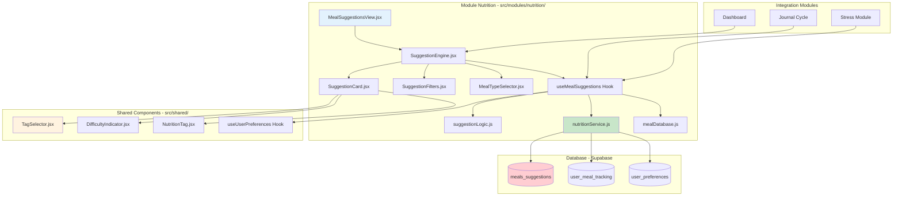
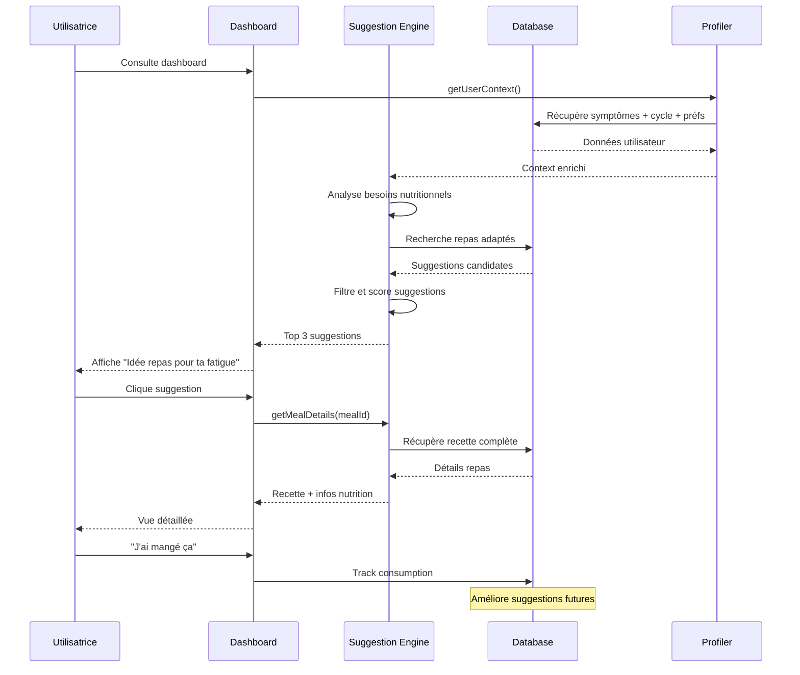

# 📝 Plan de Développement - Feature Suggestions Repas/Snacks (MVP v1.0)

## 🎯 Vue d'ensemble

### Description de la Feature
Système intelligent de suggestions de repas et snacks adaptés aux symptômes SOPK et à la phase du cycle, avec focus sur l'index glycémique bas et la simplicité de préparation.

### Valeur Utilisateur
- **Aide immédiate** : Savoir quoi manger selon ses symptômes du moment
- **Éducation douce** : Apprendre les bons réflexes alimentaires sans dogmatisme
- **Simplicité** : Suggestions courtes et faciles à préparer au quotidien

### Score RICE
- **Reach** : 5/5 (100% des utilisatrices SOPK ont des questions nutrition)
- **Impact** : 5/5 (alimentation = pilier central de gestion SOPK)
- **Confidence** : 4/5 (feature complexe mais bien définie)
- **Effort** : 2/5 (logique métier + base de données repas)
- **Score Final** : **50** ✅ **Priorité #3**

---

## 🔄 Diagrammes de Flux

### User Journey - Obtenir une Suggestion

```mermaid
flowchart TD
    A[Utilisatrice cherche quoi manger] --> B{Point d'entrée?}

    B -->|Dashboard| C[Suggestion du moment affichée]
    B -->|Notification| D[Push "Idée repas pour ton énergie"]
    B -->|Module nutrition| E[Page suggestions complète]

    C --> F[Contexte automatique]
    D --> F
    E --> F

    F --> G[Analyse du profil]
    G --> H[Symptômes du jour]
    G --> I[Phase du cycle]
    G --> J[Préférences utilisateur]
    G --> K[Historique alimentaire]

    H --> L[Moteur de suggestions]
    I --> L
    J --> L
    K --> L

    L --> M[Sélection de 2-3 options]
    M --> N[Affichage suggestions]

    N --> O[Utilisatrice choisit]
    O --> P{Action choisie?}

    P -->|Voir recette| Q[Redirection recettes détaillées]
    P -->|Ajouter au journal| R[Track consommation]
    P -->|Autres suggestions| S[Rafraîchir suggestions]
    P -->|Personnaliser| T[Ajuster préférences]

    R --> U[Mise à jour dashboard nutrition]
    Q --> V[Module recettes]

    style A fill:#ffcdd2
    style L fill:#e1f5fe
    style N fill:#e8f5e8
```

### Architecture Technique



### Flux de Données



---

## 🏗️ Architecture Technique

### Structure des Données

```sql
-- Base de données des repas et suggestions
CREATE TABLE meal_suggestions (
  id UUID PRIMARY KEY DEFAULT gen_random_uuid(),

  -- Informations de base
  name VARCHAR(100) NOT NULL,
  category VARCHAR(50) NOT NULL, -- 'breakfast', 'lunch', 'dinner', 'snack'
  difficulty VARCHAR(20) NOT NULL, -- 'very_easy', 'easy', 'medium'
  prep_time_minutes INTEGER NOT NULL,

  -- Nutrition
  glycemic_index_category VARCHAR(20), -- 'low', 'medium', 'high'
  main_nutrients TEXT[], -- ['protein', 'fiber', 'omega3']
  estimated_calories INTEGER,

  -- SOPK-specific
  sopk_benefits TEXT[], -- ['insulin_regulation', 'inflammation_reduction']
  symptom_targets TEXT[], -- ['fatigue', 'cravings', 'period_pain']
  cycle_phases TEXT[], -- ['menstrual', 'follicular', 'ovulation', 'luteal']

  -- Contenu
  ingredients_simple TEXT NOT NULL, -- Version ultra-courte
  preparation_steps TEXT NOT NULL, -- Instructions courtes
  tips TEXT, -- Conseils optionnels

  -- Métadonnées
  season TEXT[], -- ['spring', 'summer', 'autumn', 'winter']
  dietary_restrictions TEXT[], -- ['vegetarian', 'vegan', 'gluten_free']
  mood_boosting BOOLEAN DEFAULT false,

  created_at TIMESTAMP WITH TIME ZONE DEFAULT NOW()
);

-- Tracking des repas consommés par utilisateur
CREATE TABLE user_meal_tracking (
  id UUID PRIMARY KEY DEFAULT gen_random_uuid(),
  user_id UUID REFERENCES auth.users(id) ON DELETE CASCADE,
  meal_id UUID REFERENCES meal_suggestions(id),

  date DATE NOT NULL,
  meal_type VARCHAR(20) NOT NULL, -- 'breakfast', 'lunch', 'dinner', 'snack'

  -- Feedback utilisateur
  satisfaction_rating INTEGER CHECK (satisfaction_rating >= 1 AND satisfaction_rating <= 5),
  difficulty_felt VARCHAR(20), -- 'easier', 'as_expected', 'harder'
  will_remake BOOLEAN,

  created_at TIMESTAMP WITH TIME ZONE DEFAULT NOW()
);

-- Préférences alimentaires utilisateur
CREATE TABLE user_nutrition_preferences (
  id UUID PRIMARY KEY DEFAULT gen_random_uuid(),
  user_id UUID REFERENCES auth.users(id) ON DELETE CASCADE,

  -- Contraintes alimentaires
  dietary_restrictions TEXT[], -- ['vegetarian', 'gluten_free', 'dairy_free']

  -- Préférences
  preferred_meal_complexity VARCHAR(20) DEFAULT 'easy', -- 'very_easy', 'easy', 'medium'
  max_prep_time_minutes INTEGER DEFAULT 30,

  -- Dislikes/Allergies
  disliked_ingredients TEXT[],
  allergies TEXT[],

  -- Objectifs
  primary_nutrition_goals TEXT[], -- ['weight_management', 'energy_boost', 'inflammation_reduction']

  created_at TIMESTAMP WITH TIME ZONE DEFAULT NOW(),
  updated_at TIMESTAMP WITH TIME ZONE DEFAULT NOW(),

  UNIQUE(user_id)
);
```

### Structure Modulaire

#### Module Nutrition (`src/modules/nutrition/`)
```
src/modules/nutrition/
├── components/
│   ├── suggestions/
│   │   ├── SuggestionCard.jsx         # Carte suggestion individuelle
│   │   ├── SuggestionsList.jsx        # Liste des suggestions
│   │   ├── SuggestionFilters.jsx      # Filtres (temps, difficulté)
│   │   ├── MealTypeSelector.jsx       # Sélecteur type repas
│   │   └── QuickActionButtons.jsx     # Actions rapides (j'ai mangé, etc.)
│   ├── tracking/
│   │   ├── MealTracker.jsx            # Interface tracking repas
│   │   └── FeedbackForm.jsx           # Feedback post-consommation
│   └── preferences/
│       ├── DietaryPreferences.jsx     # Préférences alimentaires
│       └── NutritionGoals.jsx         # Objectifs nutrition
├── hooks/
│   ├── useMealSuggestions.js          # Hook principal suggestions
│   ├── useMealTracking.js             # Hook tracking repas
│   ├── useNutritionPreferences.js     # Hook gestion préférences
│   └── useMealDatabase.js             # Hook accès base repas
├── services/
│   ├── nutritionService.js            # API calls nutrition
│   ├── suggestionService.js           # Logique de suggestions
│   └── trackingService.js             # Service de tracking
├── types/
│   └── nutrition.types.js             # Types nutrition et repas
├── views/
│   ├── MealSuggestionsView.jsx        # Point d'entrée suggestions
│   └── NutritionPreferencesView.jsx   # Gestion préférences
├── utils/
│   ├── suggestionLogic.js             # Algorithme de suggestions
│   ├── mealDatabase.js                # Base de données repas statique
│   ├── nutritionHelpers.js            # Helpers calculs nutrition
│   └── nutritionValidation.js         # Validation Zod
└── data/
    ├── meals.json                     # Base de données repas (MVP)
    └── nutritionConstants.js          # Constantes nutrition
```

#### Extension Composants Partagés (`src/shared/`)
```
src/shared/
├── components/
│   ├── ui/
│   │   ├── NutritionTag.jsx           # Tags nutrition (IG bas, protéines)
│   │   ├── DifficultyIndicator.jsx    # Indicateur difficulté
│   │   ├── PrepTimeIndicator.jsx      # Indicateur temps de préparation
│   │   └── RatingStars.jsx            # Système de notation
│   └── nutrition/
│       ├── IngredientsList.jsx        # Liste ingrédients formatée
│       └── NutritionBadges.jsx        # Badges bénéfices SOPK
├── hooks/
│   ├── useUserPreferences.js          # Hook préférences générales
│   └── useContextualSuggestions.js    # Hook suggestions contextuelles
└── utils/
    ├── nutritionScoring.js            # Algorithmes de scoring
    └── mealFiltering.js               # Logique de filtrage repas
```

### Services API

```javascript
// src/modules/nutrition/services/suggestionService.js
export const suggestionService = {
  // Obtenir suggestions personnalisées
  async getPersonalizedSuggestions(userId, context = {}) {
    const {
      mealType = 'any',
      symptoms = [],
      cyclePhase = null,
      timeOfDay = new Date().getHours(),
      maxPrepTime = 30
    } = context;

    // Récupérer préférences utilisateur
    const { data: preferences } = await nutritionService.getUserPreferences(userId);

    // Récupérer historique récent
    const { data: recentMeals } = await trackingService.getRecentMeals(userId, 7);

    // Utiliser l'algorithme de suggestion
    const suggestions = SuggestionEngine.generateSuggestions({
      symptoms,
      cyclePhase,
      timeOfDay,
      maxPrepTime,
      preferences,
      recentMeals,
      mealType
    });

    return { data: suggestions };
  },

  // Rechercher repas par critères
  async searchMeals(filters = {}) {
    // Logique de recherche dans la base repas
    const filteredMeals = MealDatabase.search(filters);
    return { data: filteredMeals };
  },

  // Obtenir détails d'un repas
  async getMealDetails(mealId) {
    const meal = MealDatabase.getById(mealId);
    return { data: meal };
  }
};

// src/modules/nutrition/services/trackingService.js
export const trackingService = {
  // Enregistrer un repas consommé
  async trackMealConsumption(userId, mealId, mealType, feedback = {}) {
    const { error } = await supabase
      .from('user_meal_tracking')
      .insert({
        user_id: userId,
        meal_id: mealId,
        meal_type: mealType,
        date: new Date().toISOString().split('T')[0],
        ...feedback
      });
    return { error };
  },

  // Récupérer repas récents
  async getRecentMeals(userId, days = 7) {
    const startDate = new Date(Date.now() - days * 24 * 60 * 60 * 1000);
    const { data, error } = await supabase
      .from('user_meal_tracking')
      .select(`
        *,
        meal_suggestions(name, category, main_nutrients)
      `)
      .eq('user_id', userId)
      .gte('created_at', startDate.toISOString())
      .order('created_at', { ascending: false });
    return { data, error };
  }
};
```

---

## 🎨 Design UX/UI

### Interface Mobile-First

#### Intégration Dashboard
```
┌─────────────────────────┐
│      🏠 Dashboard       │
├─────────────────────────┤
│                         │
│  🍽️ Idée repas pour toi │
│                         │
│  😴 Tu sembles fatiguée │
│                         │
│  🥗 Salade quinoa-avocat │
│  ⏱️ 15 min • 🟢 IG bas   │
│  💪 Protéines • ⚡ Énergie│
│                         │
│  [Voir recette] [Autres]│
│                         │
│  ❓ Pas d'idée pour le   │
│     goûter ? Découvre   │
│     nos suggestions →   │
└─────────────────────────┘
```

#### Page Suggestions Complète
```
┌─────────────────────────┐
│   🍽️ Suggestions repas   │
├─────────────────────────┤
│                         │
│  Pour quand ?           │
│  [Maintenant] [+ tard]  │
│                         │
│  Type de repas          │
│  🌅 P.déj  🍽️ Repas     │
│  🥨 Snack  🌙 Dîner    │
│                         │
│  ⏱️ Temps: [15 min ▼]   │
│  🍽️ Difficulté: [Facile▼]│
│                         │
│  📋 Suggestions pour toi:│
│                         │
│  ┌─────────────────────┐ │
│  │ 🥗 Bowl énergie     │ │
│  │ ⏱️ 10 min • 🟢 IG bas│ │
│  │ 💪 Parfait contre   │ │
│  │    la fatigue       │ │
│  │ [Voir] [✅ Mangé]   │ │
│  └─────────────────────┘ │
│                         │
│  ┌─────────────────────┐ │
│  │ 🥪 Tartine avocat   │ │
│  │ ⏱️ 5 min • 🟢 IG bas │ │
│  │ 🧘 Anti-stress      │ │
│  │ [Voir] [✅ Mangé]   │ │
│  └─────────────────────┘ │
└─────────────────────────┘
```

#### Détail d'une Suggestion
```
┌─────────────────────────┐
│   🥗 Bowl Énergie SOPK   │
├─────────────────────────┤
│                         │
│  ⏱️ 10 min de préparation│
│  🟢 Index glycémique bas │
│  💪 Riche en protéines   │
│  ⚡ Booste l'énergie     │
│                         │
│  🛒 Ingrédients :       │
│  • Quinoa cuit (150g)   │
│  • Avocat (1/2)         │
│  • Œuf dur (1)          │
│  • Épinards (poignée)   │
│  • Graines tournesol    │
│                         │
│  👩‍🍳 Préparation :        │
│  1. Mélange quinoa +    │
│     épinards dans bol   │
│  2. Ajoute avocat en    │
│     lamelles           │
│  3. Œuf dur coupé +    │
│     graines par-dessus │
│                         │
│  💡 Parfait quand tu as │
│     besoin d'énergie    │
│     stable !           │
│                         │
│  [✅ J'ai mangé ça]     │
│  [📱 Partager]          │
│  [⭐ Noter cette recette]│
└─────────────────────────┘
```

### Design System - Nutrition

```css
:root {
  /* Couleurs par typologie nutritionnelle */
  --nutrition-protein: #8BC34A;     /* Vert - protéines */
  --nutrition-fiber: #FF9800;       /* Orange - fibres */
  --nutrition-omega3: #2196F3;      /* Bleu - oméga 3 */
  --nutrition-low-gi: #4CAF50;      /* Vert foncé - IG bas */

  /* Difficultés */
  --difficulty-easy: #4CAF50;       /* Vert - facile */
  --difficulty-medium: #FF9800;     /* Orange - moyen */
  --difficulty-hard: #F44336;       /* Rouge - difficile */

  /* Temps de préparation */
  --time-quick: #4CAF50;            /* < 15 min */
  --time-medium: #FF9800;           /* 15-30 min */
  --time-long: #F44336;             /* > 30 min */
}

.suggestion-card {
  border-radius: 12px;
  border: 2px solid #F5F5F5;
  transition: all 0.3s ease;
}

.suggestion-card:hover {
  border-color: var(--nutrition-low-gi);
  box-shadow: 0 4px 12px rgba(76, 175, 80, 0.15);
}

.nutrition-tag {
  font-size: 0.75rem;
  padding: 0.25rem 0.5rem;
  border-radius: 16px;
  font-weight: 500;
}

.nutrition-tag.protein {
  background: #E8F5E8;
  color: var(--nutrition-protein);
}

.difficulty-indicator.easy::before {
  content: "🟢";
}

.prep-time-indicator.quick::before {
  content: "⚡";
  color: var(--time-quick);
}
```

---

## 📱 User Stories Détaillées

### US1: Suggestion Contextuelle
**En tant qu'** utilisatrice SOPK fatiguée
**Je veux** des idées de repas qui donnent de l'énergie
**Afin de** savoir quoi manger sans réfléchir

**Critères d'acceptation** :
- [ ] Suggestion adaptée automatiquement à mes symptômes du jour
- [ ] Propositions concrètes avec temps de préparation réaliste
- [ ] Explication simple des bénéfices pour le SOPK
- [ ] Maximum 3 suggestions pour éviter l'indécision
- [ ] Accès depuis dashboard en 1 clic

### US2: Repas Faciles et Rapides
**En tant qu'** utilisatrice débordée
**Je veux** des repas simples en moins de 15 minutes
**Afin de** bien manger même quand j'ai peu de temps

**Critères d'acceptation** :
- [ ] Filtrage par temps de préparation (5, 15, 30 min)
- [ ] Niveau de difficulté clairement indiqué
- [ ] Ingrédients faciles à trouver en supermarché
- [ ] Instructions en 3-4 étapes maximum
- [ ] Option "Très facile" pour les jours difficiles

### US3: Apprentissage Sans Culpabilité
**En tant qu'** utilisatrice qui n'a pas de bases en nutrition
**Je veux** comprendre pourquoi tel repas est bon pour moi
**Afin d'** apprendre progressivement sans me sentir jugée

**Critères d'acceptation** :
- [ ] Explications courtes et bienveillantes des bienfaits
- [ ] Pas de jargon médical ou de restrictions strictes
- [ ] Focus sur les bénéfices positifs (énergie, bien-être)
- [ ] Suggestions alternatives sans frustration
- [ ] Langage inclusif et non culpabilisant

---

## 🛠️ Implémentation Détaillée

### Sprint 1: Base de Données Repas (Semaine 1)
**Objectif** : Créer la foundation avec première base de repas

**Tâches** :
1. **Structure base de données**
   ```sql
   -- Création tables complètes
   -- Insertion 30-50 repas de base pour MVP

   INSERT INTO meal_suggestions (name, category, difficulty, prep_time_minutes, ...) VALUES
   ('Bowl quinoa-avocat', 'lunch', 'easy', 10, 'low',
    ARRAY['protein', 'fiber'], 350, ARRAY['insulin_regulation'],
    ARRAY['fatigue'], ARRAY['any'],
    'Quinoa cuit, avocat, œuf dur, épinards, graines',
    '1. Mélanger quinoa + épinards 2. Ajouter avocat en lamelles 3. Œuf et graines par-dessus',
    'Idéal pour énergie stable !'),
   (...);
   ```

2. **Base de données statique pour MVP**
   ```javascript
   // src/modules/nutrition/data/meals.json
   export const mealsDatabase = [
     {
       id: 'bowl-quinoa-avocat',
       name: 'Bowl Quinoa-Avocat',
       category: 'lunch',
       difficulty: 'easy',
       prepTimeMinutes: 10,
       glycemicIndex: 'low',
       mainNutrients: ['protein', 'fiber', 'healthy_fats'],
       sopkBenefits: ['insulin_regulation', 'sustained_energy'],
       symptomTargets: ['fatigue', 'cravings'],
       cyclePhases: ['any'],
       ingredients: 'Quinoa cuit (150g), avocat (1/2), œuf dur (1), épinards (poignée), graines de tournesol',
       preparation: '1. Mélanger quinoa + épinards dans un bol\n2. Ajouter avocat en lamelles\n3. Œuf dur coupé + graines par-dessus',
       tips: 'Idéal quand tu as besoin d\'énergie stable !',
       estimatedCalories: 350,
       season: ['spring', 'summer', 'autumn', 'winter'],
       dietaryRestrictions: ['vegetarian'],
       moodBoosting: true
     },
     // ... autres repas
   ];
   ```

3. **Service de base**
   ```javascript
   // src/modules/nutrition/utils/mealDatabase.js
   import { mealsDatabase } from '../data/meals.json';

   export class MealDatabase {
     static search(filters = {}) {
       let results = mealsDatabase;

       if (filters.category) {
         results = results.filter(meal => meal.category === filters.category);
       }

       if (filters.maxPrepTime) {
         results = results.filter(meal => meal.prepTimeMinutes <= filters.maxPrepTime);
       }

       if (filters.difficulty) {
         results = results.filter(meal => meal.difficulty === filters.difficulty);
       }

       if (filters.symptomTargets?.length) {
         results = results.filter(meal =>
           filters.symptomTargets.some(symptom =>
             meal.symptomTargets.includes(symptom)
           )
         );
       }

       return results;
     }

     static getById(id) {
       return mealsDatabase.find(meal => meal.id === id);
     }

     static getByCategory(category) {
       return mealsDatabase.filter(meal => meal.category === category);
     }

     static getForSymptoms(symptoms = []) {
       return mealsDatabase.filter(meal =>
         symptoms.some(symptom => meal.symptomTargets.includes(symptom))
       );
     }
   }
   ```

### Sprint 2: Algorithme de Suggestions (Semaine 2)
**Objectif** : Logique métier intelligente de recommandations

**Tâches** :
1. **Moteur de suggestions**
   ```javascript
   // src/modules/nutrition/utils/suggestionLogic.js
   export class SuggestionEngine {
     static generateSuggestions(context) {
       const {
         symptoms = [],
         cyclePhase = null,
         timeOfDay = 12,
         maxPrepTime = 30,
         preferences = {},
         recentMeals = [],
         mealType = 'any'
       } = context;

       // 1. Filtrer par contraintes de base
       let candidates = MealDatabase.search({
         category: mealType !== 'any' ? mealType : this.detectMealType(timeOfDay),
         maxPrepTime: Math.min(maxPrepTime, preferences.maxPrepTime || 30),
         difficulty: preferences.preferredComplexity || 'easy'
       });

       // 2. Exclure régimes alimentaires non compatibles
       if (preferences.dietaryRestrictions?.length) {
         candidates = candidates.filter(meal =>
           preferences.dietaryRestrictions.every(restriction =>
             meal.dietaryRestrictions?.includes(restriction) ||
             !this.conflictsWith(meal, restriction)
           )
         );
       }

       // 3. Exclure ingrédients détestés/allergies
       if (preferences.dislikedIngredients?.length || preferences.allergies?.length) {
         const forbidden = [...(preferences.dislikedIngredients || []), ...(preferences.allergies || [])];
         candidates = candidates.filter(meal =>
           !forbidden.some(ingredient =>
             meal.ingredients.toLowerCase().includes(ingredient.toLowerCase())
           )
         );
       }

       // 4. Scorer selon pertinence contexte SOPK
       const scoredCandidates = candidates.map(meal => ({
         ...meal,
         score: this.calculateMealScore(meal, { symptoms, cyclePhase, recentMeals })
       }));

       // 5. Trier et retourner top 3
       return scoredCandidates
         .sort((a, b) => b.score - a.score)
         .slice(0, 3);
     }

     static calculateMealScore(meal, context) {
       let score = 50; // Score de base

       // Bonus pour symptômes ciblés
       if (context.symptoms?.length) {
         const symptomMatch = context.symptoms.filter(symptom =>
           meal.symptomTargets.includes(symptom)
         ).length;
         score += symptomMatch * 20;
       }

       // Bonus pour phase de cycle
       if (context.cyclePhase && meal.cyclePhases.includes(context.cyclePhase)) {
         score += 15;
       }

       // Malus pour répétition récente
       const recentCount = context.recentMeals?.filter(rm => rm.meal_id === meal.id).length || 0;
       score -= recentCount * 10;

       // Bonus pour index glycémique bas (priorité SOPK)
       if (meal.glycemicIndex === 'low') {
         score += 10;
       }

       // Bonus pour boost humeur si besoin
       if (meal.moodBoosting && context.symptoms?.includes('mood_low')) {
         score += 15;
       }

       return Math.max(0, score);
     }

     static detectMealType(hour) {
       if (hour < 10) return 'breakfast';
       if (hour < 14) return 'lunch';
       if (hour < 17) return 'snack';
       return 'dinner';
     }

     static conflictsWith(meal, restriction) {
       const conflicts = {
         'vegetarian': ['meat', 'fish', 'chicken'],
         'vegan': ['meat', 'fish', 'chicken', 'egg', 'dairy', 'cheese'],
         'gluten_free': ['wheat', 'bread', 'pasta']
       };

       const conflictWords = conflicts[restriction] || [];
       return conflictWords.some(word =>
         meal.ingredients.toLowerCase().includes(word)
       );
     }
   }
   ```

2. **Hook principal**
   ```javascript
   // src/modules/nutrition/hooks/useMealSuggestions.js
   import { useState, useEffect } from 'react';
   import { SuggestionEngine } from '../utils/suggestionLogic';
   import { useUserPreferences } from '../../../shared/hooks/useUserPreferences';

   export const useMealSuggestions = (context = {}) => {
     const [suggestions, setSuggestions] = useState([]);
     const [loading, setLoading] = useState(false);
     const [error, setError] = useState(null);

     const { preferences } = useUserPreferences();

     const generateSuggestions = async (customContext = {}) => {
       setLoading(true);
       setError(null);

       try {
         // Enrichir le contexte avec données utilisateur
         const enrichedContext = {
           ...context,
           ...customContext,
           preferences: preferences?.nutrition || {}
         };

         // Récupérer historique récent
         if (enrichedContext.userId) {
           const { data: recentMeals } = await trackingService.getRecentMeals(
             enrichedContext.userId,
             7
           );
           enrichedContext.recentMeals = recentMeals || [];
         }

         // Générer suggestions
         const newSuggestions = SuggestionEngine.generateSuggestions(enrichedContext);
         setSuggestions(newSuggestions);
       } catch (err) {
         setError(err);
         console.error('Erreur génération suggestions:', err);
       } finally {
         setLoading(false);
       }
     };

     const refreshSuggestions = () => generateSuggestions();

     const trackMealChosen = async (mealId, mealType) => {
       if (context.userId) {
         await trackingService.trackMealConsumption(
           context.userId,
           mealId,
           mealType
         );
         // Regénérer suggestions pour prendre en compte le nouveau choix
         generateSuggestions();
       }
     };

     useEffect(() => {
       generateSuggestions();
     }, [context.symptoms, context.cyclePhase, preferences]);

     return {
       suggestions,
       loading,
       error,
       refreshSuggestions,
       trackMealChosen
     };
   };
   ```

### Sprint 3: Interface Utilisateur (Semaine 3)
**Objectif** : UX/UI complète et intégration dashboard

**Tâches** :
1. **Composant SuggestionCard**
   ```jsx
   // src/modules/nutrition/components/suggestions/SuggestionCard.jsx
   import { DifficultyIndicator } from '../../../../shared/components/ui/DifficultyIndicator';
   import { PrepTimeIndicator } from '../../../../shared/components/ui/PrepTimeIndicator';
   import { NutritionTag } from '../../../../shared/components/ui/NutritionTag';

   export const SuggestionCard = ({ meal, onViewDetails, onTrackMeal }) => {
     const handleTrackMeal = () => {
       onTrackMeal(meal.id, meal.category);
       // Feedback visuel
       toast.success('Super ! Repas ajouté à ton suivi 🍽️');
     };

     return (
       <div className="suggestion-card bg-white p-4 rounded-xl border-2 border-gray-100 hover:border-green-400 transition-all">
         <div className="flex justify-between items-start mb-3">
           <h3 className="font-semibold text-lg text-gray-800">
             {meal.name}
           </h3>
           <button
             onClick={() => onViewDetails(meal)}
             className="text-blue-500 text-sm"
           >
             Voir →
           </button>
         </div>

         <div className="flex gap-2 mb-3">
           <PrepTimeIndicator minutes={meal.prepTimeMinutes} />
           <DifficultyIndicator level={meal.difficulty} />
           {meal.glycemicIndex === 'low' && (
             <NutritionTag type="low-gi">🟢 IG bas</NutritionTag>
           )}
         </div>

         <div className="flex gap-1 mb-3 flex-wrap">
           {meal.mainNutrients.slice(0, 2).map(nutrient => (
             <NutritionTag key={nutrient} type={nutrient}>
               {this.getNutrientLabel(nutrient)}
             </NutritionTag>
           ))}
         </div>

         {meal.tips && (
           <p className="text-sm text-gray-600 italic mb-3">
             💡 {meal.tips}
           </p>
         )}

         <div className="flex gap-2">
           <button
             onClick={() => onViewDetails(meal)}
             className="flex-1 bg-blue-50 text-blue-600 py-2 px-4 rounded-lg text-sm font-medium hover:bg-blue-100"
           >
             Voir recette
           </button>
           <button
             onClick={handleTrackMeal}
             className="bg-green-500 text-white px-4 py-2 rounded-lg text-sm font-medium hover:bg-green-600"
           >
             ✅ Mangé
           </button>
         </div>
       </div>
     );
   };
   ```

2. **Intégration Dashboard**
   ```jsx
   // Extension du Dashboard principal pour inclure suggestions
   import { useMealSuggestions } from '../../modules/nutrition/hooks/useMealSuggestions';

   export const DashboardView = () => {
     const { currentSymptoms, cyclePhase } = useDailySymptoms();
     const { suggestions } = useMealSuggestions({
       symptoms: currentSymptoms,
       cyclePhase,
       mealType: 'auto', // Détection automatique selon heure
       userId: user.id
     });

     const primarySuggestion = suggestions[0];

     return (
       <div className="dashboard">
         {/* Sections existantes */}

         {primarySuggestion && (
           <section className="meal-suggestion-widget bg-gradient-to-r from-green-50 to-blue-50 rounded-xl p-4 mb-6">
             <h2 className="text-lg font-semibold mb-3 flex items-center gap-2">
               🍽️ Idée repas pour toi
             </h2>

             {currentSymptoms.length > 0 && (
               <p className="text-sm text-gray-600 mb-3">
                 {this.getContextMessage(currentSymptoms)}
               </p>
             )}

             <SuggestionCard
               meal={primarySuggestion}
               onViewDetails={(meal) => navigate(`/nutrition/meals/${meal.id}`)}
               onTrackMeal={trackMealFromDashboard}
               compact={true}
             />

             <Link
               to="/nutrition/suggestions"
               className="block text-center text-blue-600 text-sm mt-3 hover:underline"
             >
               ❓ Pas d'idée pour plus tard ? Voir toutes les suggestions →
             </Link>
           </section>
         )}

         {/* Reste du dashboard */}
       </div>
     );
   };
   ```

---

## 🧪 Tests & Validation

### Tests Unitaires (Vitest)
```javascript
describe('SuggestionEngine', () => {
  test('génère suggestions adaptées aux symptômes', () => {
    const context = {
      symptoms: ['fatigue', 'cravings'],
      timeOfDay: 12, // midi
      maxPrepTime: 15
    };

    const suggestions = SuggestionEngine.generateSuggestions(context);

    expect(suggestions).toHaveLength(3);
    expect(suggestions[0].symptomTargets).toEqual(
      expect.arrayContaining(['fatigue'])
    );
    expect(suggestions[0].prepTimeMinutes).toBeLessThanOrEqual(15);
  });

  test('exclut repas récents de l\'historique', () => {
    const context = {
      symptoms: ['fatigue'],
      recentMeals: [
        { meal_id: 'bowl-quinoa-avocat', created_at: new Date() }
      ]
    };

    const suggestions = SuggestionEngine.generateSuggestions(context);

    // Le bowl quinoa ne devrait pas être en première position
    expect(suggestions[0].id).not.toBe('bowl-quinoa-avocat');
  });

  test('respecte les restrictions alimentaires', () => {
    const context = {
      preferences: {
        dietaryRestrictions: ['vegetarian'],
        allergies: ['nuts']
      }
    };

    const suggestions = SuggestionEngine.generateSuggestions(context);

    suggestions.forEach(meal => {
      expect(meal.ingredients.toLowerCase()).not.toContain('meat');
      expect(meal.ingredients.toLowerCase()).not.toContain('nuts');
    });
  });
});
```

### Tests d'Intégration
```javascript
describe('Meal Suggestions Feature E2E', () => {
  test('flow complet suggestion depuis dashboard', async () => {
    // Setup utilisateur avec symptômes
    const user = await createTestUser({ symptoms: ['fatigue'] });

    render(<DashboardView />, { user });

    // Vérifier affichage suggestion
    await waitFor(() => {
      expect(screen.getByText(/idée repas pour toi/i)).toBeInTheDocument();
    });

    // Vérifier contextualisation
    expect(screen.getByText(/tu sembles fatiguée/i)).toBeInTheDocument();

    // Cliquer sur suggestion
    const suggestionCard = screen.getByText(/bowl/i);
    fireEvent.click(suggestionCard);

    // Vérifier détails
    expect(screen.getByText(/ingrédients/i)).toBeInTheDocument();
    expect(screen.getByText(/préparation/i)).toBeInTheDocument();

    // Tracker consommation
    fireEvent.click(screen.getByText(/j'ai mangé/i));

    await waitFor(() => {
      expect(mockTrackingService.trackMealConsumption).toHaveBeenCalledWith(
        user.id,
        expect.any(String),
        'lunch'
      );
    });
  });
});
```

### Critères de Validation MVP
- [ ] **Pertinence** : 85% des suggestions jugées appropriées par utilisatrices
- [ ] **Facilité** : 90% des recettes classées "facile" réellement réalisées en temps annoncé
- [ ] **Adoption** : 60% utilisatrices consultent suggestions 3+ fois/semaine
- [ ] **Tracking** : 40% utilisatrices trackent au moins 1 repas/jour
- [ ] **Performance** : Génération suggestions < 500ms

---

## 🚀 Déploiement & Monitoring

### Variables d'Environnement
```env
# Configuration suggestions
VITE_MAX_SUGGESTIONS_COUNT=3
VITE_DEFAULT_PREP_TIME=30
VITE_ENABLE_MEAL_TRACKING=true

# Feature flags
VITE_ENABLE_ADVANCED_FILTERING=false
VITE_ENABLE_CALORIE_TRACKING=false
VITE_ENABLE_RECIPE_SHARING=false
```

### Métriques Clés
```javascript
// Analytics events nutrition
const trackNutritionEvents = {
  suggestion_viewed: (mealId, context) => analytics.track('Meal Suggestion Viewed', {
    meal_id: mealId,
    symptoms: context.symptoms,
    time_of_day: context.timeOfDay
  }),
  suggestion_detailed: (mealId) => analytics.track('Meal Details Viewed', { meal_id: mealId }),
  meal_tracked: (mealId, mealType, satisfaction) => analytics.track('Meal Tracked', {
    meal_id: mealId,
    meal_type: mealType,
    satisfaction_rating: satisfaction
  }),
  suggestions_refreshed: (count) => analytics.track('Suggestions Refreshed', { count }),
  suggestion_relevance: (mealId, rating) => analytics.track('Suggestion Relevance Rated', {
    meal_id: mealId,
    relevance_rating: rating
  })
};
```

### Dashboard Monitoring
- **Engagement** : Taux de consultation suggestions depuis dashboard
- **Conversion** : % suggestions → détails vus → repas trackés
- **Pertinence** : Note moyenne de pertinence des suggestions
- **Performance** : Temps de génération par utilisatrice

---

## 🔄 Évolutions Post-MVP

### Version 1.1
- **Génération intelligente** : Machine learning pour améliorer pertinence
- **Photos des plats** : Visuel pour chaque suggestion
- **Mode courses** : Génération liste d'ingrédients pour plusieurs repas

### Version 1.2
- **Planification repas** : Suggestions pour toute la semaine
- **Intégration courses** : API supermarchés pour commande en ligne
- **Partage communauté** : Suggestions entre utilisatrices

---

## ✅ Definition of Done

### Critères Techniques
- [ ] Base de données repas populée avec 50+ recettes validées
- [ ] Algorithme suggestions testé sur 20+ profils différents
- [ ] Performance < 300ms pour génération suggestions
- [ ] Code coverage > 85% pour logique métier
- [ ] Intégration fluide dashboard sans régression

### Critères Utilisateur
- [ ] Tests utilisateur > 4.3/5 sur utilité suggestions
- [ ] Recettes testées par équipe pour faisabilité temps annoncé
- [ ] Langage bienveillant validé par psychologue nutrition
- [ ] 0 suggestion avec ingrédients difficiles à trouver
- [ ] Interface accessible malvoyants

### Critères Business
- [ ] Tracking complet pour analyser patterns d'usage
- [ ] Foundation prête pour monétisation future (partenariats)
- [ ] Base de connaissances nutrition extensible
- [ ] Métriques de satisfaction configurées

---

*📋 Cette feature transforme l'app en assistant nutrition personnalisé, donnant confiance aux utilisatrices SOPK dans leurs choix alimentaires quotidiens.*