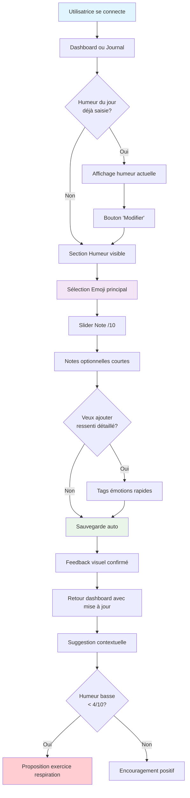
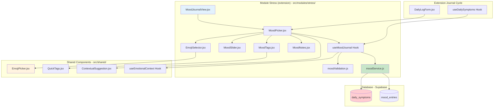
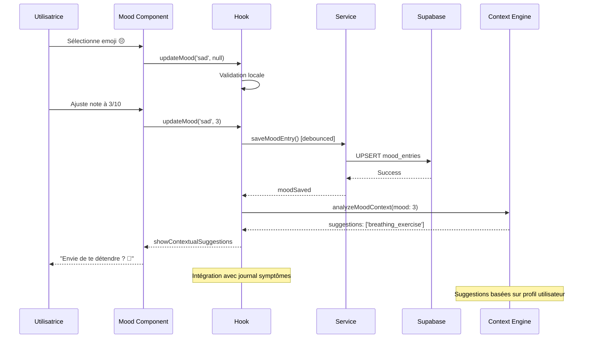

# 📝 Plan de Développement - Feature Journal Humeur Rapide (MVP v1.0)

## 🎯 Vue d'ensemble

### Description de la Feature
Interface ultra-simple permettant de noter son état émotionnel quotidien avec des émojis et une note rapide, intégrée au journal quotidien existant pour créer une routine bien-être.

### Valeur Utilisateur
- **Prise de conscience** : Comprendre ses patterns émotionnels liés au SOPK
- **Simplicité** : Saisie en 10 secondes maximum, sans contrainte
- **Corrélations** : Lien avec symptômes physiques et cycles pour insights

### Score RICE
- **Reach** : 4/5 (80% des utilisatrices SOPK ont des variations d'humeur)
- **Impact** : 3/5 (outil de compréhension, moins d'impact immédiat)
- **Confidence** : 5/5 (pattern interface éprouvé)
- **Effort** : 1/5 (extension du journal existant)
- **Score Final** : **60** ✅ **Priorité #2**

---

## 🔄 Diagrammes de Flux

### User Journey - Saisie Humeur



### Architecture Technique



### Flux de Données



---

## 🏗️ Architecture Technique

### Structure des Données

```sql
-- Extension table existante daily_symptoms avec colonnes mood
-- (déjà présentes d'après le journal quotidien)

-- Table supplémentaire pour tracking émotionnel détaillé
CREATE TABLE mood_entries (
  id UUID PRIMARY KEY DEFAULT gen_random_uuid(),
  user_id UUID REFERENCES auth.users(id) ON DELETE CASCADE,
  date DATE NOT NULL,

  -- Données humeur principales
  primary_emotion VARCHAR(20) NOT NULL, -- 'happy', 'sad', 'anxious', 'calm', etc.
  mood_score INTEGER CHECK (mood_score >= 1 AND mood_score <= 10),

  -- Tags émotionnels rapides (optionnel)
  emotion_tags TEXT[], -- ['stressed', 'tired', 'hopeful']

  -- Notes courtes (optionnel)
  mood_notes TEXT,

  -- Contexte pour suggestions
  context_triggers TEXT[], -- ['period_pain', 'work_stress', 'sleep_poor']

  created_at TIMESTAMP WITH TIME ZONE DEFAULT NOW(),
  updated_at TIMESTAMP WITH TIME ZONE DEFAULT NOW(),

  UNIQUE(user_id, date)
);

-- Index pour améliorer performances
CREATE INDEX idx_mood_entries_user_date ON mood_entries(user_id, date DESC);
CREATE INDEX idx_mood_entries_emotion ON mood_entries(user_id, primary_emotion, created_at DESC);
```

### Structure Modulaire

#### Extension Module Stress (`src/modules/stress/`)
```
src/modules/stress/
├── components/
│   ├── mood/                         # Nouveau sous-dossier
│   │   ├── MoodPicker.jsx           # Composant principal humeur
│   │   ├── EmojiSelector.jsx        # Sélecteur emoji principal
│   │   ├── MoodSlider.jsx           # Note /10 avec labels
│   │   ├── MoodTags.jsx             # Tags émotions rapides
│   │   ├── MoodNotes.jsx            # Notes courtes optionnelles
│   │   └── MoodContextualSuggestion.jsx # Suggestions basées contexte
│   └── [existing breathing components...]
├── hooks/
│   ├── useMoodJournal.js            # Hook gestion humeur
│   ├── useEmotionalContext.js       # Hook suggestions contextuelles
│   └── [existing hooks...]
├── services/
│   ├── moodService.js               # API calls humeur
│   └── [existing services...]
├── types/
│   ├── mood.types.js                # Types émotions et moods
│   └── [existing types...]
├── views/
│   ├── MoodJournalView.jsx          # Point d'entrée mood seul
│   └── [existing views...]
└── utils/
    ├── moodValidation.js            # Validation Zod humeur
    ├── emotionHelpers.js            # Helpers calculs émotionnels
    └── [existing utils...]
```

#### Extension Composants Partagés (`src/shared/`)
```
src/shared/
├── components/
│   ├── ui/
│   │   ├── EmojiPicker.jsx          # Picker emoji générique
│   │   ├── QuickTags.jsx            # Tags sélection rapide
│   │   ├── ContextualSuggestion.jsx # Suggestions intelligentes
│   │   └── [existing UI components...]
│   └── selectors/
│       └── [existing selectors...]
├── hooks/
│   ├── useEmotionalContext.js       # Hook contexte émotionnel partagé
│   └── [existing hooks...]
└── utils/
    ├── emotionConstants.js          # Constantes émojis/émotions
    ├── suggestionEngine.js          # Moteur suggestions
    └── [existing utils...]
```

### Services API

```javascript
// src/modules/stress/services/moodService.js
export const moodService = {
  // Sauvegarder humeur du jour
  async saveMoodEntry(userId, date, moodData) {
    const { error } = await supabase
      .from('mood_entries')
      .upsert({
        user_id: userId,
        date,
        ...moodData,
        updated_at: new Date().toISOString()
      });
    return { error };
  },

  // Récupérer humeur d'une date
  async getMoodEntry(userId, date) {
    const { data, error } = await supabase
      .from('mood_entries')
      .select('*')
      .eq('user_id', userId)
      .eq('date', date)
      .single();
    return { data, error };
  },

  // Historique humeur pour patterns
  async getMoodHistory(userId, days = 30) {
    const startDate = new Date(Date.now() - days * 24 * 60 * 60 * 1000);
    const { data, error } = await supabase
      .from('mood_entries')
      .select('date, primary_emotion, mood_score, emotion_tags')
      .eq('user_id', userId)
      .gte('created_at', startDate.toISOString())
      .order('date', { ascending: false });
    return { data, error };
  },

  // Moyennes et trends pour dashboard
  async getMoodStats(userId, period = 'week') {
    // Logique de calcul moyennes, tendances, emotions fréquentes
    // ...
    return { avgMood, trendDirection, commonEmotions };
  }
};
```

---

## 🎨 Design UX/UI

### Interface Mobile-First

#### Intégré au Journal Quotidien
```
┌─────────────────────────┐
│    📅 Journal du jour    │
├─────────────────────────┤
│  Mer. 13 Sept. 2024    │
│  < Hier    Demain >     │
├─────────────────────────┤
│                         │
│  🩸 Mes règles          │
│  ●○○○○  Aucune         │
│                         │
│  😴 Ma fatigue          │
│  ●●●○○  Modérée        │
│                         │
│  😊 Mon humeur          │
│  [😔] [😐] [🙂] [😊] [😄]│
│  Note: ●●●○○○○○○○ 3/10  │
│  Étiquettes: Stressée   │
│                         │
│  💡 Envie de te détendre?│
│  🧘 Essayer respiration │
│                         │
│  ✅ Sauvegardé !        │
└─────────────────────────┘
```

#### Standalone Humeur (accès rapide)
```
┌─────────────────────────┐
│     😊 Comment ça va ?   │
├─────────────────────────┤
│                         │
│  Choisis ton émotion :  │
│                         │
│  😢  😔  😐  🙂  😊  😄  │
│                         │
│  Note ton humeur :      │
│  ●●●●○○○○○○  4/10      │
│                         │
│  🏷️ Étiquettes rapides   │
│  Stressée  Fatiguée     │
│  Anxieuse  Positive     │
│                         │
│  📝 Une note ? (optionnel) │
│  [Courte zone de texte] │
│                         │
│  💡 Suggestion :        │
│  Tes données montrent   │
│  que tu es souvent plus │
│  calme après une respi  │
│                         │
│  [🧘 Essayer maintenant] │
└─────────────────────────┘
```

### Design System - Émotions

```css
:root {
  /* Palette émotionnelle */
  --emotion-very-sad: #F44336;      /* Rouge - très triste */
  --emotion-sad: #FF9800;           /* Orange - triste */
  --emotion-neutral: #9E9E9E;       /* Gris - neutre */
  --emotion-happy: #4CAF50;         /* Vert - content */
  --emotion-very-happy: #2196F3;    /* Bleu - très content */

  /* États mood slider */
  --mood-gradient: linear-gradient(
    to right,
    var(--emotion-very-sad) 0%,
    var(--emotion-sad) 25%,
    var(--emotion-neutral) 50%,
    var(--emotion-happy) 75%,
    var(--emotion-very-happy) 100%
  );

  /* Tags émotionnels */
  --tag-selected: #E3F2FD;
  --tag-unselected: #F5F5F5;
  --tag-text-selected: #1976D2;
  --tag-text-unselected: #757575;
}

.mood-slider {
  background: var(--mood-gradient);
  height: 8px;
  border-radius: 4px;
  position: relative;
}

.emoji-button {
  font-size: 2rem;
  padding: 0.5rem;
  border-radius: 50%;
  transition: transform 0.2s ease;
}

.emoji-button:hover {
  transform: scale(1.2);
}

.emoji-button.selected {
  background: rgba(33, 150, 243, 0.1);
  transform: scale(1.3);
}
```

---

## 📱 User Stories Détaillées

### US1: Saisie Express
**En tant qu'** utilisatrice pressée
**Je veux** noter mon humeur en moins de 10 secondes
**Afin de** maintenir la routine sans effort

**Critères d'acceptation** :
- [ ] Interface accessible depuis dashboard en 1 clic
- [ ] Sélection emoji seule suffit (note /10 optionnelle)
- [ ] Sauvegarde instantanée après sélection emoji
- [ ] Feedback visuel immédiat de confirmation
- [ ] Pas de champs obligatoires autres que emoji

### US2: Intégration Journal
**En tant qu'** utilisatrice qui tient déjà son journal SOPK
**Je veux** que l'humeur soit intégrée dans ma routine quotidienne
**Afin d'** avoir une vision globale de ma santé

**Critères d'acceptation** :
- [ ] Section humeur visible dans le journal quotidien existant
- [ ] Données partagées avec le module symptômes
- [ ] Navigation fluide entre sections du journal
- [ ] Pas de duplication d'interface ou de saisie
- [ ] Export inclut humeur + symptômes ensemble

### US3: Suggestions Contextuelles
**En tant qu'** utilisatrice avec une humeur basse
**Je veux** des suggestions d'aide adaptées à mon état
**Afin de** savoir quoi faire pour aller mieux

**Critères d'acceptation** :
- [ ] Suggestion automatique si humeur < 4/10
- [ ] Lien direct vers exercice respiration si disponible
- [ ] Messages bienveillants et non culpabilisants
- [ ] Suggestions basées sur mon historique et préférences
- [ ] Possibilité d'ignorer/masquer sans impact négatif

---

## 🛠️ Implémentation Détaillée

### Sprint 1: Extension Journal (Semaine 1)
**Objectif** : Intégrer humeur dans le journal quotidien existant

**Tâches** :
1. **Extension base de données**
   ```sql
   -- Les colonnes mood sont déjà dans daily_symptoms
   -- Ajouter table complémentaire mood_entries
   CREATE TABLE mood_entries (
     -- voir structure complète ci-dessus
   );
   ```

2. **Extension du hook journal existant**
   ```javascript
   // src/modules/cycle/hooks/useJournalForm.js (extension)
   import { useMoodJournal } from '../../stress/hooks/useMoodJournal';

   export const useJournalForm = (initialDate = new Date()) => {
     const [formData, setFormData] = useState({});
     const [currentDate, setCurrentDate] = useState(initialDate);

     // Intégration mood
     const moodJournal = useMoodJournal(currentDate);

     // Fonction update unifiée
     const updateField = (field, value) => {
       if (field.startsWith('mood_')) {
         moodJournal.updateMoodField(field, value);
       } else {
         // Logique existante symptômes
         const newData = { ...formData, [field]: value };
         setFormData(newData);
         triggerSave(newData);
       }
     };

     return {
       formData,
       currentDate,
       saveStatus,
       updateField,
       setCurrentDate,
       moodData: moodJournal.moodData,
       moodSuggestions: moodJournal.suggestions
     };
   };
   ```

3. **Composant MoodPicker intégré**
   ```jsx
   // src/modules/stress/components/mood/MoodPicker.jsx
   import { EmojiSelector } from './EmojiSelector';
   import { MoodSlider } from './MoodSlider';
   import { MoodTags } from './MoodTags';

   export const MoodPicker = ({ value, onChange, compact = false }) => {
     const [selectedEmotion, setSelectedEmotion] = useState(value?.primary_emotion);
     const [moodScore, setMoodScore] = useState(value?.mood_score || 5);
     const [emotionTags, setEmotionTags] = useState(value?.emotion_tags || []);

     const handleEmotionChange = (emotion) => {
       setSelectedEmotion(emotion);
       const newValue = {
         ...value,
         primary_emotion: emotion,
         mood_score: moodScore,
         emotion_tags: emotionTags
       };
       onChange('mood', newValue);
     };

     if (compact) {
       // Version compacte pour intégration journal
       return (
         <div className="mood-picker-compact">
           <EmojiSelector
             selected={selectedEmotion}
             onSelect={handleEmotionChange}
             size="small"
           />
           <div className="mt-2 text-sm text-gray-600">
             Note: {moodScore}/10
           </div>
         </div>
       );
     }

     // Version complète
     return (
       <div className="mood-picker space-y-4">
         <EmojiSelector
           selected={selectedEmotion}
           onSelect={handleEmotionChange}
         />
         <MoodSlider
           value={moodScore}
           onChange={setMoodScore}
         />
         <MoodTags
           selected={emotionTags}
           onSelectionChange={setEmotionTags}
         />
       </div>
     );
   };
   ```

### Sprint 2: Suggestions Contextuelles (Semaine 2)
**Objectif** : Intelligence émotionnelle et suggestions

**Tâches** :
1. **Moteur de suggestions**
   ```javascript
   // src/shared/utils/suggestionEngine.js
   export class EmotionalSuggestionEngine {
     static getSuggestions(moodData, userHistory, availableModules) {
       const suggestions = [];

       // Humeur basse -> respiration
       if (moodData.mood_score <= 4) {
         if (availableModules.includes('breathing')) {
           suggestions.push({
             type: 'breathing_exercise',
             title: 'Envie de te détendre ?',
             description: '5 minutes de respiration peuvent t\'aider',
             action: 'breathing/coherence',
             priority: 'high'
           });
         }
       }

       // Pattern stress récurrent -> suggestions préventives
       const recentMoods = userHistory.filter(m =>
         m.emotion_tags?.includes('stressed') &&
         Date.now() - new Date(m.created_at) < 7 * 24 * 60 * 60 * 1000
       );

       if (recentMoods.length >= 3) {
         suggestions.push({
           type: 'pattern_insight',
           title: 'Tu sembles souvent stressée cette semaine',
           description: 'Veux-tu explorer des techniques anti-stress ?',
           action: 'stress/overview',
           priority: 'medium'
         });
       }

       return suggestions.sort((a, b) =>
         a.priority === 'high' ? -1 : 1
       );
     }
   }
   ```

2. **Hook contexte émotionnel**
   ```javascript
   // src/modules/stress/hooks/useEmotionalContext.js
   import { useEffect, useState } from 'react';
   import { EmotionalSuggestionEngine } from '../../../shared/utils/suggestionEngine';
   import { moodService } from '../services/moodService';

   export const useEmotionalContext = (currentMood, userId) => {
     const [suggestions, setSuggestions] = useState([]);
     const [moodHistory, setMoodHistory] = useState([]);

     useEffect(() => {
       if (!currentMood || !userId) return;

       const loadContextAndSuggestions = async () => {
         // Charger historique récent
         const { data: history } = await moodService.getMoodHistory(userId, 30);
         setMoodHistory(history || []);

         // Générer suggestions
         const availableModules = ['breathing']; // MVP features
         const contextualSuggestions = EmotionalSuggestionEngine.getSuggestions(
           currentMood,
           history || [],
           availableModules
         );

         setSuggestions(contextualSuggestions);
       };

       loadContextAndSuggestions();
     }, [currentMood, userId]);

     return { suggestions, moodHistory };
   };
   ```

3. **Composant suggestions**
   ```jsx
   // src/shared/components/ui/ContextualSuggestion.jsx
   import { Link } from 'react-router-dom';

   export const ContextualSuggestion = ({ suggestions = [] }) => {
     if (!suggestions.length) return null;

     const primarySuggestion = suggestions[0]; // Prendre la plus prioritaire

     return (
       <div className="contextual-suggestion bg-blue-50 rounded-lg p-4 mt-4">
         <div className="flex items-start gap-3">
           <span className="text-2xl">💡</span>
           <div className="flex-1">
             <h4 className="font-medium text-blue-900 mb-1">
               {primarySuggestion.title}
             </h4>
             <p className="text-sm text-blue-700 mb-3">
               {primarySuggestion.description}
             </p>
             <Link
               to={`/${primarySuggestion.action}`}
               className="inline-block bg-blue-500 text-white px-4 py-2 rounded-md text-sm hover:bg-blue-600"
             >
               🧘 Essayer maintenant
             </Link>
           </div>
         </div>
       </div>
     );
   };
   ```

### Sprint 3: Polish et Intégration (Semaine 3)
**Objectif** : Finitions UX et tests d'intégration

**Tâches** :
1. **Intégration complète dans DailyLogForm**
   ```jsx
   // src/modules/cycle/components/DailyLogForm.jsx (extension)
   import { MoodPicker } from '../../stress/components/mood/MoodPicker';
   import { ContextualSuggestion } from '../../../shared/components/ui/ContextualSuggestion';

   export const DailyLogForm = ({ data, onFieldChange }) => {
     return (
       <div className="daily-log-form space-y-6">
         {/* Sections existantes */}
         <PeriodSlider ... />
         <SymptomSlider label="Fatigue" ... />
         <SymptomSlider label="Douleurs" ... />

         {/* Nouvelle section Humeur */}
         <div className="mood-section">
           <h3 className="text-lg font-medium mb-3 flex items-center gap-2">
             😊 Mon humeur
           </h3>
           <MoodPicker
             value={data.mood}
             onChange={onFieldChange}
             compact={true}
           />
         </div>

         {/* Notes existantes */}
         <NotesField ... />

         {/* Suggestions contextuelles */}
         <ContextualSuggestion suggestions={data.moodSuggestions} />
       </div>
     );
   };
   ```

2. **Animation et microinteractions**
   ```css
   /* Animations pour feedback émotionnel */
   .emoji-button {
     transition: all 0.3s cubic-bezier(0.4, 0, 0.2, 1);
   }

   .emoji-button:hover {
     transform: scale(1.15) rotate(5deg);
   }

   .emoji-button.selected {
     animation: emotionSelected 0.6s ease;
   }

   @keyframes emotionSelected {
     0% { transform: scale(1); }
     50% { transform: scale(1.3) rotate(-5deg); }
     100% { transform: scale(1.1); }
   }

   .contextual-suggestion {
     animation: slideIn 0.4s ease-out;
   }

   @keyframes slideIn {
     from {
       opacity: 0;
       transform: translateY(20px);
     }
     to {
       opacity: 1;
       transform: translateY(0);
     }
   }
   ```

---

## 🧪 Tests & Validation

### Tests Unitaires (Vitest)
```javascript
describe('useMoodJournal Hook', () => {
  test('met à jour émotion et déclenche sauvegarde', async () => {
    const { result } = renderHook(() => useMoodJournal());

    act(() => {
      result.current.updateMoodField('primary_emotion', 'happy');
    });

    expect(result.current.moodData.primary_emotion).toBe('happy');

    await waitFor(() => {
      expect(mockMoodService.saveMoodEntry).toHaveBeenCalledWith(
        expect.any(String),
        expect.any(String),
        expect.objectContaining({ primary_emotion: 'happy' })
      );
    });
  });

  test('génère suggestions contextuelles appropriées', async () => {
    const lowMoodData = { mood_score: 3, primary_emotion: 'sad' };
    const { result } = renderHook(() => useEmotionalContext(lowMoodData, 'user-123'));

    await waitFor(() => {
      expect(result.current.suggestions).toHaveLength(1);
      expect(result.current.suggestions[0].type).toBe('breathing_exercise');
    });
  });
});
```

### Tests d'Intégration
```javascript
describe('Mood Journal Integration', () => {
  test('flow complet dans journal quotidien', async () => {
    render(<DailyJournalView />);

    // Sélectionner émotion
    const sadEmoji = screen.getByRole('button', { name: /😔/ });
    fireEvent.click(sadEmoji);

    // Vérifier sauvegarde
    await waitFor(() => {
      expect(screen.getByText(/sauvegardé/i)).toBeInTheDocument();
    });

    // Vérifier suggestion contextuelle
    expect(screen.getByText(/envie de te détendre/i)).toBeInTheDocument();
    expect(screen.getByText(/essayer respiration/i)).toBeInTheDocument();
  });

  test('intégration avec module respiration', async () => {
    render(<DailyJournalView />);

    // Saisir humeur basse
    fireEvent.click(screen.getByRole('button', { name: /😔/ }));

    // Cliquer sur suggestion respiration
    const breathingLink = screen.getByText(/essayer maintenant/i);
    fireEvent.click(breathingLink);

    // Vérifier navigation vers module respiration
    expect(mockNavigate).toHaveBeenCalledWith('/breathing/coherence');
  });
});
```

### Critères de Validation MVP
- [ ] **Rapidité** : Saisie émotions < 10 secondes
- [ ] **Adoption** : 70% des utilisatrices journal utilisent aussi humeur
- [ ] **Pertinence** : Suggestions suivies dans 40%+ des cas humeur basse
- [ ] **Intégration** : 0 feedback négatif sur complexification du journal
- [ ] **Engagement** : Maintien routine journal quotidien (pas de baisse)

---

## 🚀 Déploiement & Monitoring

### Variables d'Environnement
```env
# Configuration suggestions
VITE_MOOD_SUGGESTION_THRESHOLD=4
VITE_ENABLE_MOOD_PATTERNS=true
VITE_MOOD_HISTORY_DAYS=30

# Feature flags
VITE_ENABLE_EMOTION_TAGS=true
VITE_ENABLE_MOOD_INSIGHTS=false
```

### Métriques Clés
```javascript
// Analytics events pour humeur
const trackMoodEvents = {
  mood_entered: (emotion, score) => analytics.track('Mood Entered', {
    emotion,
    score,
    entry_method: 'daily_journal'
  }),
  mood_suggestion_shown: (suggestion_type, mood_score) => analytics.track('Mood Suggestion Shown', {
    suggestion_type,
    mood_score
  }),
  mood_suggestion_clicked: (suggestion_type, mood_score) => analytics.track('Mood Suggestion Clicked', {
    suggestion_type,
    mood_score,
    conversion_rate: 'to_calculate'
  }),
  mood_pattern_detected: (pattern_type, frequency) => analytics.track('Mood Pattern Detected', {
    pattern_type,
    frequency
  }),
  emoji_usage: (emoji, context) => analytics.track('Emoji Used', { emoji, context })
};
```

### Dashboard Monitoring
- **Usage** : % utilisatrices journal qui remplissent aussi l'humeur
- **Patterns** : Émotions les plus fréquentes et corrélations avec symptômes
- **Suggestions** : Taux de clic sur suggestions contextuelles
- **Impact** : Effet des suggestions sur humeur suivante (A/B testing)

---

## 🔄 Évolutions Post-MVP

### Version 1.1
- **Patterns visuels** : Graphiques d'évolution humeur sur 7/30 jours
- **Tags personnalisés** : Utilisatrice peut créer ses propres étiquettes
- **Corrélations automatiques** : "Tu es plus positive les jours où tu bouges"

### Version 1.2
- **Mood insights** : Analyses prédictives basées sur historique
- **Partage anonyme** : Comparaison avec moyennes communauté SOPK
- **Intégration wearables** : Import données stress Apple Watch/Fitbit

---

## ✅ Definition of Done

### Critères Techniques
- [ ] Code reviewé et couvert à 90%+ par les tests
- [ ] Intégration sans régression avec journal quotidien existant
- [ ] Performance maintenue malgré fonctionnalité supplémentaire
- [ ] Suggestions contextuelles testées sur 10+ scénarios utilisateur
- [ ] Migration base de données sans perte de données existantes

### Critères Utilisateur
- [ ] Tests utilisateur confirment simplicité (< 10s pour émotion)
- [ ] 0 feedback sur surcharge cognitive vs journal actuel
- [ ] Suggestions perçues comme utiles et non intrusives
- [ ] Émojis culturellement appropriés et inclusifs
- [ ] Accessibilité complète (lecteurs d'écran)

### Critères Business
- [ ] Analytics configurés pour mesurer impact émotionnel
- [ ] Intégration avec futur module insights/dashboard
- [ ] Plan de contenu pour gestion des humeurs extrêmes
- [ ] Documentation support client mise à jour

---

*📋 Cette feature transforme le journal quotidien en outil de bien-être émotionnel tout en restant simple et intégrée à l'expérience utilisateur existante.*