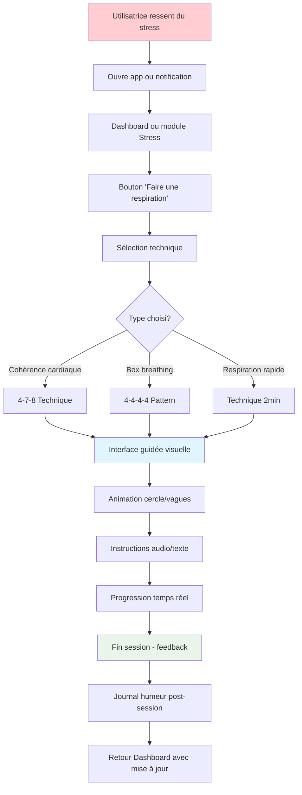
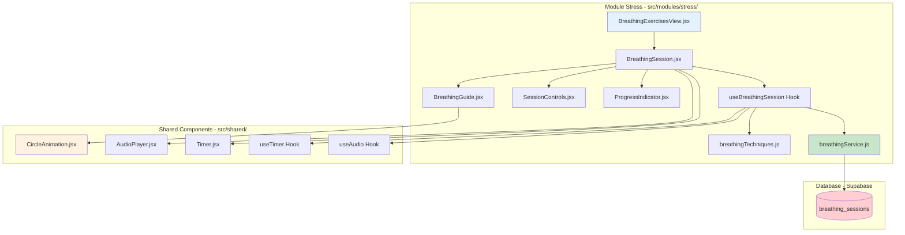
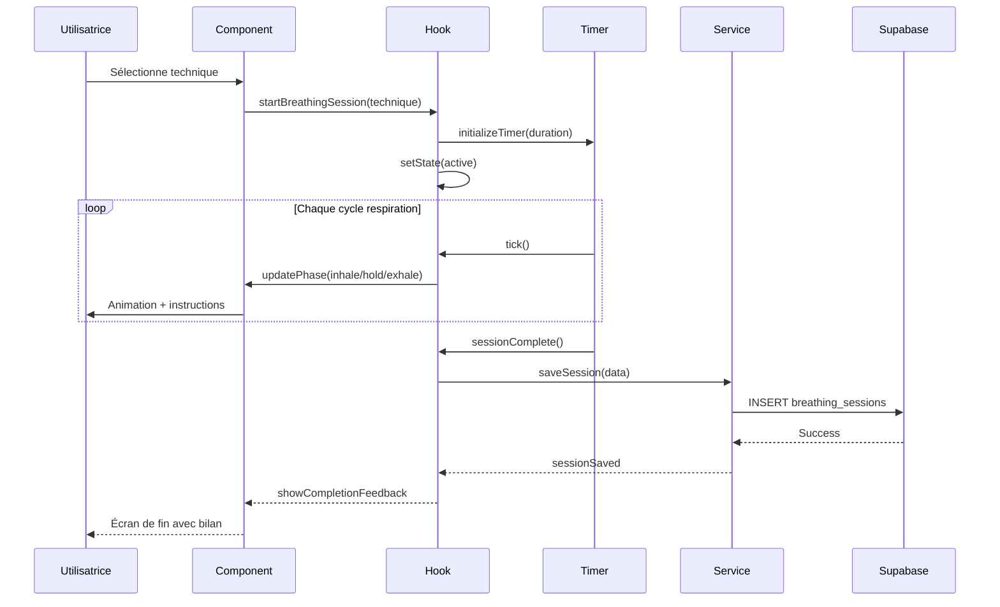

# 📝 Plan de Développement - Feature Exercices Respiration Guidée (MVP v1.0)

## 🎯 Vue d'ensemble

### Description de la Feature
Interface simple proposant des exercices de respiration guidée de 2-5 minutes pour gérer le stress et l'anxiété liés au SOPK avec des techniques validées.

### Valeur Utilisateur
- **Soulagement immédiat** : Outils rapides contre stress et anxiété
- **Accessibilité** : Disponible n'importe où, n'importe quand
- **Impact hormonal** : Réduction cortisol et amélioration équilibre SOPK

### Score RICE
- **Reach** : 4/5 (80% des utilisatrices SOPK ont du stress)
- **Impact** : 4/5 (effet immédiat et mesurable)
- **Confidence** : 5/5 (technique éprouvée)
- **Effort** : 1/5 (implémentation très simple)
- **Score Final** : **80** ✅ **Priorité #1**

---

## 🔄 Diagrammes de Flux

### User Journey - Session Respiration



### Architecture Technique



### Flux de Données



---

## 🏗️ Architecture Technique

### Structure des Données

```sql
-- Table pour tracking des sessions
CREATE TABLE breathing_sessions (
  id UUID PRIMARY KEY DEFAULT gen_random_uuid(),
  user_id UUID REFERENCES auth.users(id) ON DELETE CASCADE,

  -- Données de session
  technique VARCHAR(50) NOT NULL, -- 'box', 'coherence', 'quick'
  duration_seconds INTEGER NOT NULL,
  completed BOOLEAN DEFAULT false,
  interruption_reason VARCHAR(100), -- si pas complétée

  -- Feedback utilisateur
  stress_before INTEGER CHECK (stress_before >= 1 AND stress_before <= 10),
  stress_after INTEGER CHECK (stress_after >= 1 AND stress_after <= 10),
  feeling_after VARCHAR(20), -- 'calmer', 'same', 'better'

  created_at TIMESTAMP WITH TIME ZONE DEFAULT NOW()
);
```

### Structure Modulaire

#### Module Stress (`src/modules/stress/`)
```
src/modules/stress/
├── components/
│   ├── BreathingSession.jsx          # Session active
│   ├── BreathingGuide.jsx            # Animation + instructions
│   ├── TechniqueSelector.jsx         # Choix de technique
│   ├── SessionControls.jsx           # Play/Pause/Stop
│   ├── ProgressIndicator.jsx         # Progression temps
│   └── CompletionFeedback.jsx        # Écran de fin
├── hooks/
│   ├── useBreathingSession.js        # Hook principal session
│   └── useBreathingStats.js          # Statistiques utilisateur
├── services/
│   └── breathingService.js           # API calls sessions
├── types/
│   └── breathing.types.js            # Types techniques respiration
├── views/
│   └── BreathingExercisesView.jsx    # Point d'entrée
└── utils/
    ├── breathingTechniques.js        # Config des techniques
    └── breathingHelpers.js           # Calculs et utilitaires
```

#### Composants Partagés (`src/shared/`)
```
src/shared/
├── components/
│   ├── animations/
│   │   └── CircleAnimation.jsx       # Animation respiration
│   └── ui/
│       ├── Timer.jsx                 # Timer générique
│       ├── AudioPlayer.jsx           # Player audio guidé
│       └── StressSlider.jsx          # Slider niveau stress
├── hooks/
│   ├── useTimer.js                   # Hook timer réutilisable
│   ├── useAudio.js                   # Hook gestion audio
│   └── useVibration.js               # Hook vibration mobile
└── utils/
    ├── audioHelpers.js               # Utilitaires audio
    └── animationHelpers.js           # Utilitaires animation
```

### Services API

```javascript
// src/modules/stress/services/breathingService.js
export const breathingService = {
  // Sauvegarder une session
  async saveSession(userId, sessionData) {
    const { error } = await supabase
      .from('breathing_sessions')
      .insert({
        user_id: userId,
        ...sessionData
      });
    return { error };
  },

  // Récupérer les sessions du jour
  async getTodaySessions(userId) {
    const today = new Date().toISOString().split('T')[0];
    const { data, error } = await supabase
      .from('breathing_sessions')
      .select('*')
      .eq('user_id', userId)
      .gte('created_at', `${today}T00:00:00`)
      .order('created_at', { ascending: false });
    return { data, error };
  },

  // Statistiques hebdomadaires
  async getWeeklyStats(userId) {
    const weekAgo = new Date(Date.now() - 7 * 24 * 60 * 60 * 1000);
    const { data, error } = await supabase
      .from('breathing_sessions')
      .select('technique, duration_seconds, stress_before, stress_after, created_at')
      .eq('user_id', userId)
      .eq('completed', true)
      .gte('created_at', weekAgo.toISOString());
    return { data, error };
  }
};
```

---

## 🎨 Design UX/UI

### Interface Mobile-First

#### Sélection de Technique
```
┌─────────────────────────┐
│   🧘 Respiration Guidée  │
├─────────────────────────┤
│                         │
│  Choisis ton exercice   │
│                         │
│  🔵 Cohérence cardiaque │
│  ⏱️  5 minutes          │
│  💙 Équilibre émotionnel │
│                         │
│  ⏹️  Respiration 4-4-4-4 │
│  ⏱️  3 minutes          │
│  🎯 Focus et concentration│
│                         │
│  ⚡ Technique rapide     │
│  ⏱️  2 minutes          │
│  🚀 Anti-stress express  │
│                         │
│  📊 Mes statistiques     │
│  3 sessions cette semaine│
└─────────────────────────┘
```

#### Session Active
```
┌─────────────────────────┐
│  Cohérence Cardiaque    │
│  ⏱️  2:34 restantes     │
├─────────────────────────┤
│                         │
│       ◯────◯────◯       │
│     /           \       │
│    ◯             ◯      │ ← Animation
│     \           /       │   cercle
│       ◯────◯────◯       │   qui pulse
│                         │
│    💨 INSPIRE... 4s     │
│                         │
│  ⏸️  Pause    🛑  Arrêt  │
│                         │
│  Stress avant: 😰 8/10  │
└─────────────────────────┘
```

#### Feedback de Fin
```
┌─────────────────────────┐
│      ✨ Bravo !         │
├─────────────────────────┤
│                         │
│  Session terminée       │
│  🕐 5 minutes           │
│  💚 Technique maîtrisée  │
│                         │
│  Comment te sens-tu?    │
│                         │
│  Niveau de stress:      │
│  ●●○○○○○○○○  2/10      │
│                         │
│  😌 Plus calme          │
│  😐 Pareil              │
│  😊 Bien mieux          │
│                         │
│  [Terminer] [Nouvelle]  │
└─────────────────────────┘
```

### Design System - Couleurs & Animation

```css
:root {
  /* Couleurs respiration */
  --breathing-primary: #4FC3F7;     /* Bleu apaisant */
  --breathing-inhale: #81C784;      /* Vert inspiration */
  --breathing-hold: #FFB74D;        /* Orange rétention */
  --breathing-exhale: #F48FB1;      /* Rose expiration */

  /* Animations */
  --circle-size-min: 80px;
  --circle-size-max: 160px;
  --transition-breathing: cubic-bezier(0.4, 0, 0.6, 1);
}

.breathing-circle {
  width: var(--circle-size-min);
  height: var(--circle-size-min);
  border-radius: 50%;
  background: radial-gradient(circle, var(--breathing-primary), transparent);
  transition: all var(--transition-breathing);
}

.breathing-circle.inhale {
  width: var(--circle-size-max);
  height: var(--circle-size-max);
  background: radial-gradient(circle, var(--breathing-inhale), transparent);
}
```

---

## 📱 User Stories Détaillées

### US1: Accès Rapide Anti-Stress
**En tant qu'** utilisatrice SOPK stressée
**Je veux** démarrer un exercice de respiration en moins de 10 secondes
**Afin de** gérer mon stress immédiatement

**Critères d'acceptation** :
- [ ] Bouton "Respiration" accessible depuis le dashboard
- [ ] Lancement direct sans configuration complexe
- [ ] Proposition de la technique la plus utilisée par défaut
- [ ] Interface claire même en situation de stress
- [ ] Pas d'inscription/login requis pour essayer

### US2: Techniques Adaptées SOPK
**En tant qu'** utilisatrice SOPK
**Je veux** des exercices spécifiquement efficaces pour mon stress hormonal
**Afin de** maximiser l'impact sur mes symptômes

**Critères d'acceptation** :
- [ ] 3 techniques maximum pour éviter l'indécision
- [ ] Durées courtes (2-5 min) adaptées au rythme de vie
- [ ] Explications simples des bienfaits pour le SOPK
- [ ] Instructions audio optionnelles (pas obligatoires)
- [ ] Possibilité de personnaliser la durée

### US3: Feedback et Progression
**En tant qu'** utilisatrice
**Je veux** voir l'impact des exercices sur mon niveau de stress
**Afin de** rester motivée à continuer

**Critères d'acceptation** :
- [ ] Mesure stress avant/après (échelle 1-10)
- [ ] Visualisation simple de l'amélioration immédiate
- [ ] Statistiques hebdomadaires basiques (nombre de sessions)
- [ ] Corrélation avec le journal humeur si complété
- [ ] Encouragements bienveillants sans culpabilisation

---

## 🛠️ Implémentation Détaillée

### Sprint 1: Fondations (Semaine 1)
**Objectif** : Infrastructure technique et première technique

**Tâches** :
1. **Setup base de données**
   ```sql
   -- Table sessions + index pour performances
   CREATE INDEX idx_breathing_sessions_user_date
   ON breathing_sessions(user_id, created_at DESC);
   ```

2. **Configuration techniques de base**
   ```javascript
   // src/modules/stress/utils/breathingTechniques.js
   export const techniques = {
     coherence: {
       name: 'Cohérence cardiaque',
       duration: 300, // 5 min
       pattern: [5, 0, 5, 0], // inspire, pause, expire, pause
       description: 'Équilibre ton système nerveux',
       icon: '🔵'
     },
     box: {
       name: 'Respiration 4-4-4-4',
       duration: 180, // 3 min
       pattern: [4, 4, 4, 4],
       description: 'Focus et concentration',
       icon: '⏹️'
     },
     quick: {
       name: 'Technique rapide',
       duration: 120, // 2 min
       pattern: [4, 2, 6, 1], // 4-7-8 adapté
       description: 'Anti-stress express',
       icon: '⚡'
     }
   };
   ```

3. **Hook timer partagé**
   ```javascript
   // src/shared/hooks/useTimer.js
   import { useState, useRef, useCallback } from 'react';

   export const useTimer = (initialDuration = 0) => {
     const [timeLeft, setTimeLeft] = useState(initialDuration);
     const [isRunning, setIsRunning] = useState(false);
     const intervalRef = useRef();

     const start = useCallback(() => {
       setIsRunning(true);
       intervalRef.current = setInterval(() => {
         setTimeLeft(prev => {
           if (prev <= 1) {
             setIsRunning(false);
             return 0;
           }
           return prev - 1;
         });
       }, 1000);
     }, []);

     return { timeLeft, isRunning, start, pause, reset };
   };
   ```

4. **Service API minimal**
   ```javascript
   // Version simplifiée pour commencer
   const mockSaveSession = async (data) => {
     console.log('Session sauvegardée:', data);
     return { error: null };
   };
   ```

### Sprint 2: UX/UI Core (Semaine 2)
**Objectif** : Interface utilisateur fonctionnelle et attrayante

**Tâches** :
1. **Composant d'animation cercle**
   ```jsx
   // src/shared/components/animations/CircleAnimation.jsx
   import { useState, useEffect } from 'react';

   export const CircleAnimation = ({ phase, isActive }) => {
     const [scale, setScale] = useState(1);

     useEffect(() => {
       if (!isActive) return;

       const scaleMap = {
         inhale: 1.5,
         hold: 1.5,
         exhale: 1,
         pause: 1
       };

       setScale(scaleMap[phase] || 1);
     }, [phase, isActive]);

     return (
       <div
         className={`breathing-circle transition-transform duration-[4000ms] ease-in-out`}
         style={{ transform: `scale(${scale})` }}
       />
     );
   };
   ```

2. **Sélecteur de technique**
   ```jsx
   // src/modules/stress/components/TechniqueSelector.jsx
   import { techniques } from '../utils/breathingTechniques';

   export const TechniqueSelector = ({ onSelect }) => {
     return (
       <div className="space-y-4 p-4">
         {Object.entries(techniques).map(([key, technique]) => (
           <button
             key={key}
             onClick={() => onSelect(key)}
             className="w-full p-4 text-left border rounded-lg hover:bg-blue-50"
           >
             <div className="flex items-center gap-3">
               <span className="text-2xl">{technique.icon}</span>
               <div className="flex-1">
                 <h3 className="font-medium">{technique.name}</h3>
                 <p className="text-sm text-gray-600">{technique.description}</p>
                 <p className="text-xs text-gray-500">
                   ⏱️ {Math.floor(technique.duration / 60)} minutes
                 </p>
               </div>
             </div>
           </button>
         ))}
       </div>
     );
   };
   ```

3. **Hook principal session**
   ```jsx
   // src/modules/stress/hooks/useBreathingSession.js
   import { useState } from 'react';
   import { useTimer } from '../../../shared/hooks/useTimer';
   import { techniques } from '../utils/breathingTechniques';

   export const useBreathingSession = (techniqueId) => {
     const technique = techniques[techniqueId];
     const { timeLeft, isRunning, start, pause, reset } = useTimer(technique?.duration);

     const [currentPhase, setCurrentPhase] = useState('inhale'); // inhale, hold, exhale, pause
     const [cycleProgress, setCycleProgress] = useState(0);
     const [stressBefore, setStressBefore] = useState(null);
     const [stressAfter, setStressAfter] = useState(null);

     // Logique de cycle de respiration
     // ... détails d'implémentation

     return {
       currentPhase,
       cycleProgress,
       timeLeft,
       isRunning,
       start,
       pause,
       reset,
       stressBefore,
       stressAfter,
       setStressBefore,
       setStressAfter
     };
   };
   ```

### Sprint 3: Logique Métier (Semaine 3)
**Objectif** : Fonctionnalités complètes avec persistance des données

**Tâches** :
1. **Session complète avec sauvegarde**
   ```jsx
   // src/modules/stress/components/BreathingSession.jsx
   import { BreathingGuide } from './BreathingGuide';
   import { SessionControls } from './SessionControls';
   import { useBreathingSession } from '../hooks/useBreathingSession';

   export const BreathingSession = ({ techniqueId, onComplete }) => {
     const session = useBreathingSession(techniqueId);

     const handleSessionComplete = async () => {
       const sessionData = {
         technique: techniqueId,
         duration_seconds: techniques[techniqueId].duration - session.timeLeft,
         completed: session.timeLeft === 0,
         stress_before: session.stressBefore,
         stress_after: session.stressAfter
       };

       await breathingService.saveSession(user.id, sessionData);
       onComplete(sessionData);
     };

     return (
       <div className="breathing-session">
         <BreathingGuide
           phase={session.currentPhase}
           isActive={session.isRunning}
           technique={techniques[techniqueId]}
         />
         <SessionControls session={session} />
         {session.timeLeft === 0 && (
           <CompletionFeedback onComplete={handleSessionComplete} />
         )}
       </div>
     );
   };
   ```

2. **Feedback de fin avec tracking**
   ```jsx
   // src/modules/stress/components/CompletionFeedback.jsx
   export const CompletionFeedback = ({ stressBefore, onStressAfterChange, onComplete }) => {
     const [feeling, setFeeling] = useState('');

     return (
       <div className="completion-feedback p-6 text-center">
         <div className="mb-6">
           <h2 className="text-2xl mb-2">✨ Bravo !</h2>
           <p className="text-gray-600">Session terminée</p>
         </div>

         <div className="mb-6">
           <label className="block text-sm font-medium mb-2">
             Comment te sens-tu maintenant ?
           </label>
           <StressSlider
             value={stressAfter}
             onChange={onStressAfterChange}
             label="Niveau de stress"
           />
         </div>

         <div className="flex gap-2 mb-6">
           {['Plus calme', 'Pareil', 'Bien mieux'].map(option => (
             <button
               key={option}
               onClick={() => setFeeling(option)}
               className={`px-4 py-2 rounded-full ${
                 feeling === option ? 'bg-blue-500 text-white' : 'bg-gray-200'
               }`}
             >
               {option}
             </button>
           ))}
         </div>

         <button
           onClick={() => onComplete({ feeling_after: feeling })}
           className="w-full bg-green-500 text-white py-3 rounded-lg"
         >
           Terminer
         </button>
       </div>
     );
   };
   ```

---

## 🧪 Tests & Validation

### Tests Unitaires (Vitest)
```javascript
describe('useBreathingSession Hook', () => {
  test('démarre une session et gère les phases', () => {
    const { result } = renderHook(() => useBreathingSession('coherence'));

    expect(result.current.currentPhase).toBe('inhale');
    expect(result.current.timeLeft).toBe(300); // 5 minutes

    act(() => {
      result.current.start();
    });

    expect(result.current.isRunning).toBe(true);
  });

  test('calcule correctement les phases de respiration', () => {
    // Test de la logique de cycle respiration
    // ...
  });
});
```

### Tests d'Intégration
```javascript
describe('Breathing Exercise E2E', () => {
  test('flow complet de session', async () => {
    render(<BreathingExercisesView />);

    // Sélectionner technique
    fireEvent.click(screen.getByText('Cohérence cardiaque'));

    // Évaluer stress avant
    const stressSlider = screen.getByLabelText(/stress avant/i);
    fireEvent.change(stressSlider, { target: { value: '8' } });

    // Démarrer session
    fireEvent.click(screen.getByText('Commencer'));

    // Simuler fin de session
    act(() => {
      jest.advanceTimersByTime(300000); // 5 minutes
    });

    // Vérifier feedback
    expect(screen.getByText('Bravo !')).toBeInTheDocument();

    // Compléter feedback
    fireEvent.change(screen.getByLabelText(/stress après/i), { target: { value: '3' } });
    fireEvent.click(screen.getByText('Plus calme'));
    fireEvent.click(screen.getByText('Terminer'));

    // Vérifier sauvegarde
    await waitFor(() => {
      expect(mockBreathingService.saveSession).toHaveBeenCalledWith(
        expect.any(String),
        expect.objectContaining({
          stress_before: 8,
          stress_after: 3,
          feeling_after: 'Plus calme'
        })
      );
    });
  });
});
```

### Critères de Validation MVP
- [ ] **Performance** : Démarrage session < 2 secondes
- [ ] **UX** : 95% des utilisatrices complètent une session 2-5 min
- [ ] **Impact** : Réduction moyenne stress de 2+ points sur 10
- [ ] **Engagement** : 60% utilisent 3+ fois par semaine après 2 semaines
- [ ] **Technique** : Animations fluides 60fps sur tous mobiles

---

## 🚀 Déploiement & Monitoring

### Variables d'Environnement
```env
# Audio et animations
VITE_ENABLE_AUDIO_GUIDE=true
VITE_ENABLE_VIBRATION=true
VITE_ANIMATION_REDUCED_MOTION=false

# Feature flags
VITE_ENABLE_STRESS_TRACKING=true
VITE_ENABLE_SESSION_SHARING=false
```

### Métriques Clés
```javascript
// Analytics events spécifiques respiration
const trackBreathingEvents = {
  technique_selected: (technique) => analytics.track('Breathing Technique Selected', { technique }),
  session_started: (technique, duration) => analytics.track('Breathing Session Started', { technique, duration }),
  session_completed: (technique, duration, stress_reduction) => analytics.track('Breathing Session Completed', {
    technique,
    duration,
    stress_reduction
  }),
  session_interrupted: (technique, duration_completed, reason) => analytics.track('Breathing Session Interrupted', {
    technique,
    duration_completed,
    reason
  }),
  stress_improvement: (before, after, technique) => analytics.track('Stress Level Improved', {
    stress_before: before,
    stress_after: after,
    improvement: before - after,
    technique
  })
};
```

### Dashboard Monitoring
- **Engagement** : Sessions par utilisatrice par semaine
- **Efficacité** : Amélioration moyenne niveau de stress
- **Techniques** : Préférences et taux de complétion par technique
- **Abandons** : Moments d'interruption pour améliorer UX

---

## 🔄 Évolutions Post-MVP

### Version 1.1
- **Audio guidé** avec voix bienveillante française
- **Mode nuit** avec animations douces pour coucher
- **Rappels intelligents** basés sur niveaux de stress du journal

### Version 1.2
- **Techniques personnalisées** adaptées au cycle menstruel
- **Partage de sessions** avec proches (anonymisé)
- **Intégration capteurs** (Apple Watch, Fitbit) pour mesure HRV

---

## ✅ Definition of Done

### Critères Techniques
- [ ] Code reviewé et couvert à 90%+ par les tests
- [ ] Animations testées sur iPhone 8+ et Android 7+
- [ ] Audio facultatif et accessible (sous-titres si nécessaire)
- [ ] Mode hors-ligne pour toutes les techniques
- [ ] Bundle size < 50kb pour ce module

### Critères Utilisateur
- [ ] Tests utilisateur > 4.5/5 facilité d'utilisation
- [ ] 0 feedback négatif sur culpabilisation ou jugement
- [ ] Onboarding intégré expliquant bienfaits SOPK
- [ ] Transition fluide vers/depuis autres modules
- [ ] Guide d'accessibilité pour malvoyants

### Critères Business
- [ ] Tracking complet des sessions pour analytics
- [ ] A/B test prévu pour techniques par défaut
- [ ] Documentation complète pour support client
- [ ] Plan de contenu audio pour versions futures

---

*📋 Cette feature est conçue comme un outil thérapeutique léger mais efficace, priorité absolue du MVP pour son impact immédiat sur le bien-être des utilisatrices SOPK.*